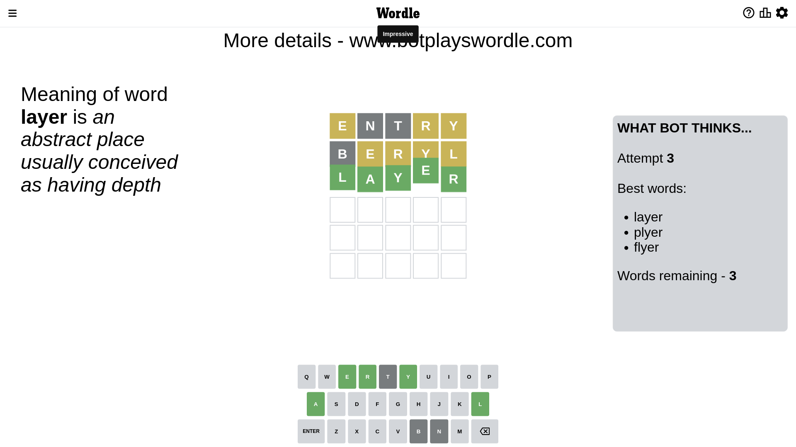

# Wordle for January 4, 2023 - \#564

## Attempt 1

This is the first attempt and we'll choose a random word to start with.

Let's start with word `entry`

Attempt for `entry` gives us 0 correct letters, 3 present letters and 2 wrong letters.

If we look into details, we can see that:

Letter `e` is on a different spot - this means that it cannot be at position 1

Letter `n` is not present in the word and we will not use it any more

Letter `t` is not present in the word and we will not use it any more

Letter `r` is on a different spot - this means that it cannot be at position 4

Letter `y` is on a different spot - this means that it cannot be at position 5

Some letters are missing (like `n`, `t`) but it's also important piece of information

Word should contain letters `[e r y]`

That was a great guess that limited number of remaining words

## Attempt 2

Right now we have 32 words to choose from and best of them seem to be `[layer ceryl clyer plyer beryl]`

So far we know that possible letters are:

At position 1: `[a b c d f g h i j k l m o p q r s u v w x y z]`

At position 2: `[a b c d e f g h i j k l m o p q r s u v w x y z]`

At position 3: `[a b c d e f g h i j k l m o p q r s u v w x y z]`

At position 4: `[a b c d e f g h i j k l m o p q s u v w x y z]`

At position 5: `[a b c d e f g h i j k l m o p q r s u v w x z]`

Next guess is `clyer`, let's see what it gives us

Wordle does not know word `clyer`, need to try something different

## Attempt 2

Right now we have 31 words to choose from and best of them seem to be `[layer ceryl plyer beryl flyer]`

So far we know that possible letters are:

At position 1: `[a b c d f g h i j k l m o p q r s u v w x y z]`

At position 2: `[a b c d e f g h i j k l m o p q r s u v w x y z]`

At position 3: `[a b c d e f g h i j k l m o p q r s u v w x y z]`

At position 4: `[a b c d e f g h i j k l m o p q s u v w x y z]`

At position 5: `[a b c d e f g h i j k l m o p q r s u v w x z]`

Next guess is `beryl`, let's see what it gives us

Attempt for `beryl` gives us 0 correct letters, 4 present letters and 1 wrong letters.

If we look into details, we can see that:

Letter `b` is not present in the word and we will not use it any more

Letter `e` is on a different spot - this means that it cannot be at position 2

Letter `r` is on a different spot - this means that it cannot be at position 3

Letter `y` is on a different spot - this means that it cannot be at position 4

Letter `l` is on a different spot - this means that it cannot be at position 5

Some letters are missing (like `b`) but it's also important piece of information

Word should contain letters `[e r y l]`

That was a great guess that limited number of remaining words

## Attempt 3

Right now we have 3 words to choose from and best of them seem to be `[layer plyer flyer]`

So far we know that possible letters are:

At position 1: `[a c d f g h i j k l m o p q r s u v w x y z]`

At position 2: `[a c d f g h i j k l m o p q r s u v w x y z]`

At position 3: `[a c d e f g h i j k l m o p q s u v w x y z]`

At position 4: `[a c d e f g h i j k l m o p q s u v w x z]`

At position 5: `[a c d e f g h i j k m o p q r s u v w x z]`

Next guess is `layer`, let's see what it gives us

That's the correct answer! The word is `layer`!

## Conclusion

Today's word is `layer` and it took 3 attempts to guess it

