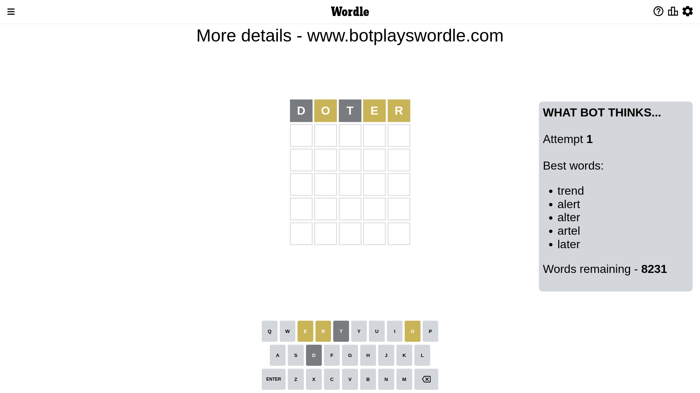

# Wordle for January 8, 2023 - \#568

## Attempt 1

This is the first attempt and we'll choose a random word to start with.

Let's start with word `doter`

Attempt for `doter` gives us 0 correct letters, 3 present letters and 2 wrong letters.

If we look into details, we can see that:

Letter `d` is not present in the word and we will not use it any more

Letter `o` is on a different spot - this means that it cannot be at position 2

Letter `t` is not present in the word and we will not use it any more

Letter `e` is on a different spot - this means that it cannot be at position 4

Letter `r` is on a different spot - this means that it cannot be at position 5

Some letters are missing (like `d`, `t`) but it's also important piece of information

Word should contain letters `[o e r]`

That was a great guess that limited number of remaining words

## Attempt 2

Right now we have 66 words to choose from and best of them seem to be `[enrol heron reoil ceorl irone]`

So far we know that possible letters are:

At position 1: `[a b c e f g h i j k l m n o p q r s u v w x y z]`

At position 2: `[a b c e f g h i j k l m n p q r s u v w x y z]`

At position 3: `[a b c e f g h i j k l m n o p q r s u v w x y z]`

At position 4: `[a b c f g h i j k l m n o p q r s u v w x y z]`

At position 5: `[a b c e f g h i j k l m n o p q s u v w x y z]`

Next guess is `irone`, let's see what it gives us

Attempt for `irone` gives us 0 correct letters, 3 present letters and 2 wrong letters.

If we look into details, we can see that:

Letter `i` is not present in the word and we will not use it any more

Letter `r` is on a different spot - this means that it cannot be at position 2

Letter `o` is on a different spot - this means that it cannot be at position 3

Letter `n` is not present in the word and we will not use it any more

Letter `e` is on a different spot - this means that it cannot be at position 5

Some letters are missing (like `i`, `n`) but it's also important piece of information

Word should contain letters `[o e r]`

Not a bad guess in general

## Attempt 3

Right now we have 15 words to choose from and best of them seem to be `[opera meros sermo resow serow]`

So far we know that possible letters are:

At position 1: `[a b c e f g h j k l m o p q r s u v w x y z]`

At position 2: `[a b c e f g h j k l m p q s u v w x y z]`

At position 3: `[a b c e f g h j k l m p q r s u v w x y z]`

At position 4: `[a b c f g h j k l m o p q r s u v w x y z]`

At position 5: `[a b c f g h j k l m o p q s u v w x y z]`

Next guess is `meros`, let's see what it gives us

Wordle does not know word `meros`, need to try something different

## Attempt 3

Right now we have 14 words to choose from and best of them seem to be `[opera sermo resow serow servo]`

So far we know that possible letters are:

At position 1: `[a b c e f g h j k l m o p q r s u v w x y z]`

At position 2: `[a b c e f g h j k l m p q s u v w x y z]`

At position 3: `[a b c e f g h j k l m p q r s u v w x y z]`

At position 4: `[a b c f g h j k l m o p q r s u v w x y z]`

At position 5: `[a b c f g h j k l m o p q s u v w x y z]`

Next guess is `opera`, let's see what it gives us

That's the correct answer! The word is `opera`!

To be honest that was a pretty lucky guess, but it worked out well.

## Conclusion

Today's word is `opera` and it took 3 attempts to guess it

