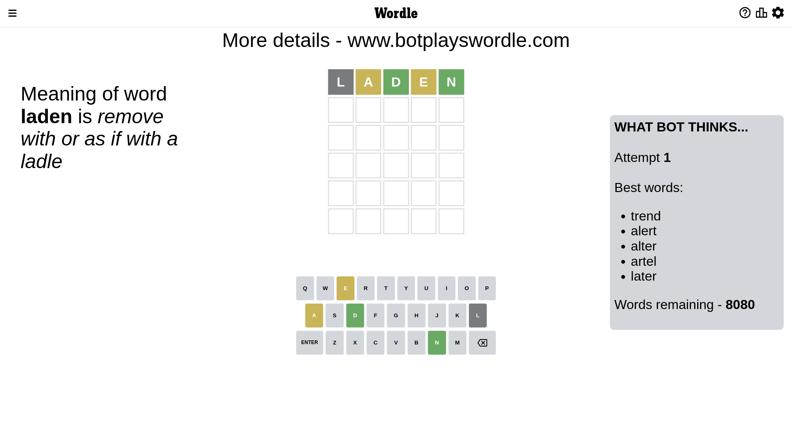
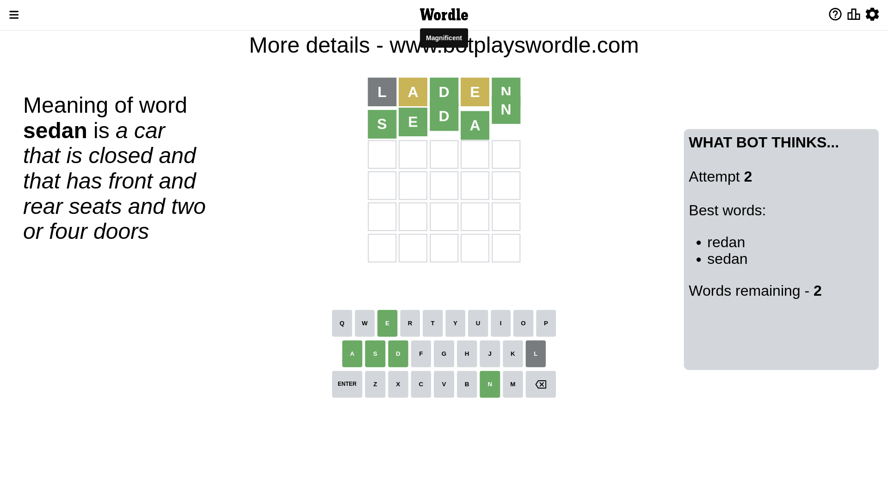

# Wordle for January 11, 2023 - \#571

## Attempt 1

This is the first attempt and we'll choose a random word to start with.

Let's start with word `laden`

Attempt for `laden` gives us 2 correct letters, 2 present letters and 1 wrong letters.

If we look into details, we can see that:

Letter `l` is not present in the word and we will not use it any more

Letter `a` is on a different spot - this means that it cannot be at position 2

Letter `d` should be at position 3

Letter `e` is on a different spot - this means that it cannot be at position 4

Letter `n` should be at position 5

We got information about the correct letters and it should make next attempt easier

Some letters are missing (like `l`) but it's also important piece of information

Word should contain letters `[a d e n]`

That was a great guess that limited number of remaining words

## Attempt 2

Right now we have 2 words to choose from and best of them seem to be `[redan sedan]`

So far we know that possible letters are:

At position 1: `[a b c d e f g h i j k m n o p q r s t u v w x y z]`

At position 2: `[b c d e f g h i j k m n o p q r s t u v w x y z]`

At position 3: `[d]`

At position 4: `[a b c d f g h i j k m n o p q r s t u v w x y z]`

At position 5: `[n]`

Next guess is `sedan`, let's see what it gives us

That's the correct answer! The word is `sedan`!

## Conclusion

Today's word is `sedan` and it took 2 attempts to guess it

