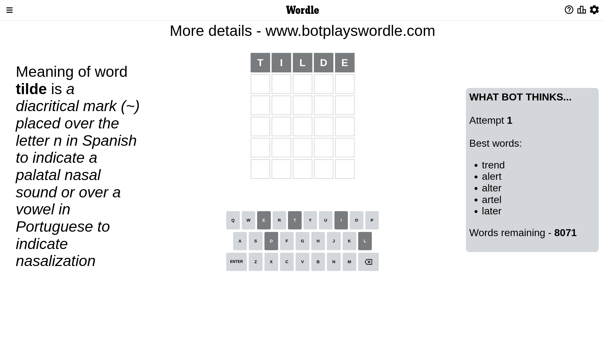
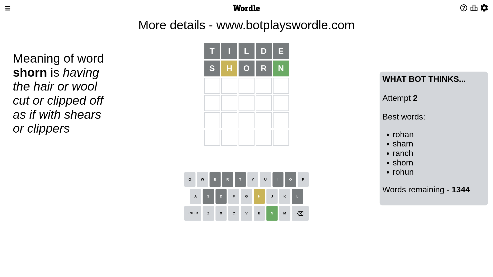
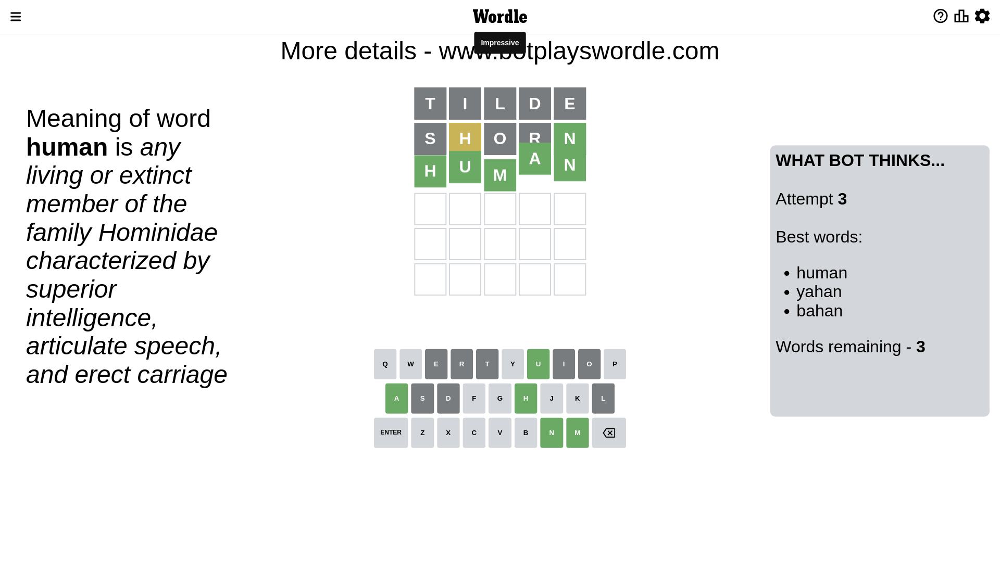

# Wordle for January 13, 2023 - \#573

## Attempt 1

This is the first attempt and we'll choose a random word to start with.

Let's start with word `tilde`

Attempt for `tilde` gives us 0 correct letters, 0 present letters and 5 wrong letters.

If we look into details, we can see that:

Letter `t` is not present in the word and we will not use it any more

Letter `i` is not present in the word and we will not use it any more

Letter `l` is not present in the word and we will not use it any more

Letter `d` is not present in the word and we will not use it any more

Letter `e` is not present in the word and we will not use it any more

Some letters are missing (like `t`, `i`, `l`, `d`, `e`) but it's also important piece of information

So far we don't know any of the letters!

Not a bad guess in general

## Attempt 2

Right now we have 1344 words to choose from and best of them seem to be `[rohan sharn ranch shorn rohun]`

So far we know that possible letters are:

At position 1: `[a b c f g h j k m n o p q r s u v w x y z]`

At position 2: `[a b c f g h j k m n o p q r s u v w x y z]`

At position 3: `[a b c f g h j k m n o p q r s u v w x y z]`

At position 4: `[a b c f g h j k m n o p q r s u v w x y z]`

At position 5: `[a b c f g h j k m n o p q r s u v w x y z]`

Next guess is `shorn`, let's see what it gives us

Attempt for `shorn` gives us 1 correct letters, 1 present letters and 3 wrong letters.

If we look into details, we can see that:

Letter `s` is not present in the word and we will not use it any more

Letter `h` is on a different spot - this means that it cannot be at position 2

Letter `o` is not present in the word and we will not use it any more

Letter `r` is not present in the word and we will not use it any more

Letter `n` should be at position 5

We got information about the correct letters and it should make next attempt easier

Some letters are missing (like `s`, `o`, `r`) but it's also important piece of information

Word should contain letters `[h n]`

That was a great guess that limited number of remaining words

## Attempt 3

Right now we have 3 words to choose from and best of them seem to be `[human yahan bahan]`

So far we know that possible letters are:

At position 1: `[a b c f g h j k m n p q u v w x y z]`

At position 2: `[a b c f g j k m n p q u v w x y z]`

At position 3: `[a b c f g h j k m n p q u v w x y z]`

At position 4: `[a b c f g h j k m n p q u v w x y z]`

At position 5: `[n]`

Next guess is `human`, let's see what it gives us

That's the correct answer! The word is `human`!

## Conclusion

Today's word is `human` and it took 3 attempts to guess it

