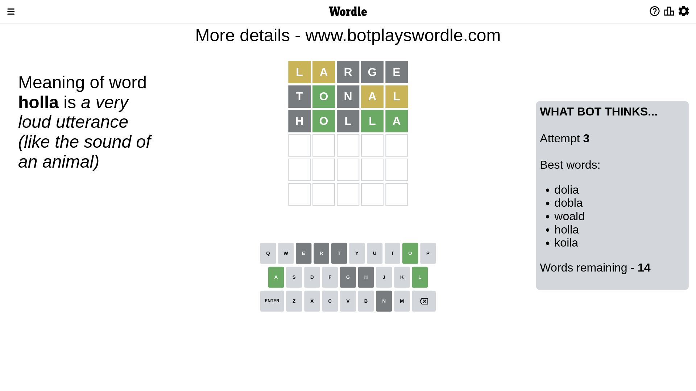

# Wordle for January 14, 2023 - \#574

## Attempt 1

This is the first attempt and we'll choose a random word to start with.

Let's start with word `large`

Attempt for `large` gives us 0 correct letters, 2 present letters and 3 wrong letters.

If we look into details, we can see that:

Letter `l` is on a different spot - this means that it cannot be at position 1

Letter `a` is on a different spot - this means that it cannot be at position 2

Letter `r` is not present in the word and we will not use it any more

Letter `g` is not present in the word and we will not use it any more

Letter `e` is not present in the word and we will not use it any more

Some letters are missing (like `r`, `g`, `e`) but it's also important piece of information

Word should contain letters `[l a]`

That was a great guess that limited number of remaining words

## Attempt 2

Right now we have 307 words to choose from and best of them seem to be `[notal ontal tolan tonal altin]`

So far we know that possible letters are:

At position 1: `[a b c d f h i j k m n o p q s t u v w x y z]`

At position 2: `[b c d f h i j k l m n o p q s t u v w x y z]`

At position 3: `[a b c d f h i j k l m n o p q s t u v w x y z]`

At position 4: `[a b c d f h i j k l m n o p q s t u v w x y z]`

At position 5: `[a b c d f h i j k l m n o p q s t u v w x y z]`

Next guess is `tonal`, let's see what it gives us

Attempt for `tonal` gives us 1 correct letters, 2 present letters and 2 wrong letters.

If we look into details, we can see that:

Letter `t` is not present in the word and we will not use it any more

Letter `o` should be at position 2

Letter `n` is not present in the word and we will not use it any more

Letter `a` is on a different spot - this means that it cannot be at position 4

Letter `l` is on a different spot - this means that it cannot be at position 5

We got information about the correct letters and it should make next attempt easier

Some letters are missing (like `t`, `n`) but it's also important piece of information

Word should contain letters `[l a o]`

That was a great guess that limited number of remaining words

## Attempt 3

Right now we have 14 words to choose from and best of them seem to be `[dolia dobla woald holla koila]`

So far we know that possible letters are:

At position 1: `[a b c d f h i j k m o p q s u v w x y z]`

At position 2: `[o]`

At position 3: `[a b c d f h i j k l m o p q s u v w x y z]`

At position 4: `[b c d f h i j k l m o p q s u v w x y z]`

At position 5: `[a b c d f h i j k m o p q s u v w x y z]`

Next guess is `holla`, let's see what it gives us

Attempt for `holla` gives us 3 correct letters, 0 present letters and 2 wrong letters.

If we look into details, we can see that:

Letter `h` is not present in the word and we will not use it any more

Letter `l` is not present in the word and we will not use it any more

Letter `l` should be at position 4

Letter `a` should be at position 5

We got information about the correct letters and it should make next attempt easier

Some letters are missing (like `h`, `l`) but it's also important piece of information

Word should contain letters `[l a o]`

Could be a better guess

## Attempt 4

Right now we have 5 words to choose from and best of them seem to be `[dobla koila boyla bowla koala]`

So far we know that possible letters are:

At position 1: `[a b c d f i j k m o p q s u v w x y z]`

At position 2: `[o]`

At position 3: `[a b c d f i j k m o p q s u v w x y z]`

At position 4: `[l]`

At position 5: `[a]`

Next guess is `koala`, let's see what it gives us

That's the correct answer! The word is `koala`!

## Conclusion

Today's word is `koala` and it took 4 attempts to guess it

