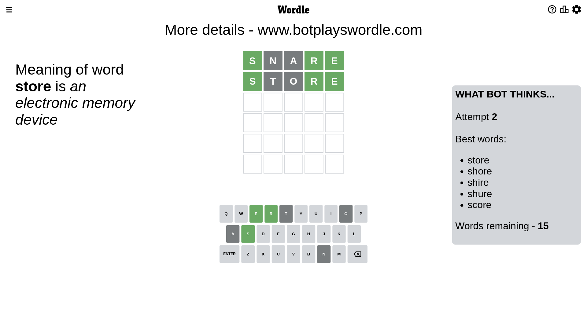

# Wordle for January 15, 2023 - \#575

## Attempt 1

This is the first attempt and we'll choose a random word to start with.

Let's start with word `snare`

Attempt for `snare` gives us 3 correct letters, 0 present letters and 2 wrong letters.

If we look into details, we can see that:

Letter `s` should be at position 1

Letter `n` is not present in the word and we will not use it any more

Letter `a` is not present in the word and we will not use it any more

Letter `r` should be at position 4

Letter `e` should be at position 5

We got information about the correct letters and it should make next attempt easier

Some letters are missing (like `n`, `a`) but it's also important piece of information

Word should contain letters `[s r e]`

That was a great guess that limited number of remaining words

## Attempt 2

Right now we have 15 words to choose from and best of them seem to be `[store shore shire shure score]`

So far we know that possible letters are:

At position 1: `[s]`

At position 2: `[b c d e f g h i j k l m o p q r s t u v w x y z]`

At position 3: `[b c d e f g h i j k l m o p q r s t u v w x y z]`

At position 4: `[r]`

At position 5: `[e]`

Next guess is `store`, let's see what it gives us

Attempt for `store` gives us 3 correct letters, 0 present letters and 2 wrong letters.

If we look into details, we can see that:

Letter `t` is not present in the word and we will not use it any more

Letter `o` is not present in the word and we will not use it any more

Some letters are missing (like `t`, `o`) but it's also important piece of information

Word should contain letters `[s r e]`

This was a waste, almost no valuable information...

## Attempt 3

Right now we have 8 words to choose from and best of them seem to be `[shire shure spire sucre swire]`

So far we know that possible letters are:

At position 1: `[s]`

At position 2: `[b c d e f g h i j k l m p q r s u v w x y z]`

At position 3: `[b c d e f g h i j k l m p q r s u v w x y z]`

At position 4: `[r]`

At position 5: `[e]`

Next guess is `shire`, let's see what it gives us

Attempt for `shire` gives us 4 correct letters, 0 present letters and 1 wrong letters.

If we look into details, we can see that:

Letter `h` is not present in the word and we will not use it any more

Letter `i` should be at position 3

We got information about the correct letters and it should make next attempt easier

Some letters are missing (like `h`) but it's also important piece of information

Word should contain letters `[s r e i]`

Could be a better guess

## Attempt 4

Right now we have 2 words to choose from and best of them seem to be `[spire swire]`

So far we know that possible letters are:

At position 1: `[s]`

At position 2: `[b c d e f g i j k l m p q r s u v w x y z]`

At position 3: `[i]`

At position 4: `[r]`

At position 5: `[e]`

Next guess is `swire`, let's see what it gives us

Attempt for `swire` gives us 4 correct letters, 0 present letters and 1 wrong letters.

If we look into details, we can see that:

Letter `w` is not present in the word and we will not use it any more

Some letters are missing (like `w`) but it's also important piece of information

Word should contain letters `[s r e i]`

This was a waste, almost no valuable information...

## Attempt 5

Right now we have 1 words to choose from and best of them seem to be `[spire]`

So far we know that possible letters are:

At position 1: `[s]`

At position 2: `[b c d e f g i j k l m p q r s u v x y z]`

At position 3: `[i]`

At position 4: `[r]`

At position 5: `[e]`

It must be `spire`

That's the correct answer! The word is `spire`!

## Conclusion

Today's word is `spire` and it took 5 attempts to guess it

