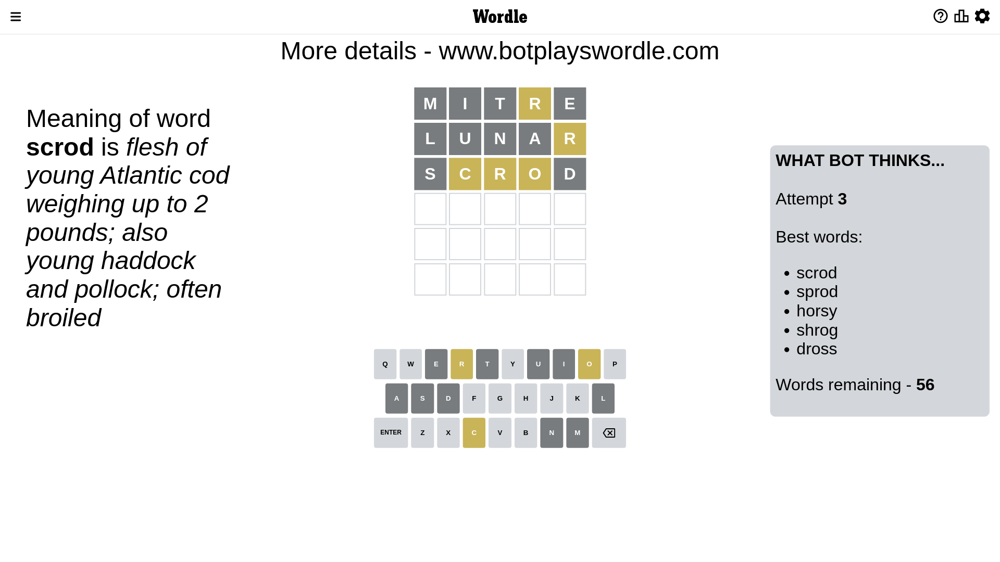

# Wordle for January 16, 2023 - \#576

## Attempt 1

This is the first attempt and we'll choose a random word to start with.

Let's start with word `mitre`

Attempt for `mitre` gives us 0 correct letters, 1 present letters and 4 wrong letters.

If we look into details, we can see that:

Letter `m` is not present in the word and we will not use it any more

Letter `i` is not present in the word and we will not use it any more

Letter `t` is not present in the word and we will not use it any more

Letter `r` is on a different spot - this means that it cannot be at position 4

Letter `e` is not present in the word and we will not use it any more

Some letters are missing (like `m`, `i`, `t`, `e`) but it's also important piece of information

Word should contain letters `[r]`

That was a great guess that limited number of remaining words

## Attempt 2

Right now we have 489 words to choose from and best of them seem to be `[loran ulnar urnal dural horal]`

So far we know that possible letters are:

At position 1: `[a b c d f g h j k l n o p q r s u v w x y z]`

At position 2: `[a b c d f g h j k l n o p q r s u v w x y z]`

At position 3: `[a b c d f g h j k l n o p q r s u v w x y z]`

At position 4: `[a b c d f g h j k l n o p q s u v w x y z]`

At position 5: `[a b c d f g h j k l n o p q r s u v w x y z]`

Next guess is `lunar`, let's see what it gives us

Attempt for `lunar` gives us 0 correct letters, 1 present letters and 4 wrong letters.

If we look into details, we can see that:

Letter `l` is not present in the word and we will not use it any more

Letter `u` is not present in the word and we will not use it any more

Letter `n` is not present in the word and we will not use it any more

Letter `a` is not present in the word and we will not use it any more

Letter `r` is on a different spot - this means that it cannot be at position 5

Some letters are missing (like `l`, `u`, `n`, `a`) but it's also important piece of information

Word should contain letters `[r]`

That was a great guess that limited number of remaining words

## Attempt 3

Right now we have 56 words to choose from and best of them seem to be `[scrod sprod horsy shrog dross]`

So far we know that possible letters are:

At position 1: `[b c d f g h j k o p q r s v w x y z]`

At position 2: `[b c d f g h j k o p q r s v w x y z]`

At position 3: `[b c d f g h j k o p q r s v w x y z]`

At position 4: `[b c d f g h j k o p q s v w x y z]`

At position 5: `[b c d f g h j k o p q s v w x y z]`

Next guess is `scrod`, let's see what it gives us

Attempt for `scrod` gives us 0 correct letters, 3 present letters and 2 wrong letters.

If we look into details, we can see that:

Letter `s` is not present in the word and we will not use it any more

Letter `c` is on a different spot - this means that it cannot be at position 2

Letter `r` is on a different spot - this means that it cannot be at position 3

Letter `o` is on a different spot - this means that it cannot be at position 4

Letter `d` is not present in the word and we will not use it any more

Some letters are missing (like `s`, `d`) but it's also important piece of information

Word should contain letters `[r c o]`

That was a great guess that limited number of remaining words

## Attempt 4

Right now we have 5 words to choose from and best of them seem to be `[broch rocky brock frock crock]`

So far we know that possible letters are:

At position 1: `[b c f g h j k o p q r v w x y z]`

At position 2: `[b f g h j k o p q r v w x y z]`

At position 3: `[b c f g h j k o p q v w x y z]`

At position 4: `[b c f g h j k p q v w x y z]`

At position 5: `[b c f g h j k o p q v w x y z]`

Next guess is `frock`, let's see what it gives us

That's the correct answer! The word is `frock`!

## Conclusion

Today's word is `frock` and it took 4 attempts to guess it

