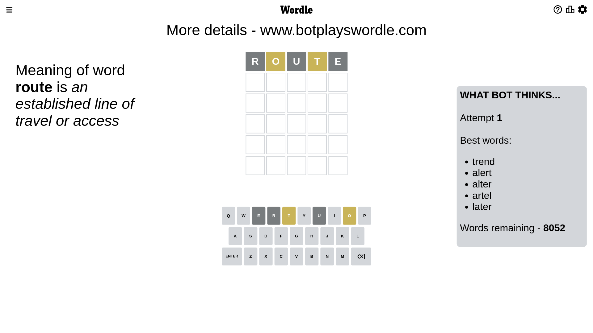
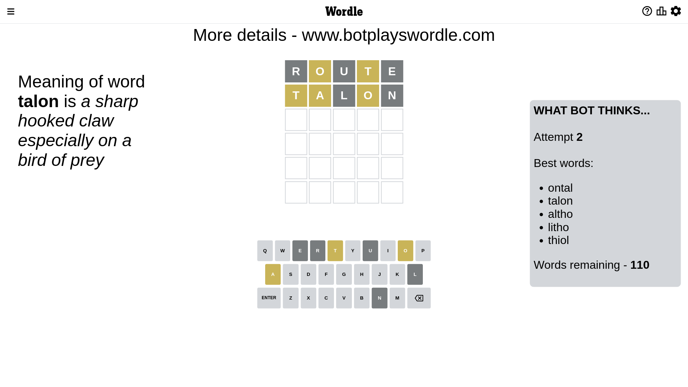
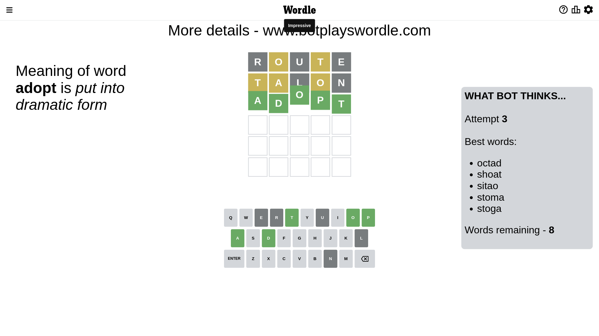

# Wordle for January 17, 2023 - \#577

## Attempt 1

This is the first attempt and we'll choose a random word to start with.

Let's start with word `route`

Attempt for `route` gives us 0 correct letters, 2 present letters and 3 wrong letters.

If we look into details, we can see that:

Letter `r` is not present in the word and we will not use it any more

Letter `o` is on a different spot - this means that it cannot be at position 2

Letter `u` is not present in the word and we will not use it any more

Letter `t` is on a different spot - this means that it cannot be at position 4

Letter `e` is not present in the word and we will not use it any more

Some letters are missing (like `r`, `u`, `e`) but it's also important piece of information

Word should contain letters `[o t]`

That was a great guess that limited number of remaining words

## Attempt 2

Right now we have 110 words to choose from and best of them seem to be `[ontal talon altho litho thiol]`

So far we know that possible letters are:

At position 1: `[a b c d f g h i j k l m n o p q s t v w x y z]`

At position 2: `[a b c d f g h i j k l m n p q s t v w x y z]`

At position 3: `[a b c d f g h i j k l m n o p q s t v w x y z]`

At position 4: `[a b c d f g h i j k l m n o p q s v w x y z]`

At position 5: `[a b c d f g h i j k l m n o p q s t v w x y z]`

Next guess is `talon`, let's see what it gives us

Attempt for `talon` gives us 0 correct letters, 3 present letters and 2 wrong letters.

If we look into details, we can see that:

Letter `t` is on a different spot - this means that it cannot be at position 1

Letter `a` is on a different spot - this means that it cannot be at position 2

Letter `l` is not present in the word and we will not use it any more

Letter `o` is on a different spot - this means that it cannot be at position 4

Letter `n` is not present in the word and we will not use it any more

Some letters are missing (like `l`, `n`) but it's also important piece of information

Word should contain letters `[o t a]`

That was a great guess that limited number of remaining words

## Attempt 3

Right now we have 8 words to choose from and best of them seem to be `[octad shoat sitao stoma stoga]`

So far we know that possible letters are:

At position 1: `[a b c d f g h i j k m o p q s v w x y z]`

At position 2: `[b c d f g h i j k m p q s t v w x y z]`

At position 3: `[a b c d f g h i j k m o p q s t v w x y z]`

At position 4: `[a b c d f g h i j k m p q s v w x y z]`

At position 5: `[a b c d f g h i j k m o p q s t v w x y z]`

Next guess is `adopt`, let's see what it gives us

That's the correct answer! The word is `adopt`!

## Conclusion

Today's word is `adopt` and it took 3 attempts to guess it

