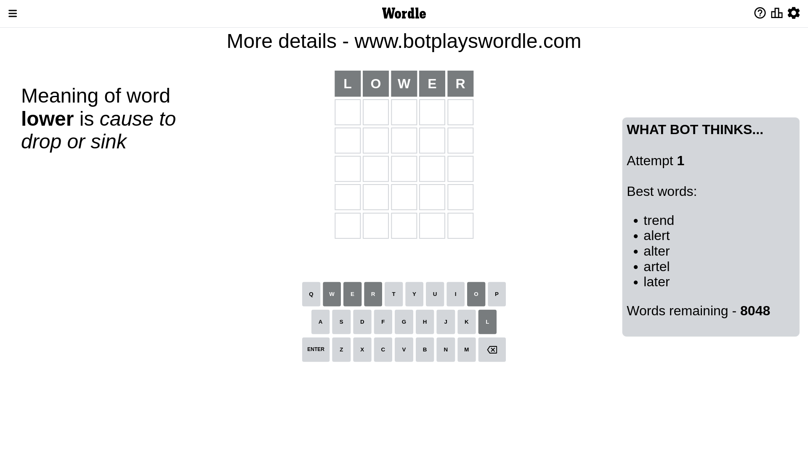
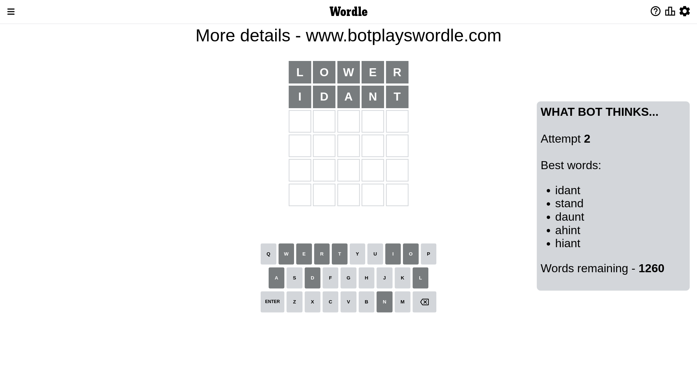
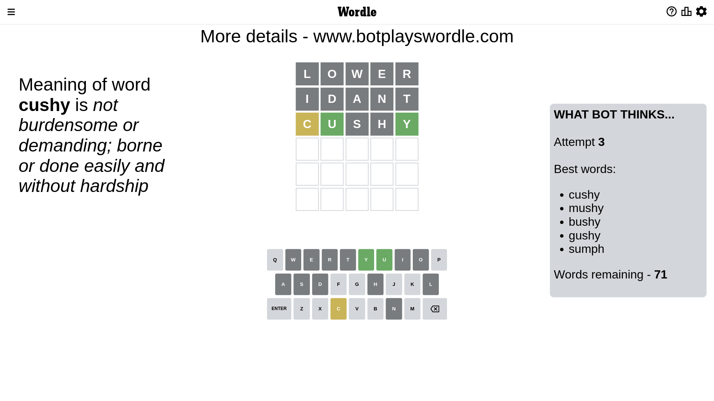
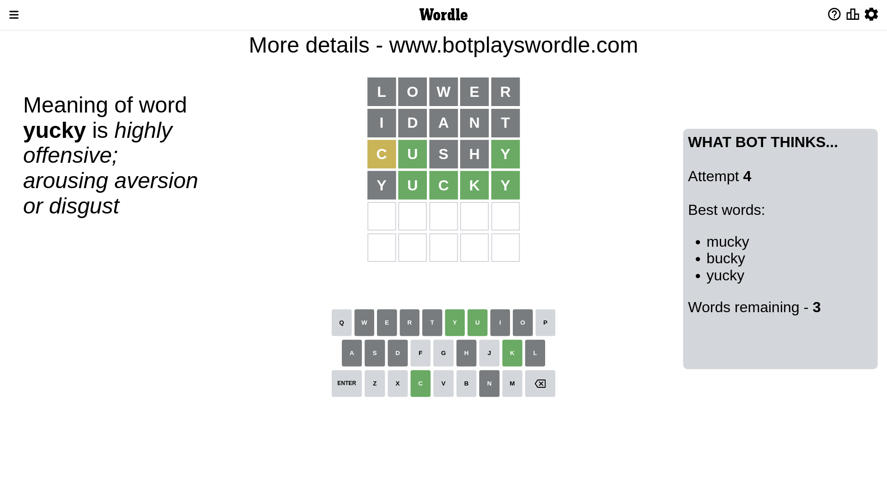
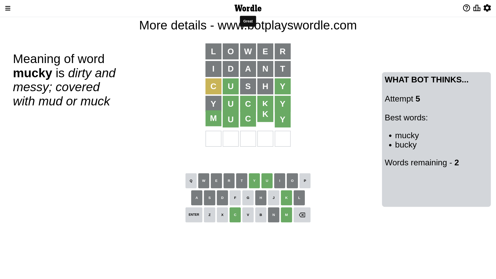

# Wordle for January 19, 2023 - \#579

## Attempt 1

This is the first attempt and we'll choose a random word to start with.

Let's start with word `lower`

Attempt for `lower` gives us 0 correct letters, 0 present letters and 5 wrong letters.

If we look into details, we can see that:

Letter `l` is not present in the word and we will not use it any more

Letter `o` is not present in the word and we will not use it any more

Letter `w` is not present in the word and we will not use it any more

Letter `e` is not present in the word and we will not use it any more

Letter `r` is not present in the word and we will not use it any more

Some letters are missing (like `l`, `o`, `w`, `e`, `r`) but it's also important piece of information

So far we don't know any of the letters!

Not a bad guess in general

## Attempt 2

Right now we have 1260 words to choose from and best of them seem to be `[idant stand daunt ahint hiant]`

So far we know that possible letters are:

At position 1: `[a b c d f g h i j k m n p q s t u v x y z]`

At position 2: `[a b c d f g h i j k m n p q s t u v x y z]`

At position 3: `[a b c d f g h i j k m n p q s t u v x y z]`

At position 4: `[a b c d f g h i j k m n p q s t u v x y z]`

At position 5: `[a b c d f g h i j k m n p q s t u v x y z]`

Next guess is `idant`, let's see what it gives us

Attempt for `idant` gives us 0 correct letters, 0 present letters and 5 wrong letters.

If we look into details, we can see that:

Letter `i` is not present in the word and we will not use it any more

Letter `d` is not present in the word and we will not use it any more

Letter `a` is not present in the word and we will not use it any more

Letter `n` is not present in the word and we will not use it any more

Letter `t` is not present in the word and we will not use it any more

Some letters are missing (like `i`, `d`, `a`, `n`, `t`) but it's also important piece of information

So far we don't know any of the letters!

That was a great guess that limited number of remaining words

## Attempt 3

Right now we have 71 words to choose from and best of them seem to be `[cushy mushy bushy gushy sumph]`

So far we know that possible letters are:

At position 1: `[b c f g h j k m p q s u v x y z]`

At position 2: `[b c f g h j k m p q s u v x y z]`

At position 3: `[b c f g h j k m p q s u v x y z]`

At position 4: `[b c f g h j k m p q s u v x y z]`

At position 5: `[b c f g h j k m p q s u v x y z]`

Next guess is `cushy`, let's see what it gives us

Attempt for `cushy` gives us 2 correct letters, 1 present letters and 2 wrong letters.

If we look into details, we can see that:

Letter `c` is on a different spot - this means that it cannot be at position 1

Letter `u` should be at position 2

Letter `s` is not present in the word and we will not use it any more

Letter `h` is not present in the word and we will not use it any more

Letter `y` should be at position 5

We got information about the correct letters and it should make next attempt easier

Some letters are missing (like `s`, `h`) but it's also important piece of information

Word should contain letters `[c u y]`

That was a great guess that limited number of remaining words

## Attempt 4

Right now we have 3 words to choose from and best of them seem to be `[mucky bucky yucky]`

So far we know that possible letters are:

At position 1: `[b f g j k m p q u v x y z]`

At position 2: `[u]`

At position 3: `[b c f g j k m p q u v x y z]`

At position 4: `[b c f g j k m p q u v x y z]`

At position 5: `[y]`

Next guess is `yucky`, let's see what it gives us

Attempt for `yucky` gives us 4 correct letters, 0 present letters and 1 wrong letters.

If we look into details, we can see that:

Letter `y` is not present in the word and we will not use it any more

Letter `c` should be at position 3

Letter `k` should be at position 4

We got information about the correct letters and it should make next attempt easier

Some letters are missing (like `y`) but it's also important piece of information

Word should contain letters `[c u y k]`

This was a waste, almost no valuable information...

## Attempt 5

Right now we have 2 words to choose from and best of them seem to be `[mucky bucky]`

So far we know that possible letters are:

At position 1: `[b f g j k m p q u v x z]`

At position 2: `[u]`

At position 3: `[c]`

At position 4: `[k]`

At position 5: `[y]`

Next guess is `mucky`, let's see what it gives us

That's the correct answer! The word is `mucky`!

## Conclusion

Today's word is `mucky` and it took 5 attempts to guess it

