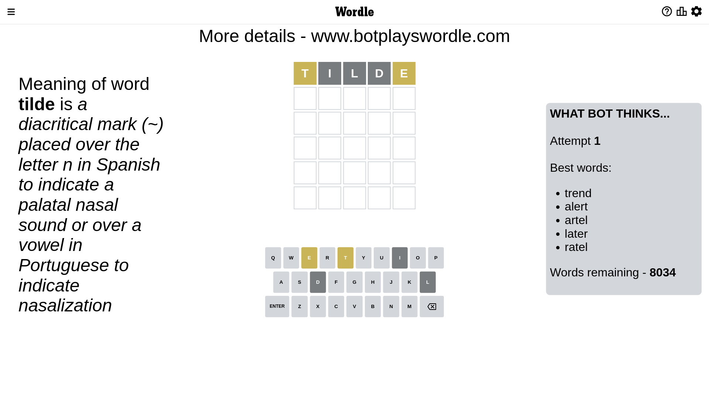
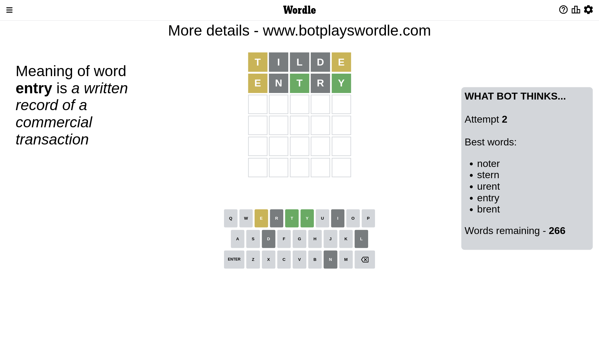
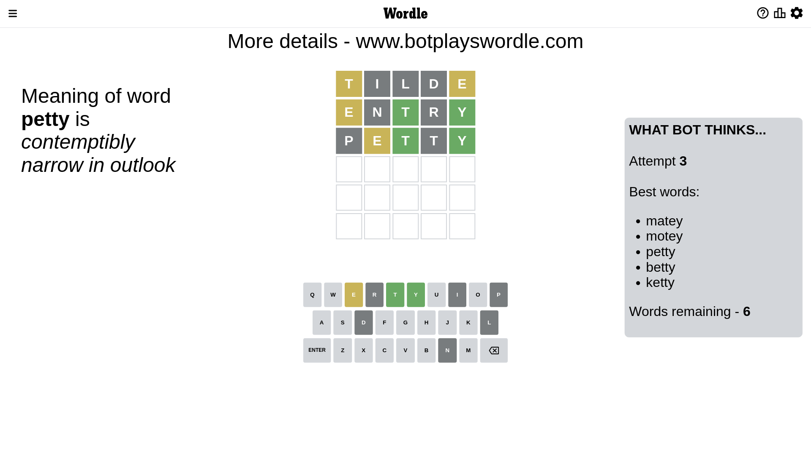
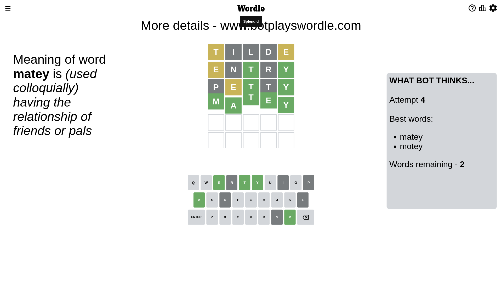

# Wordle for January 22, 2023 - \#582

## Attempt 1

This is the first attempt and we'll choose a random word to start with.

Let's start with word `tilde`

Attempt for `tilde` gives us 0 correct letters, 2 present letters and 3 wrong letters.

If we look into details, we can see that:

Letter `t` is on a different spot - this means that it cannot be at position 1

Letter `i` is not present in the word and we will not use it any more

Letter `l` is not present in the word and we will not use it any more

Letter `d` is not present in the word and we will not use it any more

Letter `e` is on a different spot - this means that it cannot be at position 5

Some letters are missing (like `i`, `l`, `d`) but it's also important piece of information

Word should contain letters `[t e]`

That was a great guess that limited number of remaining words

## Attempt 2

Right now we have 266 words to choose from and best of them seem to be `[noter stern urent entry brent]`

So far we know that possible letters are:

At position 1: `[a b c e f g h j k m n o p q r s u v w x y z]`

At position 2: `[a b c e f g h j k m n o p q r s t u v w x y z]`

At position 3: `[a b c e f g h j k m n o p q r s t u v w x y z]`

At position 4: `[a b c e f g h j k m n o p q r s t u v w x y z]`

At position 5: `[a b c f g h j k m n o p q r s t u v w x y z]`

Next guess is `entry`, let's see what it gives us

Attempt for `entry` gives us 2 correct letters, 1 present letters and 2 wrong letters.

If we look into details, we can see that:

Letter `e` is on a different spot - this means that it cannot be at position 1

Letter `n` is not present in the word and we will not use it any more

Letter `t` should be at position 3

Letter `r` is not present in the word and we will not use it any more

Letter `y` should be at position 5

We got information about the correct letters and it should make next attempt easier

Some letters are missing (like `n`, `r`) but it's also important piece of information

Word should contain letters `[t e y]`

That was a great guess that limited number of remaining words

## Attempt 3

Right now we have 6 words to choose from and best of them seem to be `[matey motey petty betty ketty]`

So far we know that possible letters are:

At position 1: `[a b c f g h j k m o p q s u v w x y z]`

At position 2: `[a b c e f g h j k m o p q s t u v w x y z]`

At position 3: `[t]`

At position 4: `[a b c e f g h j k m o p q s t u v w x y z]`

At position 5: `[y]`

Next guess is `petty`, let's see what it gives us

Attempt for `petty` gives us 2 correct letters, 1 present letters and 2 wrong letters.

If we look into details, we can see that:

Letter `p` is not present in the word and we will not use it any more

Letter `e` is on a different spot - this means that it cannot be at position 2

Letter `t` is not present in the word and we will not use it any more

Some letters are missing (like `p`, `t`) but it's also important piece of information

Word should contain letters `[t e y]`

Could be a better guess

## Attempt 4

Right now we have 2 words to choose from and best of them seem to be `[matey motey]`

So far we know that possible letters are:

At position 1: `[a b c f g h j k m o q s u v w x y z]`

At position 2: `[a b c f g h j k m o q s u v w x y z]`

At position 3: `[t]`

At position 4: `[a b c e f g h j k m o q s u v w x y z]`

At position 5: `[y]`

Next guess is `matey`, let's see what it gives us

That's the correct answer! The word is `matey`!

## Conclusion

Today's word is `matey` and it took 4 attempts to guess it

