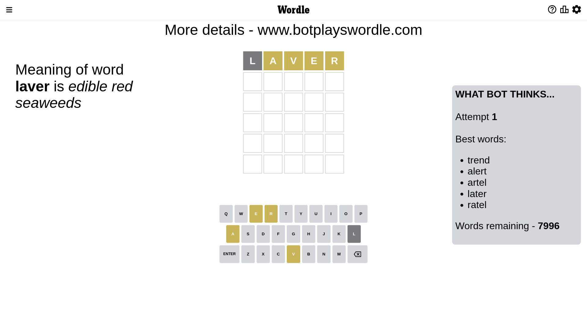
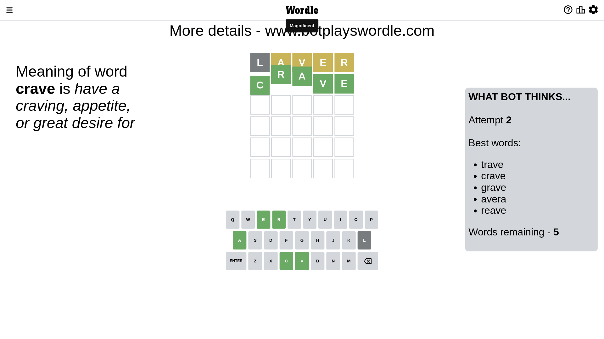

# Wordle for January 30, 2023 - \#590

## Attempt 1

This is the first attempt and we'll choose a random word to start with.

Let's start with word `laver`

Attempt for `laver` gives us 0 correct letters, 4 present letters and 1 wrong letters.

If we look into details, we can see that:

Letter `l` is not present in the word and we will not use it any more

Letter `a` is on a different spot - this means that it cannot be at position 2

Letter `v` is on a different spot - this means that it cannot be at position 3

Letter `e` is on a different spot - this means that it cannot be at position 4

Letter `r` is on a different spot - this means that it cannot be at position 5

Some letters are missing (like `l`) but it's also important piece of information

Word should contain letters `[a v e r]`

That was a great guess that limited number of remaining words

## Attempt 2

Right now we have 5 words to choose from and best of them seem to be `[trave crave grave avera reave]`

So far we know that possible letters are:

At position 1: `[a b c d e f g h i j k m n o p q r s t u v w x y z]`

At position 2: `[b c d e f g h i j k m n o p q r s t u v w x y z]`

At position 3: `[a b c d e f g h i j k m n o p q r s t u w x y z]`

At position 4: `[a b c d f g h i j k m n o p q r s t u v w x y z]`

At position 5: `[a b c d e f g h i j k m n o p q s t u v w x y z]`

Next guess is `crave`, let's see what it gives us

That's the correct answer! The word is `crave`!

## Conclusion

Today's word is `crave` and it took 2 attempts to guess it

