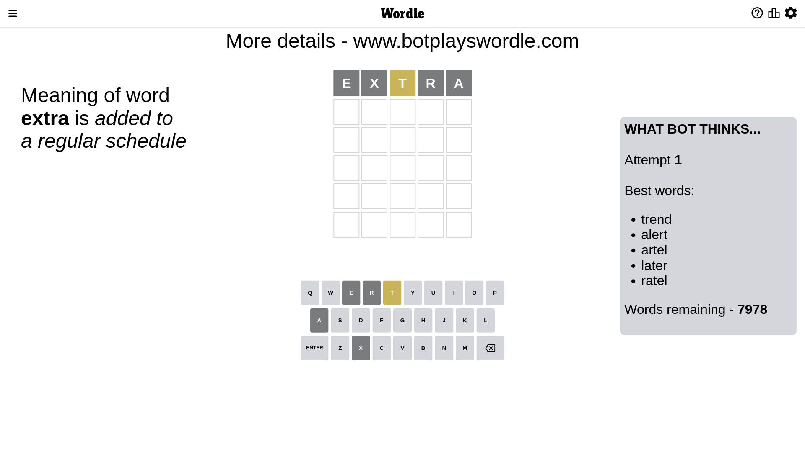
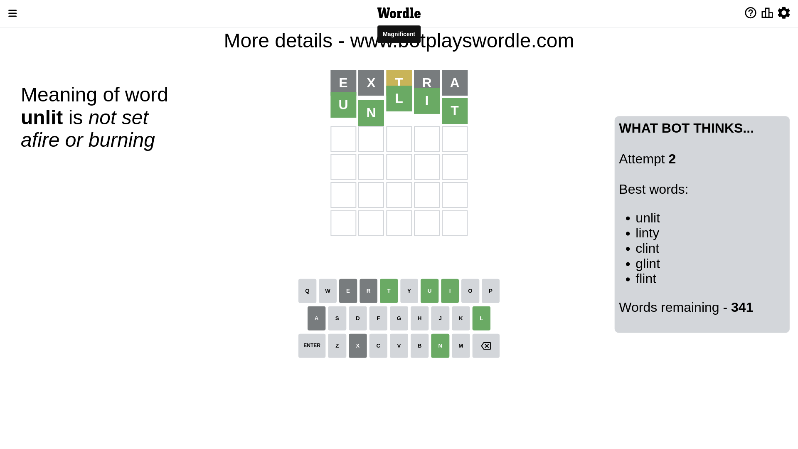

# Wordle for February 4, 2023 - \#595

## Attempt 1

This is the first attempt and we'll choose a random word to start with.

Let's start with word `extra`

Attempt for `extra` gives us 0 correct letters, 1 present letters and 4 wrong letters.

If we look into details, we can see that:

Letter `e` is not present in the word and we will not use it any more

Letter `x` is not present in the word and we will not use it any more

Letter `t` is on a different spot - this means that it cannot be at position 3

Letter `r` is not present in the word and we will not use it any more

Letter `a` is not present in the word and we will not use it any more

Some letters are missing (like `e`, `x`, `r`, `a`) but it's also important piece of information

Word should contain letters `[t]`

That was a great guess that limited number of remaining words

## Attempt 2

Right now we have 341 words to choose from and best of them seem to be `[unlit linty clint glint flint]`

So far we know that possible letters are:

At position 1: `[b c d f g h i j k l m n o p q s t u v w y z]`

At position 2: `[b c d f g h i j k l m n o p q s t u v w y z]`

At position 3: `[b c d f g h i j k l m n o p q s u v w y z]`

At position 4: `[b c d f g h i j k l m n o p q s t u v w y z]`

At position 5: `[b c d f g h i j k l m n o p q s t u v w y z]`

Next guess is `unlit`, let's see what it gives us

That's the correct answer! The word is `unlit`!

To be honest that was a pretty lucky guess, but it worked out well.

## Conclusion

Today's word is `unlit` and it took 2 attempts to guess it

