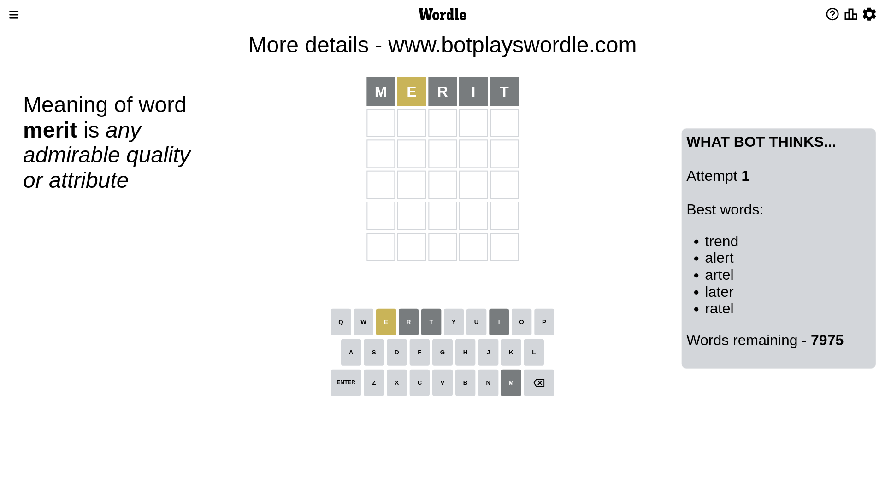
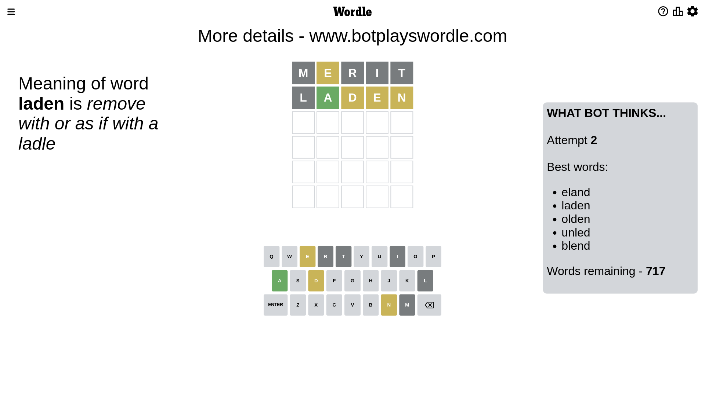
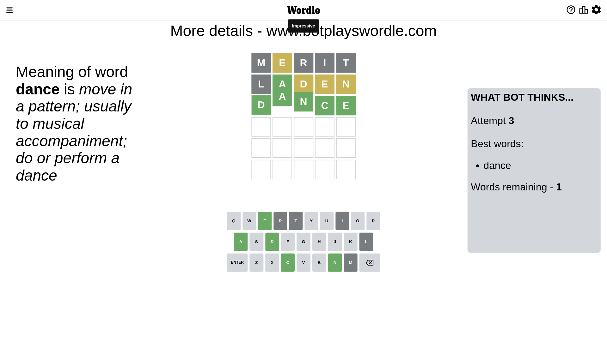

# Wordle for February 5, 2023 - \#596

## Attempt 1

This is the first attempt and we'll choose a random word to start with.

Let's start with word `merit`

Attempt for `merit` gives us 0 correct letters, 1 present letters and 4 wrong letters.

If we look into details, we can see that:

Letter `m` is not present in the word and we will not use it any more

Letter `e` is on a different spot - this means that it cannot be at position 2

Letter `r` is not present in the word and we will not use it any more

Letter `i` is not present in the word and we will not use it any more

Letter `t` is not present in the word and we will not use it any more

Some letters are missing (like `m`, `r`, `i`, `t`) but it's also important piece of information

Word should contain letters `[e]`

That was a great guess that limited number of remaining words

## Attempt 2

Right now we have 717 words to choose from and best of them seem to be `[eland laden olden unled blend]`

So far we know that possible letters are:

At position 1: `[a b c d e f g h j k l n o p q s u v w x y z]`

At position 2: `[a b c d f g h j k l n o p q s u v w x y z]`

At position 3: `[a b c d e f g h j k l n o p q s u v w x y z]`

At position 4: `[a b c d e f g h j k l n o p q s u v w x y z]`

At position 5: `[a b c d e f g h j k l n o p q s u v w x y z]`

Next guess is `laden`, let's see what it gives us

Attempt for `laden` gives us 1 correct letters, 3 present letters and 1 wrong letters.

If we look into details, we can see that:

Letter `l` is not present in the word and we will not use it any more

Letter `a` should be at position 2

Letter `d` is on a different spot - this means that it cannot be at position 3

Letter `e` is on a different spot - this means that it cannot be at position 4

Letter `n` is on a different spot - this means that it cannot be at position 5

We got information about the correct letters and it should make next attempt easier

Some letters are missing (like `l`) but it's also important piece of information

Word should contain letters `[e a d n]`

That was a great guess that limited number of remaining words

## Attempt 3

Right now we have 1 words to choose from and best of them seem to be `[dance]`

So far we know that possible letters are:

At position 1: `[a b c d e f g h j k n o p q s u v w x y z]`

At position 2: `[a]`

At position 3: `[a b c e f g h j k n o p q s u v w x y z]`

At position 4: `[a b c d f g h j k n o p q s u v w x y z]`

At position 5: `[a b c d e f g h j k o p q s u v w x y z]`

It must be `dance`

That's the correct answer! The word is `dance`!

## Conclusion

Today's word is `dance` and it took 3 attempts to guess it

