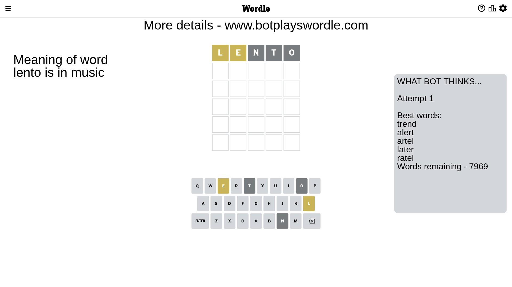
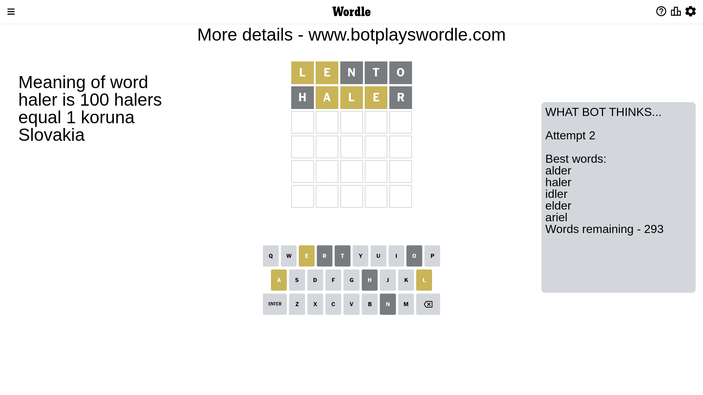
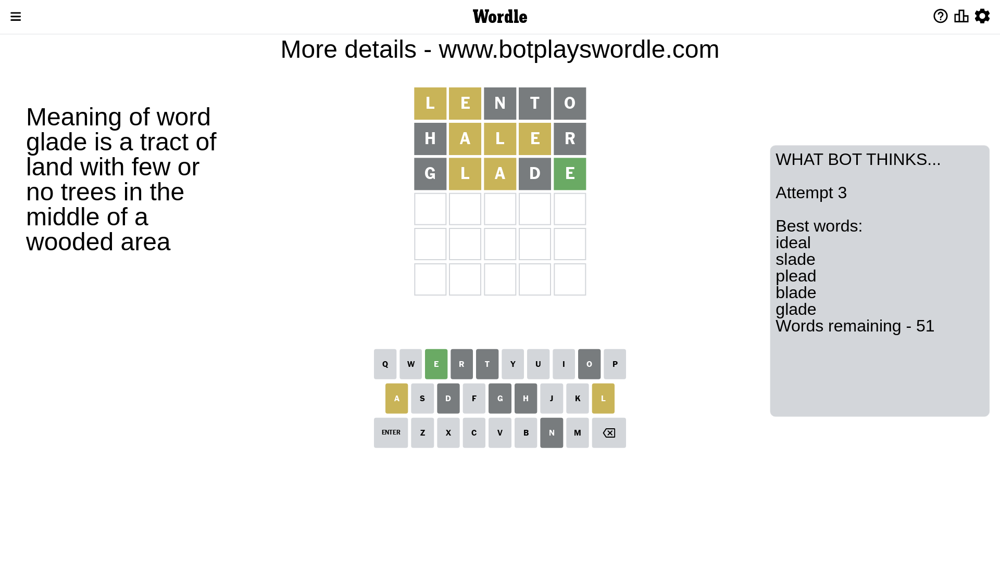
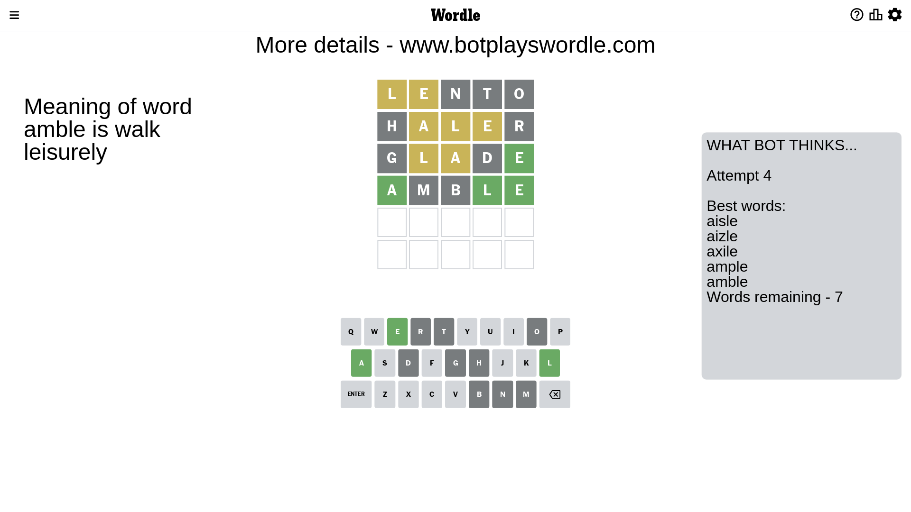
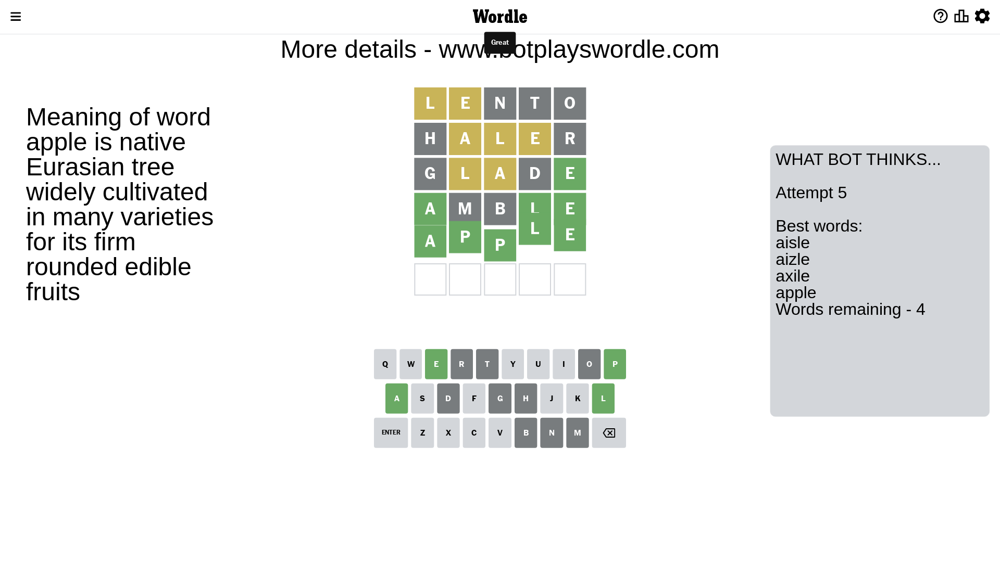

# Wordle for February 7, 2023 - \#598

## Attempt 1

This is the first attempt and we'll choose a random word to start with.

Let's start with word `lento`

Attempt for `lento` gives us 0 correct letters, 2 present letters and 3 wrong letters.

If we look into details, we can see that:

Letter `l` is on a different spot - this means that it cannot be at position 1

Letter `e` is on a different spot - this means that it cannot be at position 2

Letter `n` is not present in the word and we will not use it any more

Letter `t` is not present in the word and we will not use it any more

Letter `o` is not present in the word and we will not use it any more

Some letters are missing (like `n`, `t`, `o`) but it's also important piece of information

Word should contain letters `[l e]`

That was a great guess that limited number of remaining words

## Attempt 2

Right now we have 293 words to choose from and best of them seem to be `[alder haler idler elder ariel]`

So far we know that possible letters are:

At position 1: `[a b c d e f g h i j k m p q r s u v w x y z]`

At position 2: `[a b c d f g h i j k l m p q r s u v w x y z]`

At position 3: `[a b c d e f g h i j k l m p q r s u v w x y z]`

At position 4: `[a b c d e f g h i j k l m p q r s u v w x y z]`

At position 5: `[a b c d e f g h i j k l m p q r s u v w x y z]`

Next guess is `haler`, let's see what it gives us

Attempt for `haler` gives us 0 correct letters, 3 present letters and 2 wrong letters.

If we look into details, we can see that:

Letter `h` is not present in the word and we will not use it any more

Letter `a` is on a different spot - this means that it cannot be at position 2

Letter `l` is on a different spot - this means that it cannot be at position 3

Letter `e` is on a different spot - this means that it cannot be at position 4

Letter `r` is not present in the word and we will not use it any more

Some letters are missing (like `h`, `r`) but it's also important piece of information

Word should contain letters `[l e a]`

Not a bad guess in general

## Attempt 3

Right now we have 52 words to choose from and best of them seem to be `[ideal slade clead plead blade]`

So far we know that possible letters are:

At position 1: `[a b c d e f g i j k m p q s u v w x y z]`

At position 2: `[b c d f g i j k l m p q s u v w x y z]`

At position 3: `[a b c d e f g i j k m p q s u v w x y z]`

At position 4: `[a b c d f g i j k l m p q s u v w x y z]`

At position 5: `[a b c d e f g i j k l m p q s u v w x y z]`

Next guess is `clead`, let's see what it gives us

Wordle does not know word `clead`, need to try something different

## Attempt 3

Right now we have 51 words to choose from and best of them seem to be `[ideal slade plead blade glade]`

So far we know that possible letters are:

At position 1: `[a b c d e f g i j k m p q s u v w x y z]`

At position 2: `[b c d f g i j k l m p q s u v w x y z]`

At position 3: `[a b c d e f g i j k m p q s u v w x y z]`

At position 4: `[a b c d f g i j k l m p q s u v w x y z]`

At position 5: `[a b c d e f g i j k l m p q s u v w x y z]`

Next guess is `glade`, let's see what it gives us

Attempt for `glade` gives us 1 correct letters, 2 present letters and 2 wrong letters.

If we look into details, we can see that:

Letter `g` is not present in the word and we will not use it any more

Letter `l` is on a different spot - this means that it cannot be at position 2

Letter `a` is on a different spot - this means that it cannot be at position 3

Letter `d` is not present in the word and we will not use it any more

Letter `e` should be at position 5

We got information about the correct letters and it should make next attempt easier

Some letters are missing (like `g`, `d`) but it's also important piece of information

Word should contain letters `[l e a]`

Not a bad guess in general

## Attempt 4

Right now we have 7 words to choose from and best of them seem to be `[aisle aizle axile ample amble]`

So far we know that possible letters are:

At position 1: `[a b c e f i j k m p q s u v w x y z]`

At position 2: `[b c f i j k m p q s u v w x y z]`

At position 3: `[b c e f i j k m p q s u v w x y z]`

At position 4: `[a b c f i j k l m p q s u v w x y z]`

At position 5: `[e]`

Next guess is `amble`, let's see what it gives us

Attempt for `amble` gives us 3 correct letters, 0 present letters and 2 wrong letters.

If we look into details, we can see that:

Letter `a` should be at position 1

Letter `m` is not present in the word and we will not use it any more

Letter `b` is not present in the word and we will not use it any more

Letter `l` should be at position 4

We got information about the correct letters and it should make next attempt easier

Some letters are missing (like `m`, `b`) but it's also important piece of information

Word should contain letters `[l e a]`

This was a waste, almost no valuable information...

## Attempt 5

Right now we have 4 words to choose from and best of them seem to be `[aisle aizle axile apple]`

So far we know that possible letters are:

At position 1: `[a]`

At position 2: `[c f i j k p q s u v w x y z]`

At position 3: `[c e f i j k p q s u v w x y z]`

At position 4: `[l]`

At position 5: `[e]`

Next guess is `apple`, let's see what it gives us

That's the correct answer! The word is `apple`!

## Conclusion

Today's word is `apple` and it took 5 attempts to guess it

