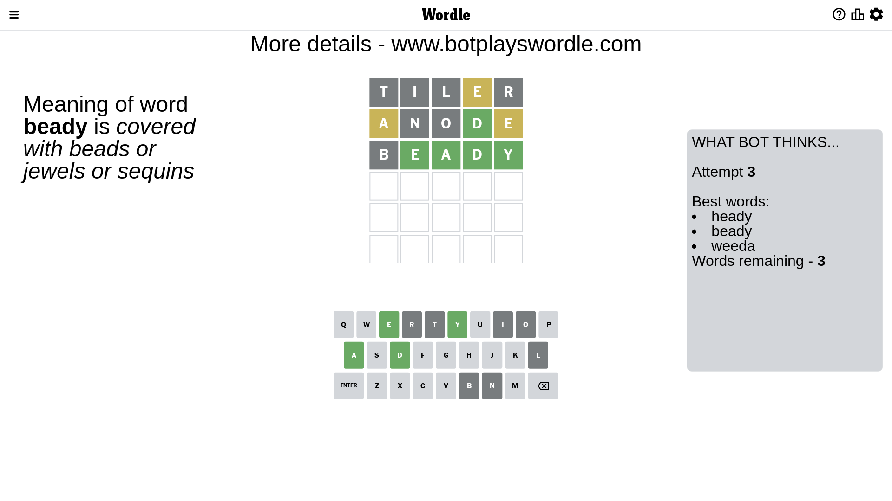

# Wordle for February 10, 2023 - \#601

## Attempt 1

This is the first attempt and we'll choose a random word to start with.

Let's start with word `tiler`

Attempt for `tiler` gives us 0 correct letters, 1 present letters and 4 wrong letters.

If we look into details, we can see that:

Letter `t` is not present in the word and we will not use it any more

Letter `i` is not present in the word and we will not use it any more

Letter `l` is not present in the word and we will not use it any more

Letter `e` is on a different spot - this means that it cannot be at position 4

Letter `r` is not present in the word and we will not use it any more

Some letters are missing (like `t`, `i`, `l`, `r`) but it's also important piece of information

Word should contain letters `[e]`

That was a great guess that limited number of remaining words

## Attempt 2

Right now we have 551 words to choose from and best of them seem to be `[shend hynde anode snead decan]`

So far we know that possible letters are:

At position 1: `[a b c d e f g h j k m n o p q s u v w x y z]`

At position 2: `[a b c d e f g h j k m n o p q s u v w x y z]`

At position 3: `[a b c d e f g h j k m n o p q s u v w x y z]`

At position 4: `[a b c d f g h j k m n o p q s u v w x y z]`

At position 5: `[a b c d e f g h j k m n o p q s u v w x y z]`

Next guess is `anode`, let's see what it gives us

Attempt for `anode` gives us 1 correct letters, 2 present letters and 2 wrong letters.

If we look into details, we can see that:

Letter `a` is on a different spot - this means that it cannot be at position 1

Letter `n` is not present in the word and we will not use it any more

Letter `o` is not present in the word and we will not use it any more

Letter `d` should be at position 4

Letter `e` is on a different spot - this means that it cannot be at position 5

We got information about the correct letters and it should make next attempt easier

Some letters are missing (like `n`, `o`) but it's also important piece of information

Word should contain letters `[e a d]`

That was a great guess that limited number of remaining words

## Attempt 3

Right now we have 3 words to choose from and best of them seem to be `[heady beady weeda]`

So far we know that possible letters are:

At position 1: `[b c d e f g h j k m p q s u v w x y z]`

At position 2: `[a b c d e f g h j k m p q s u v w x y z]`

At position 3: `[a b c d e f g h j k m p q s u v w x y z]`

At position 4: `[d]`

At position 5: `[a b c d f g h j k m p q s u v w x y z]`

Next guess is `beady`, let's see what it gives us

Attempt for `beady` gives us 4 correct letters, 0 present letters and 1 wrong letters.

If we look into details, we can see that:

Letter `b` is not present in the word and we will not use it any more

Letter `e` should be at position 2

Letter `a` should be at position 3

Letter `y` should be at position 5

We got information about the correct letters and it should make next attempt easier

Some letters are missing (like `b`) but it's also important piece of information

Word should contain letters `[e a d y]`

Could be a better guess

## Attempt 4

Right now we have 1 words to choose from and best of them seem to be `[heady]`

So far we know that possible letters are:

At position 1: `[c d e f g h j k m p q s u v w x y z]`

At position 2: `[e]`

At position 3: `[a]`

At position 4: `[d]`

At position 5: `[y]`

It must be `heady`

That's the correct answer! The word is `heady`!

## Conclusion

Today's word is `heady` and it took 4 attempts to guess it

