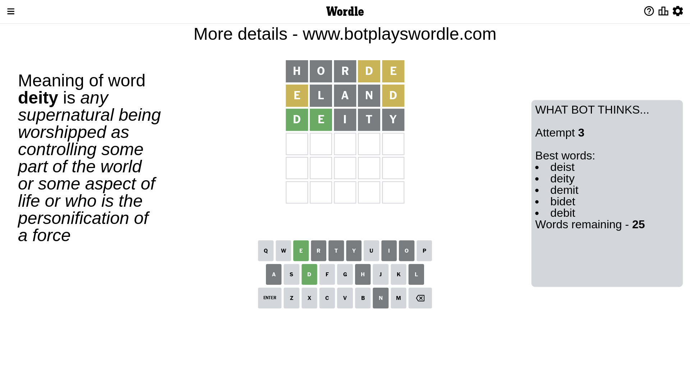
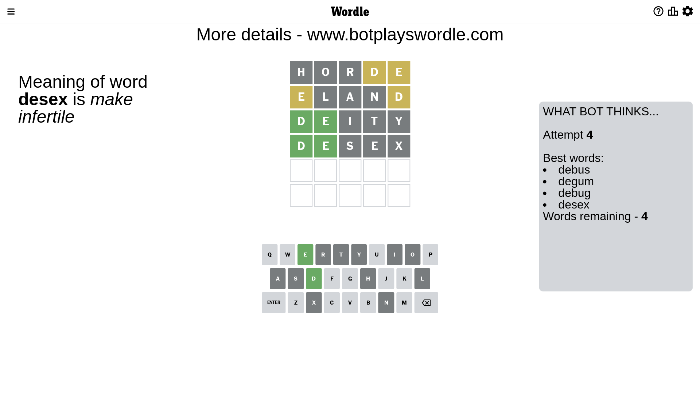

# Wordle for February 11, 2023 - \#602

## Attempt 1

This is the first attempt and we'll choose a random word to start with.

Let's start with word `tuner`

Attempt for `tuner` gives us 0 correct letters, 2 present letters and 3 wrong letters.

If we look into details, we can see that:

Letter `t` is not present in the word and we will not use it any more

Letter `u` is on a different spot - this means that it cannot be at position 2

Letter `n` is not present in the word and we will not use it any more

Letter `e` is on a different spot - this means that it cannot be at position 4

Letter `r` is not present in the word and we will not use it any more

Some letters are missing (like `t`, `n`, `r`) but it's also important piece of information

Word should contain letters `[u e]`

That was a great guess that limited number of remaining words

## Attempt 2

Right now we have 101 words to choose from and best of them seem to be `[lehua leuch peuhl udell amelu]`

So far we know that possible letters are:

At position 1: `[a b c d e f g h i j k l m o p q s u v w x y z]`

At position 2: `[a b c d e f g h i j k l m o p q s v w x y z]`

At position 3: `[a b c d e f g h i j k l m o p q s u v w x y z]`

At position 4: `[a b c d f g h i j k l m o p q s u v w x y z]`

At position 5: `[a b c d e f g h i j k l m o p q s u v w x y z]`

Next guess is `peuhl`, let's see what it gives us

Wordle does not know word `peuhl`, need to try something different

## Attempt 2

Right now we have 100 words to choose from and best of them seem to be `[lehua leuch udell amelu leuma]`

So far we know that possible letters are:

At position 1: `[a b c d e f g h i j k l m o p q s u v w x y z]`

At position 2: `[a b c d e f g h i j k l m o p q s v w x y z]`

At position 3: `[a b c d e f g h i j k l m o p q s u v w x y z]`

At position 4: `[a b c d f g h i j k l m o p q s u v w x y z]`

At position 5: `[a b c d e f g h i j k l m o p q s u v w x y z]`

Next guess is `amelu`, let's see what it gives us

Wordle does not know word `amelu`, need to try something different

## Attempt 2

Right now we have 99 words to choose from and best of them seem to be `[lehua leuch udell leuma ulema]`

So far we know that possible letters are:

At position 1: `[a b c d e f g h i j k l m o p q s u v w x y z]`

At position 2: `[a b c d e f g h i j k l m o p q s v w x y z]`

At position 3: `[a b c d e f g h i j k l m o p q s u v w x y z]`

At position 4: `[a b c d f g h i j k l m o p q s u v w x y z]`

At position 5: `[a b c d e f g h i j k l m o p q s u v w x y z]`

Next guess is `lehua`, let's see what it gives us

Attempt for `lehua` gives us 2 correct letters, 0 present letters and 3 wrong letters.

If we look into details, we can see that:

Letter `l` is not present in the word and we will not use it any more

Letter `e` should be at position 2

Letter `h` is not present in the word and we will not use it any more

Letter `u` should be at position 4

Letter `a` is not present in the word and we will not use it any more

We got information about the correct letters and it should make next attempt easier

Some letters are missing (like `l`, `h`, `a`) but it's also important piece of information

Word should contain letters `[u e]`

That was a great guess that limited number of remaining words

## Attempt 3

Right now we have 9 words to choose from and best of them seem to be `[sedum debus bemud degum sebum]`

So far we know that possible letters are:

At position 1: `[b c d e f g i j k m o p q s u v w x y z]`

At position 2: `[e]`

At position 3: `[b c d e f g i j k m o p q s u v w x y z]`

At position 4: `[u]`

At position 5: `[b c d e f g i j k m o p q s u v w x y z]`

Next guess is `degum`, let's see what it gives us

Attempt for `degum` gives us 3 correct letters, 1 present letters and 1 wrong letters.

If we look into details, we can see that:

Letter `d` should be at position 1

Letter `g` is on a different spot - this means that it cannot be at position 3

Letter `m` is not present in the word and we will not use it any more

We got information about the correct letters and it should make next attempt easier

Some letters are missing (like `m`) but it's also important piece of information

Word should contain letters `[u e d g]`

That was a great guess that limited number of remaining words

## Attempt 4

Something went wrong and we are out of possible guesses. Just use some dummy word and loose the game

Next guess is `wrong`, let's see what it gives us

Attempt for `wrong` gives us 1 correct letters, 0 present letters and 4 wrong letters.

If we look into details, we can see that:

Letter `w` is not present in the word and we will not use it any more

Letter `r` is not present in the word and we will not use it any more

Letter `o` is not present in the word and we will not use it any more

Letter `n` is not present in the word and we will not use it any more

Letter `g` should be at position 5

We got information about the correct letters and it should make next attempt easier

Some letters are missing (like `w`, `r`, `o`, `n`) but it's also important piece of information

Word should contain letters `[u e d g]`

This was a waste, almost no valuable information...

## Attempt 5

Something went wrong and we are out of possible guesses. Just use some dummy word and loose the game

Next guess is `wrong`, let's see what it gives us

Attempt for `wrong` gives us 1 correct letters, 0 present letters and 4 wrong letters.

If we look into details, we can see that:

Letter `w` is not present in the word and we will not use it any more

Letter `r` is not present in the word and we will not use it any more

Letter `o` is not present in the word and we will not use it any more

Letter `n` is not present in the word and we will not use it any more

Some letters are missing (like `w`, `r`, `o`, `n`) but it's also important piece of information

Word should contain letters `[u e d g]`

This was a waste, almost no valuable information...

## Attempt 6

Something went wrong and we are out of possible guesses. Just use some dummy word and loose the game

Next guess is `wrong`, let's see what it gives us

Attempt for `wrong` gives us 1 correct letters, 0 present letters and 4 wrong letters.

If we look into details, we can see that:

Letter `w` is not present in the word and we will not use it any more

Letter `r` is not present in the word and we will not use it any more

Letter `o` is not present in the word and we will not use it any more

Letter `n` is not present in the word and we will not use it any more

Some letters are missing (like `w`, `r`, `o`, `n`) but it's also important piece of information

Word should contain letters `[u e d g]`

This was a waste, almost no valuable information...

## Conclusion

Today we failed to guess the word after 6 attempts, that was really tricky. Maybe we will be more lucky next time.

