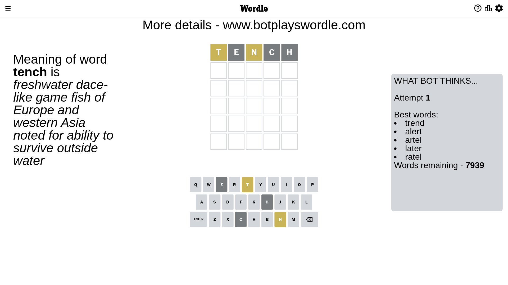
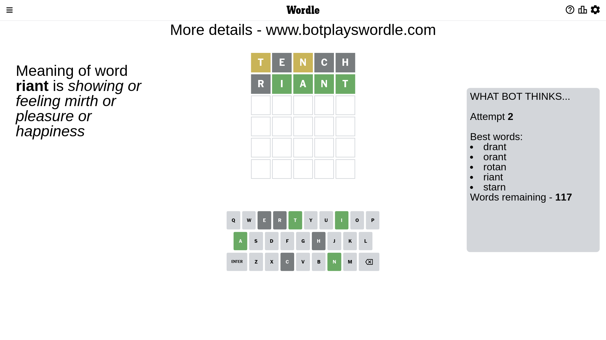
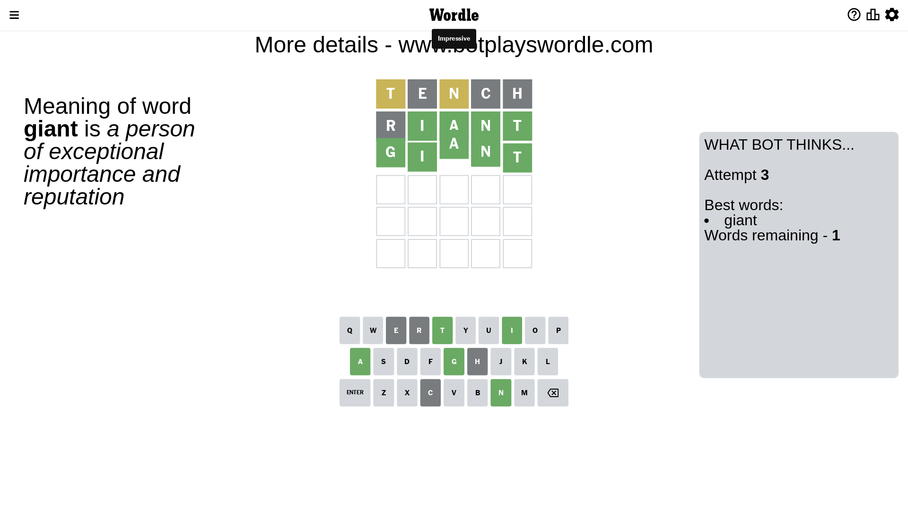

# Wordle for February 12, 2023 - \#603

## Attempt 1

This is the first attempt and we'll choose a random word to start with.

Let's start with word `tench`

Attempt for `tench` gives us 0 correct letters, 2 present letters and 3 wrong letters.

If we look into details, we can see that:

Letter `t` is on a different spot - this means that it cannot be at position 1

Letter `e` is not present in the word and we will not use it any more

Letter `n` is on a different spot - this means that it cannot be at position 3

Letter `c` is not present in the word and we will not use it any more

Letter `h` is not present in the word and we will not use it any more

Some letters are missing (like `e`, `c`, `h`) but it's also important piece of information

Word should contain letters `[t n]`

That was a great guess that limited number of remaining words

## Attempt 2

Right now we have 117 words to choose from and best of them seem to be `[drant orant rotan riant starn]`

So far we know that possible letters are:

At position 1: `[a b d f g i j k l m n o p q r s u v w x y z]`

At position 2: `[a b d f g i j k l m n o p q r s t u v w x y z]`

At position 3: `[a b d f g i j k l m o p q r s t u v w x y z]`

At position 4: `[a b d f g i j k l m n o p q r s t u v w x y z]`

At position 5: `[a b d f g i j k l m n o p q r s t u v w x y z]`

Next guess is `riant`, let's see what it gives us

Attempt for `riant` gives us 4 correct letters, 0 present letters and 1 wrong letters.

If we look into details, we can see that:

Letter `r` is not present in the word and we will not use it any more

Letter `i` should be at position 2

Letter `a` should be at position 3

Letter `n` should be at position 4

Letter `t` should be at position 5

We got information about the correct letters and it should make next attempt easier

Some letters are missing (like `r`) but it's also important piece of information

Word should contain letters `[t n i a]`

That was a great guess that limited number of remaining words

## Attempt 3

Right now we have 1 words to choose from and best of them seem to be `[giant]`

So far we know that possible letters are:

At position 1: `[a b d f g i j k l m n o p q s u v w x y z]`

At position 2: `[i]`

At position 3: `[a]`

At position 4: `[n]`

At position 5: `[t]`

It must be `giant`

That's the correct answer! The word is `giant`!

## Conclusion

Today's word is `giant` and it took 3 attempts to guess it

