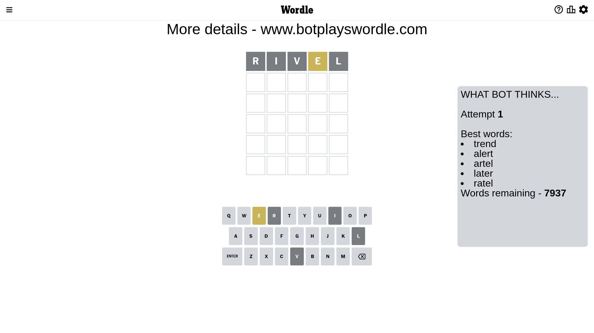
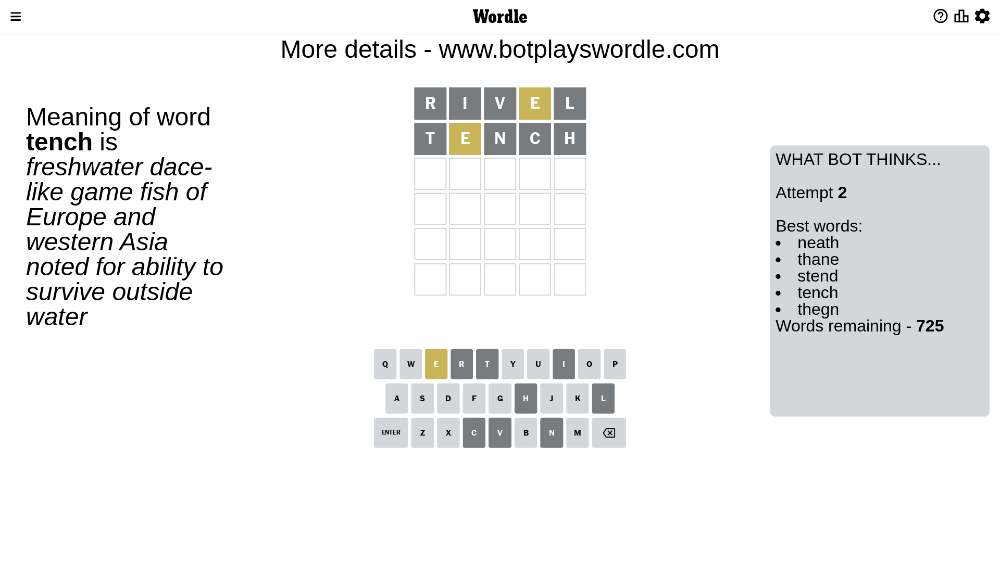
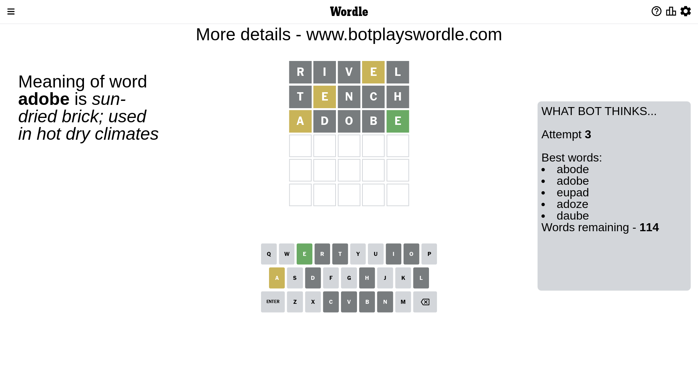
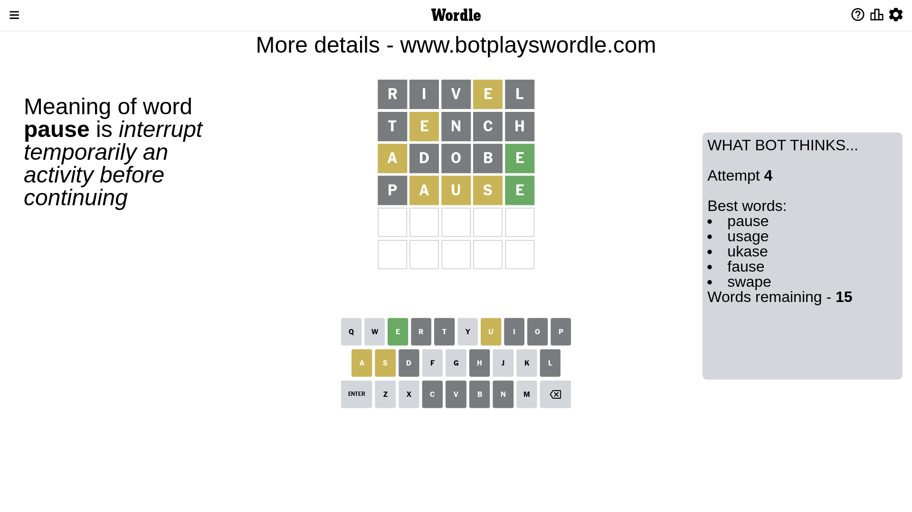
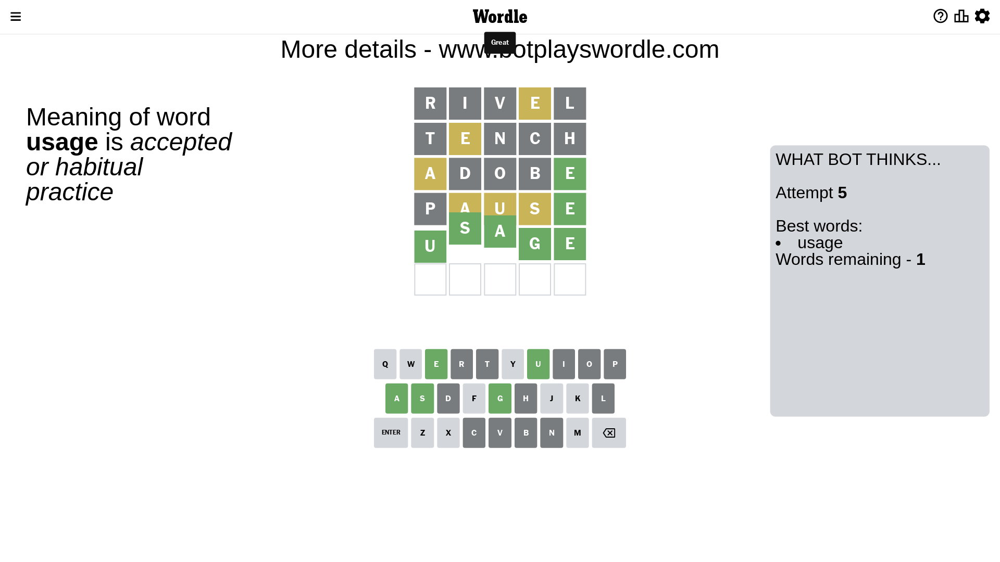

# Wordle for February 13, 2023 - \#604

## Attempt 1

This is the first attempt and we'll choose a random word to start with.

Let's start with word `rivel`

Attempt for `rivel` gives us 0 correct letters, 1 present letters and 4 wrong letters.

If we look into details, we can see that:

Letter `r` is not present in the word and we will not use it any more

Letter `i` is not present in the word and we will not use it any more

Letter `v` is not present in the word and we will not use it any more

Letter `e` is on a different spot - this means that it cannot be at position 4

Letter `l` is not present in the word and we will not use it any more

Some letters are missing (like `r`, `i`, `v`, `l`) but it's also important piece of information

Word should contain letters `[e]`

That was a great guess that limited number of remaining words

## Attempt 2

Right now we have 725 words to choose from and best of them seem to be `[neath thane stend tench thegn]`

So far we know that possible letters are:

At position 1: `[a b c d e f g h j k m n o p q s t u w x y z]`

At position 2: `[a b c d e f g h j k m n o p q s t u w x y z]`

At position 3: `[a b c d e f g h j k m n o p q s t u w x y z]`

At position 4: `[a b c d f g h j k m n o p q s t u w x y z]`

At position 5: `[a b c d e f g h j k m n o p q s t u w x y z]`

Next guess is `tench`, let's see what it gives us

Attempt for `tench` gives us 0 correct letters, 1 present letters and 4 wrong letters.

If we look into details, we can see that:

Letter `t` is not present in the word and we will not use it any more

Letter `e` is on a different spot - this means that it cannot be at position 2

Letter `n` is not present in the word and we will not use it any more

Letter `c` is not present in the word and we will not use it any more

Letter `h` is not present in the word and we will not use it any more

Some letters are missing (like `t`, `n`, `c`, `h`) but it's also important piece of information

Word should contain letters `[e]`

Not a bad guess in general

## Attempt 3

Right now we have 114 words to choose from and best of them seem to be `[abode adobe eupad adoze daube]`

So far we know that possible letters are:

At position 1: `[a b d e f g j k m o p q s u w x y z]`

At position 2: `[a b d f g j k m o p q s u w x y z]`

At position 3: `[a b d e f g j k m o p q s u w x y z]`

At position 4: `[a b d f g j k m o p q s u w x y z]`

At position 5: `[a b d e f g j k m o p q s u w x y z]`

Next guess is `adobe`, let's see what it gives us

Attempt for `adobe` gives us 1 correct letters, 1 present letters and 3 wrong letters.

If we look into details, we can see that:

Letter `a` is on a different spot - this means that it cannot be at position 1

Letter `d` is not present in the word and we will not use it any more

Letter `o` is not present in the word and we will not use it any more

Letter `b` is not present in the word and we will not use it any more

Letter `e` should be at position 5

We got information about the correct letters and it should make next attempt easier

Some letters are missing (like `d`, `o`, `b`) but it's also important piece of information

Word should contain letters `[e a]`

Not a bad guess in general

## Attempt 4

Right now we have 15 words to choose from and best of them seem to be `[pause usage ukase fause swape]`

So far we know that possible letters are:

At position 1: `[e f g j k m p q s u w x y z]`

At position 2: `[a f g j k m p q s u w x y z]`

At position 3: `[a e f g j k m p q s u w x y z]`

At position 4: `[a f g j k m p q s u w x y z]`

At position 5: `[e]`

Next guess is `pause`, let's see what it gives us

Attempt for `pause` gives us 1 correct letters, 3 present letters and 1 wrong letters.

If we look into details, we can see that:

Letter `p` is not present in the word and we will not use it any more

Letter `a` is on a different spot - this means that it cannot be at position 2

Letter `u` is on a different spot - this means that it cannot be at position 3

Letter `s` is on a different spot - this means that it cannot be at position 4

Some letters are missing (like `p`) but it's also important piece of information

Word should contain letters `[e a u s]`

That was a great guess that limited number of remaining words

## Attempt 5

Right now we have 1 words to choose from and best of them seem to be `[usage]`

So far we know that possible letters are:

At position 1: `[e f g j k m q s u w x y z]`

At position 2: `[f g j k m q s u w x y z]`

At position 3: `[a e f g j k m q s w x y z]`

At position 4: `[a f g j k m q u w x y z]`

At position 5: `[e]`

It must be `usage`

That's the correct answer! The word is `usage`!

## Conclusion

Today's word is `usage` and it took 5 attempts to guess it

