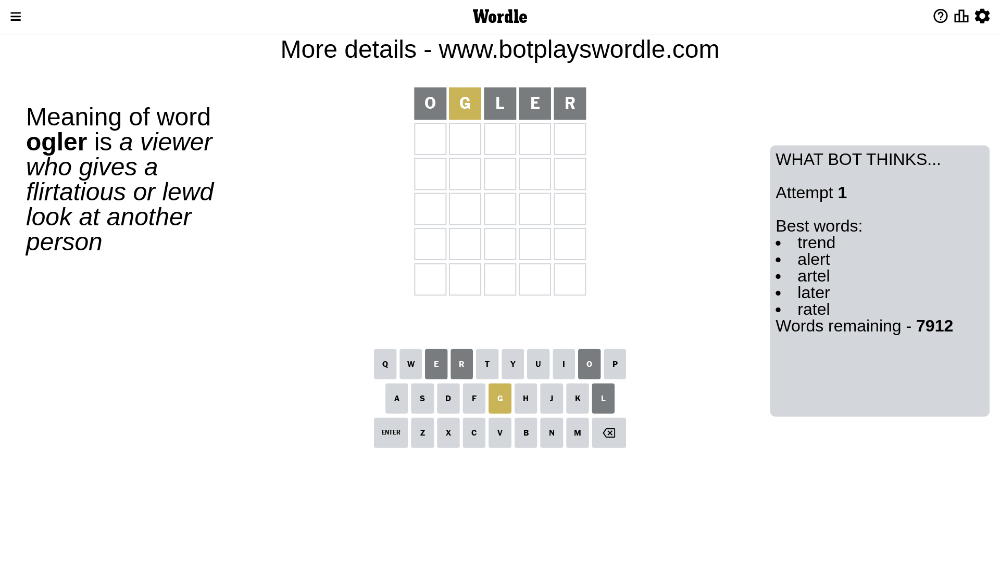
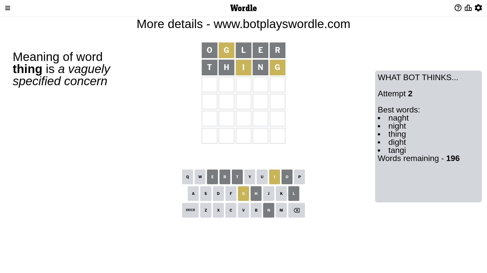
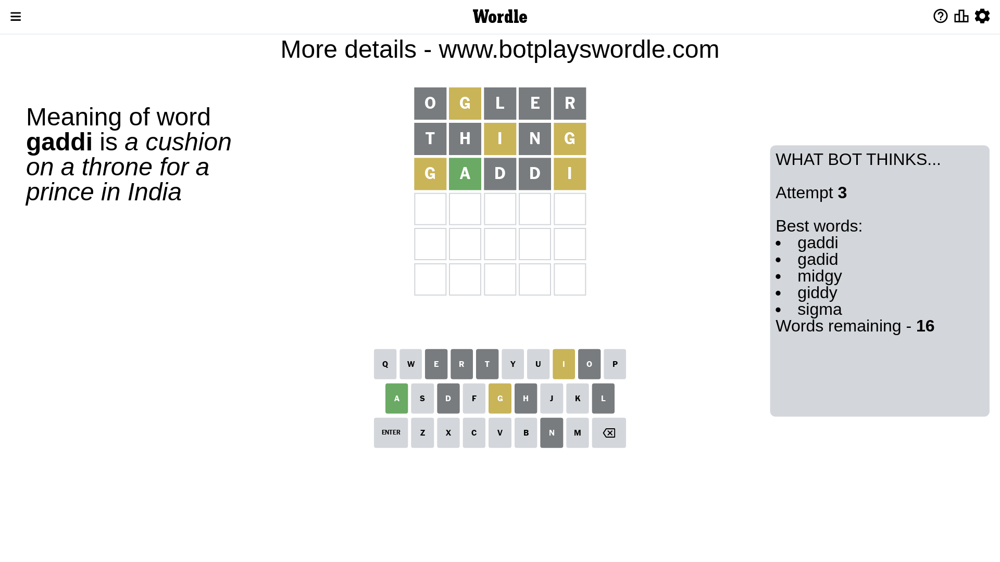
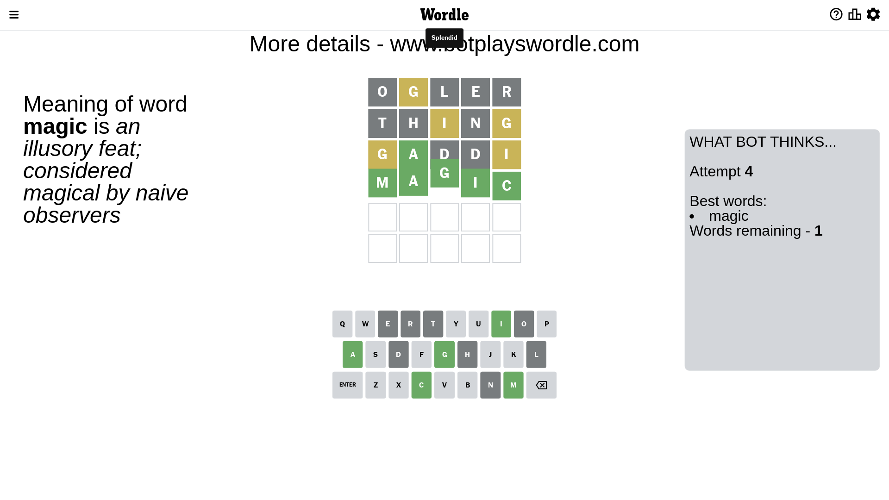

# Wordle for February 16, 2023 - \#607

## Attempt 1

This is the first attempt and we'll choose a random word to start with.

Let's start with word `ogler`

Attempt for `ogler` gives us 0 correct letters, 1 present letters and 4 wrong letters.

If we look into details, we can see that:

Letter `o` is not present in the word and we will not use it any more

Letter `g` is on a different spot - this means that it cannot be at position 2

Letter `l` is not present in the word and we will not use it any more

Letter `e` is not present in the word and we will not use it any more

Letter `r` is not present in the word and we will not use it any more

Some letters are missing (like `o`, `l`, `e`, `r`) but it's also important piece of information

Word should contain letters `[g]`

That was a great guess that limited number of remaining words

## Attempt 2

Right now we have 196 words to choose from and best of them seem to be `[naght night thing dight tangi]`

So far we know that possible letters are:

At position 1: `[a b c d f g h i j k m n p q s t u v w x y z]`

At position 2: `[a b c d f h i j k m n p q s t u v w x y z]`

At position 3: `[a b c d f g h i j k m n p q s t u v w x y z]`

At position 4: `[a b c d f g h i j k m n p q s t u v w x y z]`

At position 5: `[a b c d f g h i j k m n p q s t u v w x y z]`

Next guess is `thing`, let's see what it gives us

Attempt for `thing` gives us 0 correct letters, 2 present letters and 3 wrong letters.

If we look into details, we can see that:

Letter `t` is not present in the word and we will not use it any more

Letter `h` is not present in the word and we will not use it any more

Letter `i` is on a different spot - this means that it cannot be at position 3

Letter `n` is not present in the word and we will not use it any more

Letter `g` is on a different spot - this means that it cannot be at position 5

Some letters are missing (like `t`, `h`, `n`) but it's also important piece of information

Word should contain letters `[g i]`

That was a great guess that limited number of remaining words

## Attempt 3

Right now we have 16 words to choose from and best of them seem to be `[gaddi gadid midgy giddy sigma]`

So far we know that possible letters are:

At position 1: `[a b c d f g i j k m p q s u v w x y z]`

At position 2: `[a b c d f i j k m p q s u v w x y z]`

At position 3: `[a b c d f g j k m p q s u v w x y z]`

At position 4: `[a b c d f g i j k m p q s u v w x y z]`

At position 5: `[a b c d f i j k m p q s u v w x y z]`

Next guess is `gaddi`, let's see what it gives us

Attempt for `gaddi` gives us 1 correct letters, 2 present letters and 2 wrong letters.

If we look into details, we can see that:

Letter `g` is on a different spot - this means that it cannot be at position 1

Letter `a` should be at position 2

Letter `d` is not present in the word and we will not use it any more

Letter `d` is not present in the word and we will not use it any more

Letter `i` is on a different spot - this means that it cannot be at position 5

We got information about the correct letters and it should make next attempt easier

Some letters are missing (like `d`) but it's also important piece of information

Word should contain letters `[g i a]`

That was a great guess that limited number of remaining words

## Attempt 4

Right now we have 1 words to choose from and best of them seem to be `[magic]`

So far we know that possible letters are:

At position 1: `[a b c f i j k m p q s u v w x y z]`

At position 2: `[a]`

At position 3: `[a b c f g j k m p q s u v w x y z]`

At position 4: `[a b c f g i j k m p q s u v w x y z]`

At position 5: `[a b c f j k m p q s u v w x y z]`

It must be `magic`

That's the correct answer! The word is `magic`!

## Conclusion

Today's word is `magic` and it took 4 attempts to guess it

