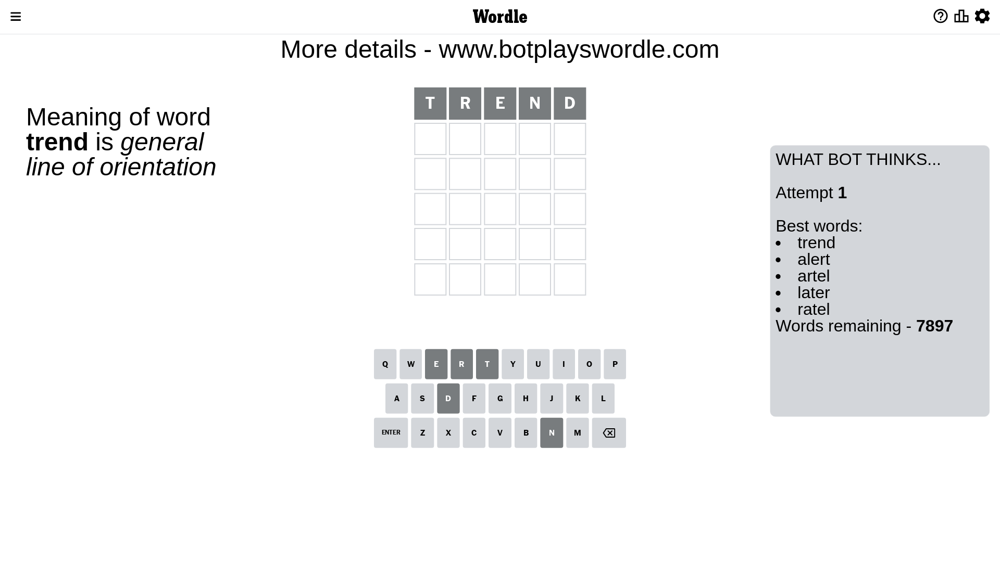
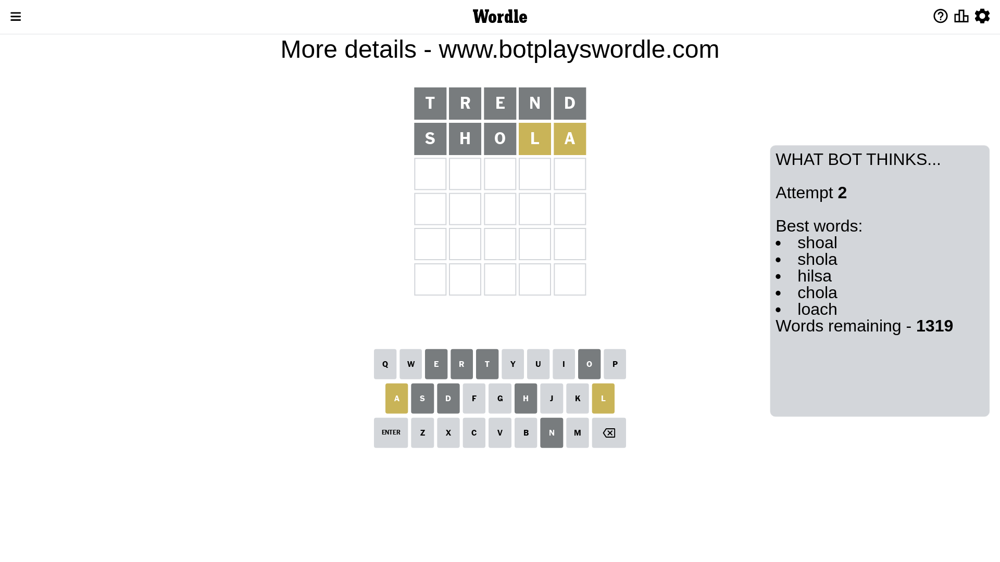
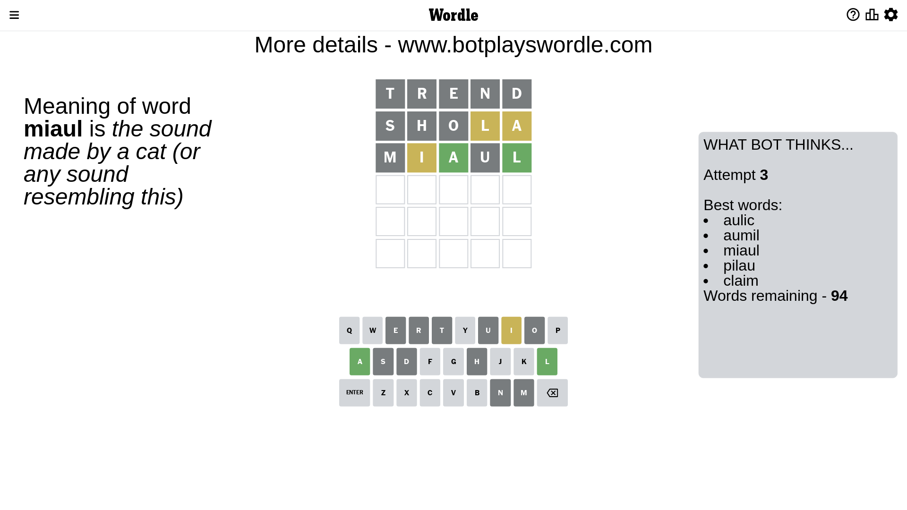
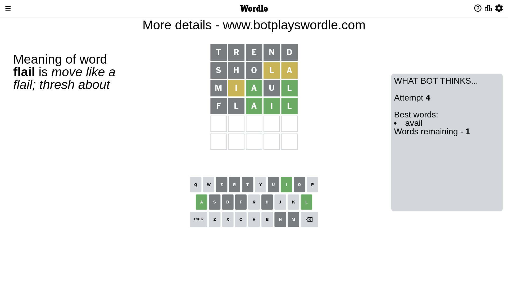
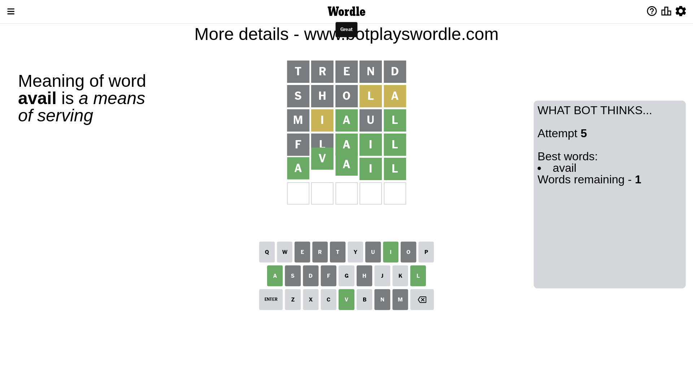

# Wordle for February 18, 2023 - \#609

## Attempt 1

This is the first attempt and we'll choose a random word to start with.

Let's start with word `trend`

Attempt for `trend` gives us 0 correct letters, 0 present letters and 5 wrong letters.

If we look into details, we can see that:

Letter `t` is not present in the word and we will not use it any more

Letter `r` is not present in the word and we will not use it any more

Letter `e` is not present in the word and we will not use it any more

Letter `n` is not present in the word and we will not use it any more

Letter `d` is not present in the word and we will not use it any more

Some letters are missing (like `t`, `r`, `e`, `n`, `d`) but it's also important piece of information

So far we don't know any of the letters!

Not a bad guess in general

## Attempt 2

Right now we have 1319 words to choose from and best of them seem to be `[shoal shola hilsa chola loach]`

So far we know that possible letters are:

At position 1: `[a b c f g h i j k l m o p q s u v w x y z]`

At position 2: `[a b c f g h i j k l m o p q s u v w x y z]`

At position 3: `[a b c f g h i j k l m o p q s u v w x y z]`

At position 4: `[a b c f g h i j k l m o p q s u v w x y z]`

At position 5: `[a b c f g h i j k l m o p q s u v w x y z]`

Next guess is `shola`, let's see what it gives us

Attempt for `shola` gives us 0 correct letters, 2 present letters and 3 wrong letters.

If we look into details, we can see that:

Letter `s` is not present in the word and we will not use it any more

Letter `h` is not present in the word and we will not use it any more

Letter `o` is not present in the word and we will not use it any more

Letter `l` is on a different spot - this means that it cannot be at position 4

Letter `a` is on a different spot - this means that it cannot be at position 5

Some letters are missing (like `s`, `h`, `o`) but it's also important piece of information

Word should contain letters `[l a]`

That was a great guess that limited number of remaining words

## Attempt 3

Right now we have 94 words to choose from and best of them seem to be `[aulic aumil miaul pilau claim]`

So far we know that possible letters are:

At position 1: `[a b c f g i j k l m p q u v w x y z]`

At position 2: `[a b c f g i j k l m p q u v w x y z]`

At position 3: `[a b c f g i j k l m p q u v w x y z]`

At position 4: `[a b c f g i j k m p q u v w x y z]`

At position 5: `[b c f g i j k l m p q u v w x y z]`

Next guess is `miaul`, let's see what it gives us

Attempt for `miaul` gives us 2 correct letters, 1 present letters and 2 wrong letters.

If we look into details, we can see that:

Letter `m` is not present in the word and we will not use it any more

Letter `i` is on a different spot - this means that it cannot be at position 2

Letter `a` should be at position 3

Letter `u` is not present in the word and we will not use it any more

Letter `l` should be at position 5

We got information about the correct letters and it should make next attempt easier

Some letters are missing (like `m`, `u`) but it's also important piece of information

Word should contain letters `[l a i]`

That was a great guess that limited number of remaining words

## Attempt 4

Right now we have 1 words to choose from and best of them seem to be `[avail]`

So far we know that possible letters are:

At position 1: `[a b c f g i j k l p q v w x y z]`

At position 2: `[a b c f g j k l p q v w x y z]`

At position 3: `[a]`

At position 4: `[a b c f g i j k p q v w x y z]`

At position 5: `[l]`

It must be `flail`

Attempt for `flail` gives us 3 correct letters, 0 present letters and 2 wrong letters.

If we look into details, we can see that:

Letter `f` is not present in the word and we will not use it any more

Letter `l` is not present in the word and we will not use it any more

Letter `i` should be at position 4

We got information about the correct letters and it should make next attempt easier

Some letters are missing (like `f`, `l`) but it's also important piece of information

Word should contain letters `[l a i]`

This was a waste, almost no valuable information...

## Attempt 5

Right now we have 1 words to choose from and best of them seem to be `[avail]`

So far we know that possible letters are:

At position 1: `[a b c g i j k p q v w x y z]`

At position 2: `[a b c g j k p q v w x y z]`

At position 3: `[a]`

At position 4: `[i]`

At position 5: `[l]`

It must be `avail`

That's the correct answer! The word is `avail`!

## Conclusion

Today's word is `avail` and it took 5 attempts to guess it

