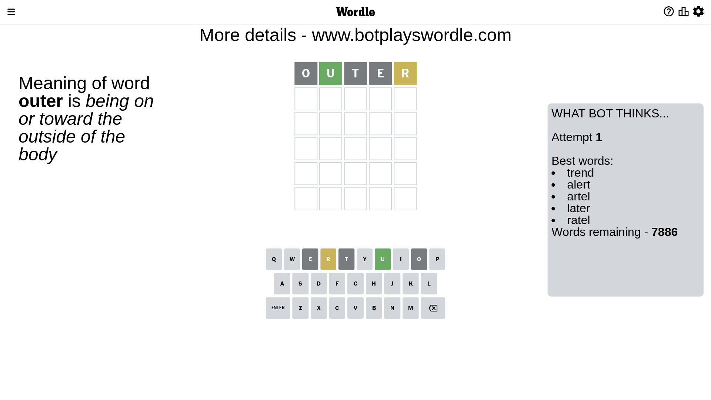
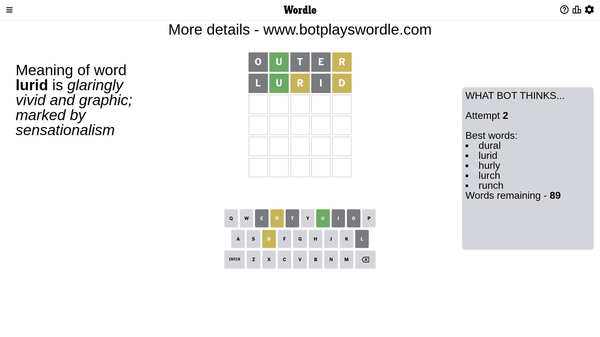
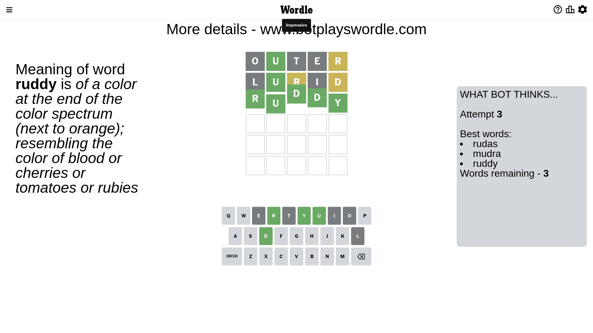

# Wordle for February 21, 2023 - \#612

## Attempt 1

This is the first attempt and we'll choose a random word to start with.

Let's start with word `outer`

Attempt for `outer` gives us 1 correct letters, 1 present letters and 3 wrong letters.

If we look into details, we can see that:

Letter `o` is not present in the word and we will not use it any more

Letter `u` should be at position 2

Letter `t` is not present in the word and we will not use it any more

Letter `e` is not present in the word and we will not use it any more

Letter `r` is on a different spot - this means that it cannot be at position 5

We got information about the correct letters and it should make next attempt easier

Some letters are missing (like `o`, `t`, `e`) but it's also important piece of information

Word should contain letters `[u r]`

That was a great guess that limited number of remaining words

## Attempt 2

Right now we have 89 words to choose from and best of them seem to be `[dural lurid hurly lurch runch]`

So far we know that possible letters are:

At position 1: `[a b c d f g h i j k l m n p q r s u v w x y z]`

At position 2: `[u]`

At position 3: `[a b c d f g h i j k l m n p q r s u v w x y z]`

At position 4: `[a b c d f g h i j k l m n p q r s u v w x y z]`

At position 5: `[a b c d f g h i j k l m n p q s u v w x y z]`

Next guess is `lurid`, let's see what it gives us

Attempt for `lurid` gives us 1 correct letters, 2 present letters and 2 wrong letters.

If we look into details, we can see that:

Letter `l` is not present in the word and we will not use it any more

Letter `r` is on a different spot - this means that it cannot be at position 3

Letter `i` is not present in the word and we will not use it any more

Letter `d` is on a different spot - this means that it cannot be at position 5

Some letters are missing (like `l`, `i`) but it's also important piece of information

Word should contain letters `[u r d]`

That was a great guess that limited number of remaining words

## Attempt 3

Right now we have 3 words to choose from and best of them seem to be `[rudas mudra ruddy]`

So far we know that possible letters are:

At position 1: `[a b c d f g h j k m n p q r s u v w x y z]`

At position 2: `[u]`

At position 3: `[a b c d f g h j k m n p q s u v w x y z]`

At position 4: `[a b c d f g h j k m n p q r s u v w x y z]`

At position 5: `[a b c f g h j k m n p q s u v w x y z]`

Next guess is `ruddy`, let's see what it gives us

That's the correct answer! The word is `ruddy`!

## Conclusion

Today's word is `ruddy` and it took 3 attempts to guess it

