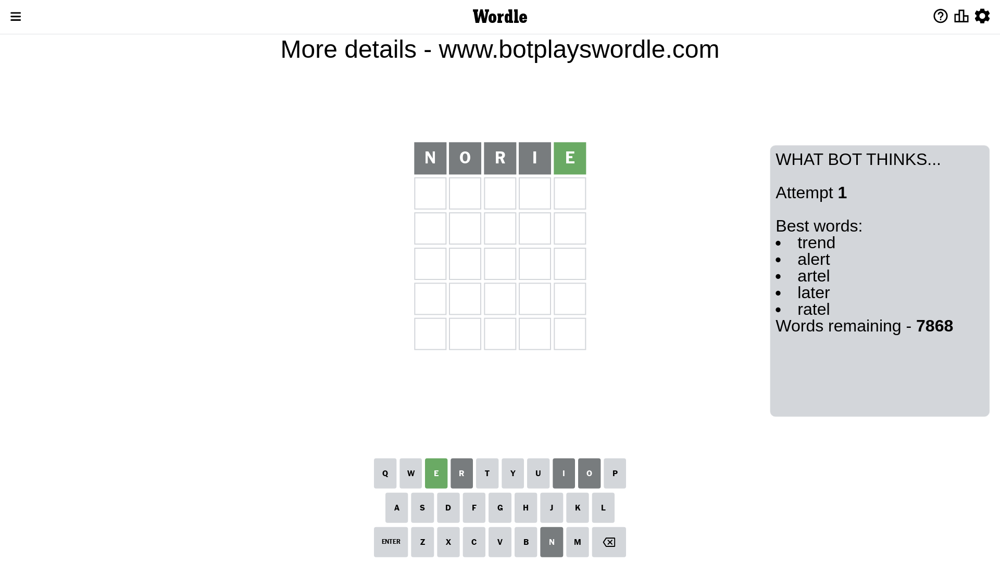
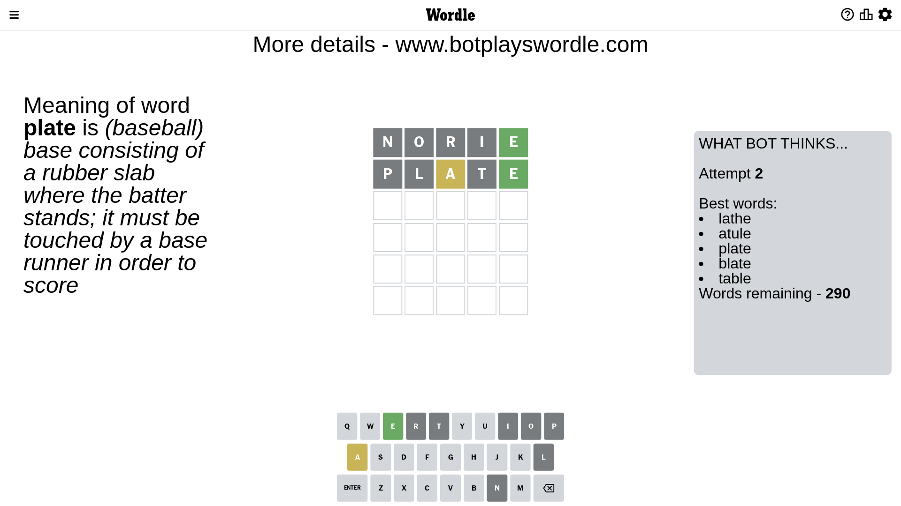
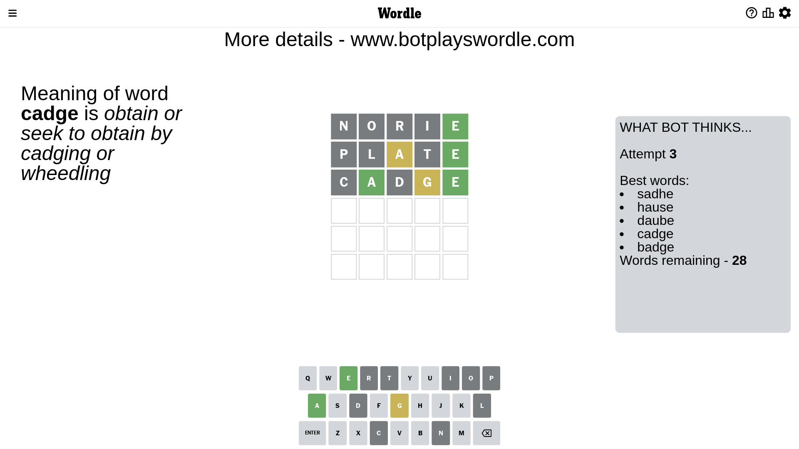
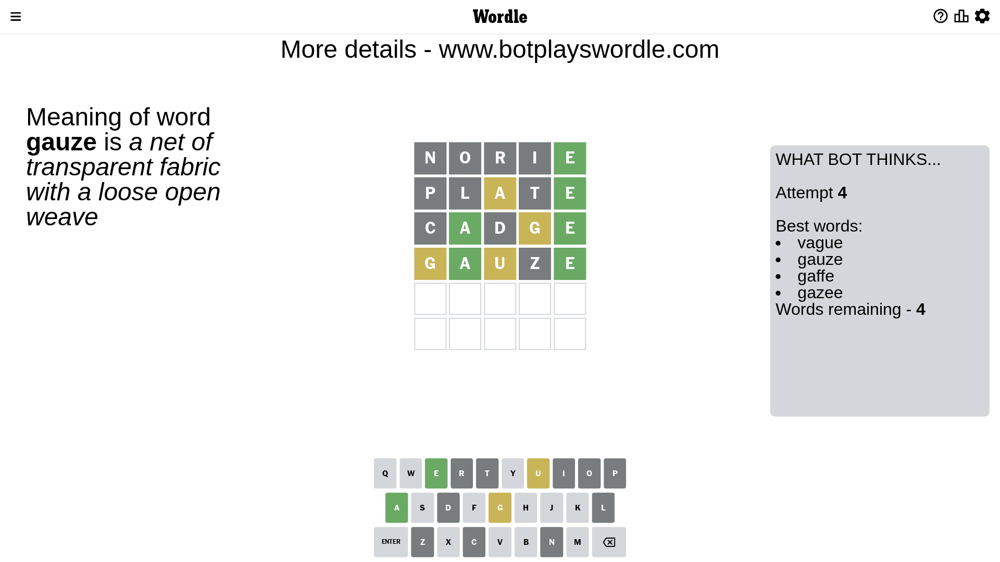
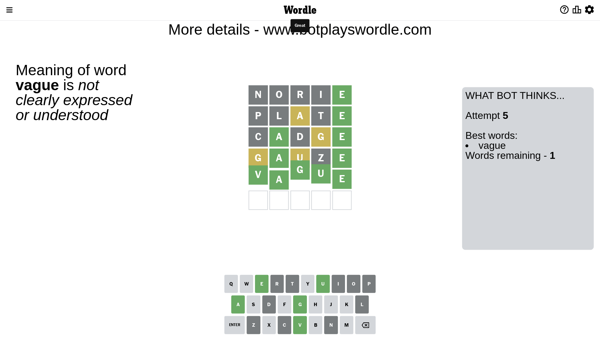

# Wordle for February 23, 2023 - \#614

## Attempt 1

This is the first attempt and we'll choose a random word to start with.

Let's start with word `norie`

Attempt for `norie` gives us 1 correct letters, 0 present letters and 4 wrong letters.

If we look into details, we can see that:

Letter `n` is not present in the word and we will not use it any more

Letter `o` is not present in the word and we will not use it any more

Letter `r` is not present in the word and we will not use it any more

Letter `i` is not present in the word and we will not use it any more

Letter `e` should be at position 5

We got information about the correct letters and it should make next attempt easier

Some letters are missing (like `n`, `o`, `r`, `i`) but it's also important piece of information

Word should contain letters `[e]`

That was a great guess that limited number of remaining words

## Attempt 2

Right now we have 290 words to choose from and best of them seem to be `[lathe atule plate blate table]`

So far we know that possible letters are:

At position 1: `[a b c d e f g h j k l m p q s t u v w x y z]`

At position 2: `[a b c d e f g h j k l m p q s t u v w x y z]`

At position 3: `[a b c d e f g h j k l m p q s t u v w x y z]`

At position 4: `[a b c d e f g h j k l m p q s t u v w x y z]`

At position 5: `[e]`

Next guess is `plate`, let's see what it gives us

Attempt for `plate` gives us 1 correct letters, 1 present letters and 3 wrong letters.

If we look into details, we can see that:

Letter `p` is not present in the word and we will not use it any more

Letter `l` is not present in the word and we will not use it any more

Letter `a` is on a different spot - this means that it cannot be at position 3

Letter `t` is not present in the word and we will not use it any more

Some letters are missing (like `p`, `l`, `t`) but it's also important piece of information

Word should contain letters `[e a]`

That was a great guess that limited number of remaining words

## Attempt 3

Right now we have 28 words to choose from and best of them seem to be `[sadhe hause daube cadge badge]`

So far we know that possible letters are:

At position 1: `[a b c d e f g h j k m q s u v w x y z]`

At position 2: `[a b c d e f g h j k m q s u v w x y z]`

At position 3: `[b c d e f g h j k m q s u v w x y z]`

At position 4: `[a b c d e f g h j k m q s u v w x y z]`

At position 5: `[e]`

Next guess is `cadge`, let's see what it gives us

Attempt for `cadge` gives us 2 correct letters, 1 present letters and 2 wrong letters.

If we look into details, we can see that:

Letter `c` is not present in the word and we will not use it any more

Letter `a` should be at position 2

Letter `d` is not present in the word and we will not use it any more

Letter `g` is on a different spot - this means that it cannot be at position 4

We got information about the correct letters and it should make next attempt easier

Some letters are missing (like `c`, `d`) but it's also important piece of information

Word should contain letters `[e a g]`

Not a bad guess in general

## Attempt 4

Right now we have 4 words to choose from and best of them seem to be `[vague gauze gaffe gazee]`

So far we know that possible letters are:

At position 1: `[a b e f g h j k m q s u v w x y z]`

At position 2: `[a]`

At position 3: `[b e f g h j k m q s u v w x y z]`

At position 4: `[a b e f h j k m q s u v w x y z]`

At position 5: `[e]`

Next guess is `gauze`, let's see what it gives us

Attempt for `gauze` gives us 2 correct letters, 2 present letters and 1 wrong letters.

If we look into details, we can see that:

Letter `g` is on a different spot - this means that it cannot be at position 1

Letter `u` is on a different spot - this means that it cannot be at position 3

Letter `z` is not present in the word and we will not use it any more

Some letters are missing (like `z`) but it's also important piece of information

Word should contain letters `[e a g u]`

Could be a better guess

## Attempt 5

Right now we have 1 words to choose from and best of them seem to be `[vague]`

So far we know that possible letters are:

At position 1: `[a b e f h j k m q s u v w x y]`

At position 2: `[a]`

At position 3: `[b e f g h j k m q s v w x y]`

At position 4: `[a b e f h j k m q s u v w x y]`

At position 5: `[e]`

It must be `vague`

That's the correct answer! The word is `vague`!

## Conclusion

Today's word is `vague` and it took 5 attempts to guess it

