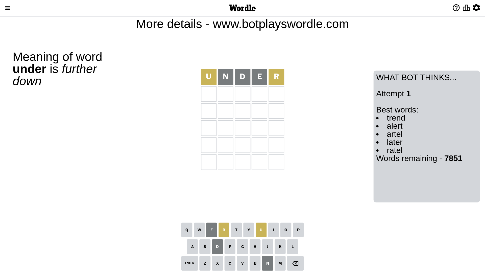
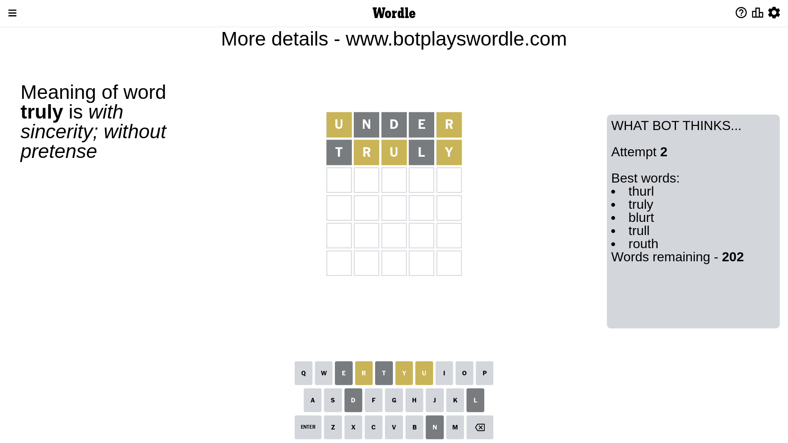
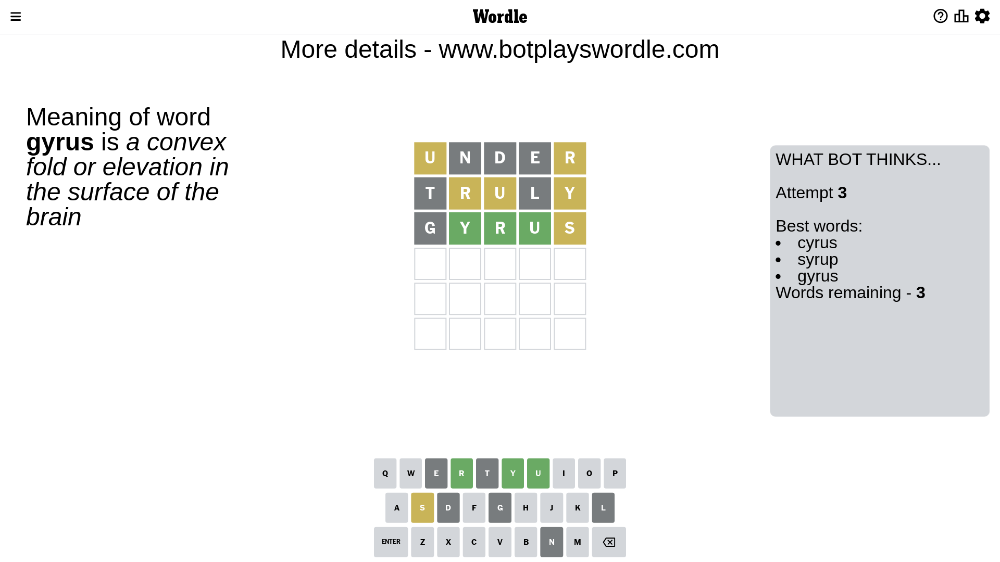
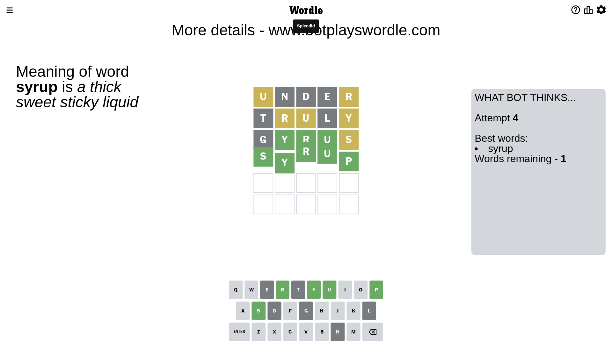

# Wordle for February 26, 2023 - \#617

## Attempt 1

This is the first attempt and we'll choose a random word to start with.

Let's start with word `under`

Attempt for `under` gives us 0 correct letters, 2 present letters and 3 wrong letters.

If we look into details, we can see that:

Letter `u` is on a different spot - this means that it cannot be at position 1

Letter `n` is not present in the word and we will not use it any more

Letter `d` is not present in the word and we will not use it any more

Letter `e` is not present in the word and we will not use it any more

Letter `r` is on a different spot - this means that it cannot be at position 5

Some letters are missing (like `n`, `d`, `e`) but it's also important piece of information

Word should contain letters `[u r]`

That was a great guess that limited number of remaining words

## Attempt 2

Right now we have 202 words to choose from and best of them seem to be `[thurl truly blurt trull routh]`

So far we know that possible letters are:

At position 1: `[a b c f g h i j k l m o p q r s t v w x y z]`

At position 2: `[a b c f g h i j k l m o p q r s t u v w x y z]`

At position 3: `[a b c f g h i j k l m o p q r s t u v w x y z]`

At position 4: `[a b c f g h i j k l m o p q r s t u v w x y z]`

At position 5: `[a b c f g h i j k l m o p q s t u v w x y z]`

Next guess is `truly`, let's see what it gives us

Attempt for `truly` gives us 0 correct letters, 3 present letters and 2 wrong letters.

If we look into details, we can see that:

Letter `t` is not present in the word and we will not use it any more

Letter `r` is on a different spot - this means that it cannot be at position 2

Letter `u` is on a different spot - this means that it cannot be at position 3

Letter `l` is not present in the word and we will not use it any more

Letter `y` is on a different spot - this means that it cannot be at position 5

Some letters are missing (like `t`, `l`) but it's also important piece of information

Word should contain letters `[u r y]`

That was a great guess that limited number of remaining words

## Attempt 3

Right now we have 3 words to choose from and best of them seem to be `[cyrus syrup gyrus]`

So far we know that possible letters are:

At position 1: `[a b c f g h i j k m o p q r s v w x y z]`

At position 2: `[a b c f g h i j k m o p q s u v w x y z]`

At position 3: `[a b c f g h i j k m o p q r s v w x y z]`

At position 4: `[a b c f g h i j k m o p q r s u v w x y z]`

At position 5: `[a b c f g h i j k m o p q s u v w x z]`

Next guess is `gyrus`, let's see what it gives us

Attempt for `gyrus` gives us 3 correct letters, 1 present letters and 1 wrong letters.

If we look into details, we can see that:

Letter `g` is not present in the word and we will not use it any more

Letter `y` should be at position 2

Letter `r` should be at position 3

Letter `u` should be at position 4

Letter `s` is on a different spot - this means that it cannot be at position 5

We got information about the correct letters and it should make next attempt easier

Some letters are missing (like `g`) but it's also important piece of information

Word should contain letters `[u r y s]`

Could be a better guess

## Attempt 4

Right now we have 1 words to choose from and best of them seem to be `[syrup]`

So far we know that possible letters are:

At position 1: `[a b c f h i j k m o p q r s v w x y z]`

At position 2: `[y]`

At position 3: `[r]`

At position 4: `[u]`

At position 5: `[a b c f h i j k m o p q u v w x z]`

It must be `syrup`

That's the correct answer! The word is `syrup`!

## Conclusion

Today's word is `syrup` and it took 4 attempts to guess it

