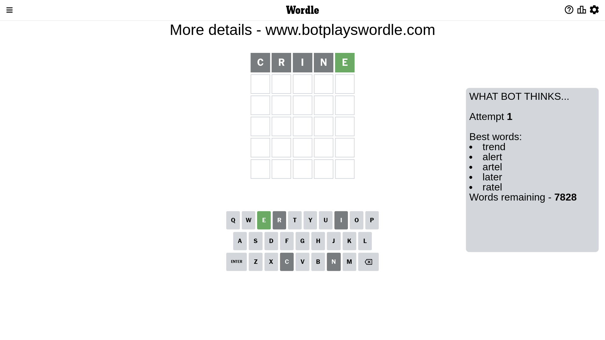
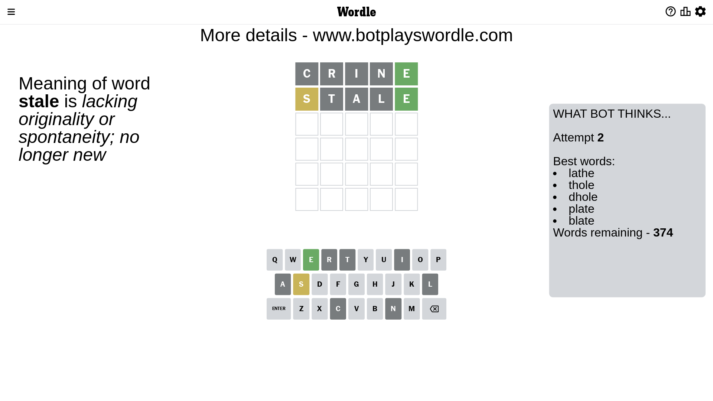
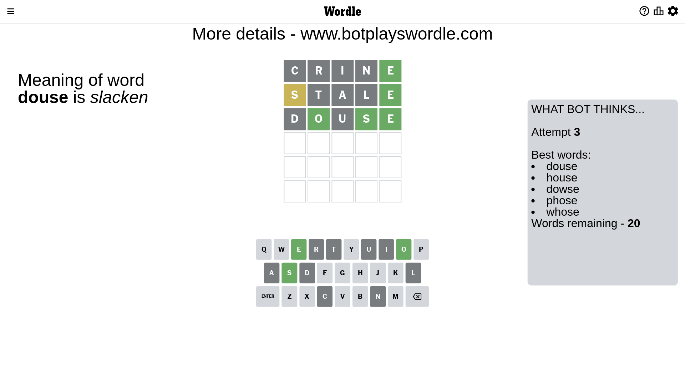
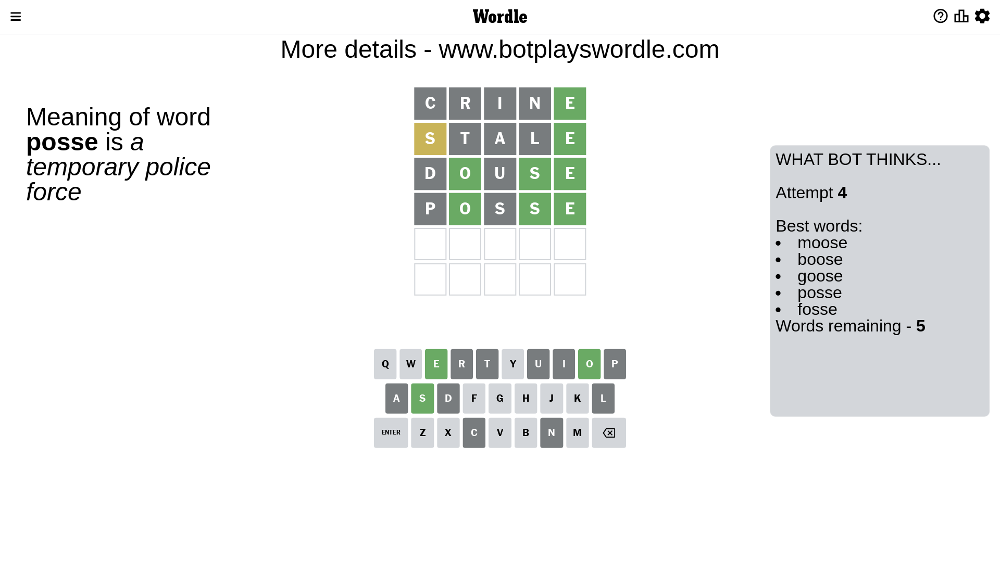
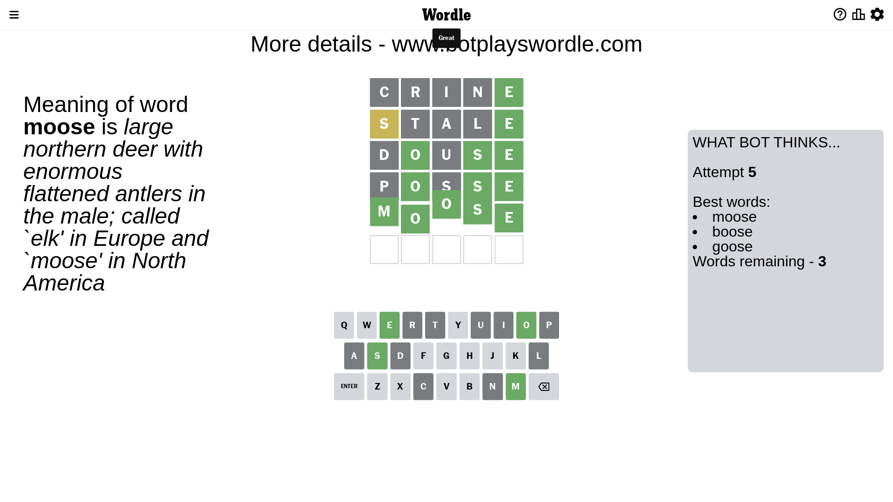

# Wordle for March 1, 2023 - \#620

## Attempt 1

This is the first attempt and we'll choose a random word to start with.

Let's start with word `crine`

Attempt for `crine` gives us 1 correct letters, 0 present letters and 4 wrong letters.

If we look into details, we can see that:

Letter `c` is not present in the word and we will not use it any more

Letter `r` is not present in the word and we will not use it any more

Letter `i` is not present in the word and we will not use it any more

Letter `n` is not present in the word and we will not use it any more

Letter `e` should be at position 5

We got information about the correct letters and it should make next attempt easier

Some letters are missing (like `c`, `r`, `i`, `n`) but it's also important piece of information

Word should contain letters `[e]`

That was a great guess that limited number of remaining words

## Attempt 2

Right now we have 374 words to choose from and best of them seem to be `[lathe thole dhole plate blate]`

So far we know that possible letters are:

At position 1: `[a b d e f g h j k l m o p q s t u v w x y z]`

At position 2: `[a b d e f g h j k l m o p q s t u v w x y z]`

At position 3: `[a b d e f g h j k l m o p q s t u v w x y z]`

At position 4: `[a b d e f g h j k l m o p q s t u v w x y z]`

At position 5: `[e]`

Next guess is `stale`, let's see what it gives us

Attempt for `stale` gives us 1 correct letters, 1 present letters and 3 wrong letters.

If we look into details, we can see that:

Letter `s` is on a different spot - this means that it cannot be at position 1

Letter `t` is not present in the word and we will not use it any more

Letter `a` is not present in the word and we will not use it any more

Letter `l` is not present in the word and we will not use it any more

Some letters are missing (like `t`, `a`, `l`) but it's also important piece of information

Word should contain letters `[e s]`

That was a great guess that limited number of remaining words

## Attempt 3

Right now we have 20 words to choose from and best of them seem to be `[douse house dowse phose whose]`

So far we know that possible letters are:

At position 1: `[b d e f g h j k m o p q u v w x y z]`

At position 2: `[b d e f g h j k m o p q s u v w x y z]`

At position 3: `[b d e f g h j k m o p q s u v w x y z]`

At position 4: `[b d e f g h j k m o p q s u v w x y z]`

At position 5: `[e]`

Next guess is `douse`, let's see what it gives us

Attempt for `douse` gives us 3 correct letters, 0 present letters and 2 wrong letters.

If we look into details, we can see that:

Letter `d` is not present in the word and we will not use it any more

Letter `o` should be at position 2

Letter `u` is not present in the word and we will not use it any more

Letter `s` should be at position 4

We got information about the correct letters and it should make next attempt easier

Some letters are missing (like `d`, `u`) but it's also important piece of information

Word should contain letters `[e s o]`

Could be a better guess

## Attempt 4

Right now we have 5 words to choose from and best of them seem to be `[moose boose goose posse fosse]`

So far we know that possible letters are:

At position 1: `[b e f g h j k m o p q v w x y z]`

At position 2: `[o]`

At position 3: `[b e f g h j k m o p q s v w x y z]`

At position 4: `[s]`

At position 5: `[e]`

Next guess is `posse`, let's see what it gives us

Attempt for `posse` gives us 3 correct letters, 0 present letters and 2 wrong letters.

If we look into details, we can see that:

Letter `p` is not present in the word and we will not use it any more

Letter `s` is not present in the word and we will not use it any more

Some letters are missing (like `p`, `s`) but it's also important piece of information

Word should contain letters `[e s o]`

This was a waste, almost no valuable information...

## Attempt 5

Right now we have 3 words to choose from and best of them seem to be `[moose boose goose]`

So far we know that possible letters are:

At position 1: `[b e f g h j k m o q v w x y z]`

At position 2: `[o]`

At position 3: `[b e f g h j k m o q v w x y z]`

At position 4: `[s]`

At position 5: `[e]`

Next guess is `moose`, let's see what it gives us

That's the correct answer! The word is `moose`!

## Conclusion

Today's word is `moose` and it took 5 attempts to guess it

