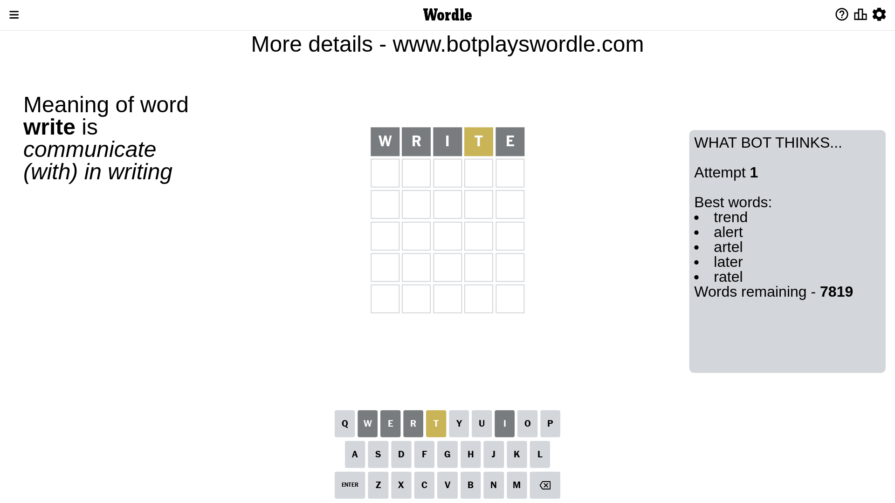
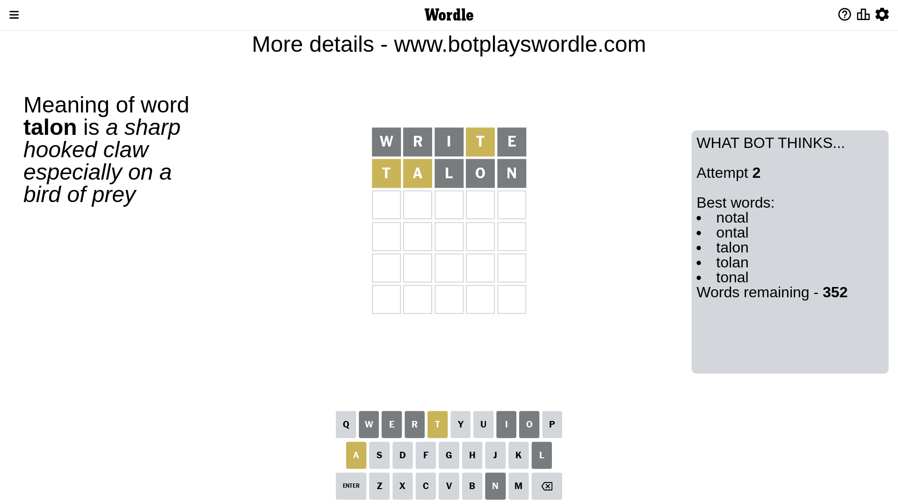
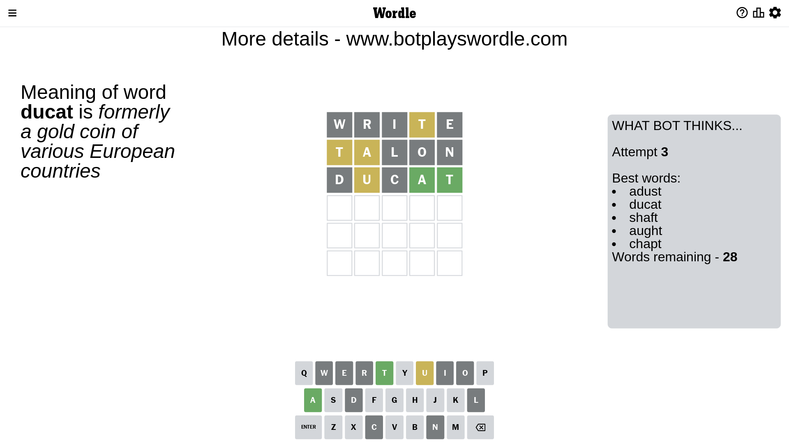
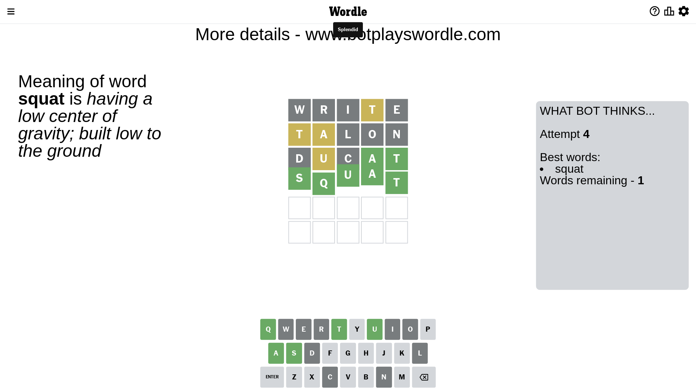

# Wordle for March 3, 2023 - \#622

## Attempt 1

This is the first attempt and we'll choose a random word to start with.

Let's start with word `write`

Attempt for `write` gives us 0 correct letters, 1 present letters and 4 wrong letters.

If we look into details, we can see that:

Letter `w` is not present in the word and we will not use it any more

Letter `r` is not present in the word and we will not use it any more

Letter `i` is not present in the word and we will not use it any more

Letter `t` is on a different spot - this means that it cannot be at position 4

Letter `e` is not present in the word and we will not use it any more

Some letters are missing (like `w`, `r`, `i`, `e`) but it's also important piece of information

Word should contain letters `[t]`

That was a great guess that limited number of remaining words

## Attempt 2

Right now we have 352 words to choose from and best of them seem to be `[notal ontal talon tolan tonal]`

So far we know that possible letters are:

At position 1: `[a b c d f g h j k l m n o p q s t u v x y z]`

At position 2: `[a b c d f g h j k l m n o p q s t u v x y z]`

At position 3: `[a b c d f g h j k l m n o p q s t u v x y z]`

At position 4: `[a b c d f g h j k l m n o p q s u v x y z]`

At position 5: `[a b c d f g h j k l m n o p q s t u v x y z]`

Next guess is `talon`, let's see what it gives us

Attempt for `talon` gives us 0 correct letters, 2 present letters and 3 wrong letters.

If we look into details, we can see that:

Letter `t` is on a different spot - this means that it cannot be at position 1

Letter `a` is on a different spot - this means that it cannot be at position 2

Letter `l` is not present in the word and we will not use it any more

Letter `o` is not present in the word and we will not use it any more

Letter `n` is not present in the word and we will not use it any more

Some letters are missing (like `l`, `o`, `n`) but it's also important piece of information

Word should contain letters `[t a]`

That was a great guess that limited number of remaining words

## Attempt 3

Right now we have 28 words to choose from and best of them seem to be `[adust ducat shaft aught chapt]`

So far we know that possible letters are:

At position 1: `[a b c d f g h j k m p q s u v x y z]`

At position 2: `[b c d f g h j k m p q s t u v x y z]`

At position 3: `[a b c d f g h j k m p q s t u v x y z]`

At position 4: `[a b c d f g h j k m p q s u v x y z]`

At position 5: `[a b c d f g h j k m p q s t u v x y z]`

Next guess is `ducat`, let's see what it gives us

Attempt for `ducat` gives us 2 correct letters, 1 present letters and 2 wrong letters.

If we look into details, we can see that:

Letter `d` is not present in the word and we will not use it any more

Letter `u` is on a different spot - this means that it cannot be at position 2

Letter `c` is not present in the word and we will not use it any more

Letter `a` should be at position 4

Letter `t` should be at position 5

We got information about the correct letters and it should make next attempt easier

Some letters are missing (like `d`, `c`) but it's also important piece of information

Word should contain letters `[t a u]`

That was a great guess that limited number of remaining words

## Attempt 4

Right now we have 1 words to choose from and best of them seem to be `[squat]`

So far we know that possible letters are:

At position 1: `[a b f g h j k m p q s u v x y z]`

At position 2: `[b f g h j k m p q s t v x y z]`

At position 3: `[a b f g h j k m p q s t u v x y z]`

At position 4: `[a]`

At position 5: `[t]`

It must be `squat`

That's the correct answer! The word is `squat`!

## Conclusion

Today's word is `squat` and it took 4 attempts to guess it

