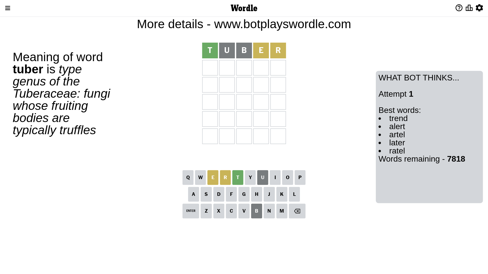

# Wordle for March 4, 2023 - \#623

## Attempt 1

This is the first attempt and we'll choose a random word to start with.

Let's start with word `tuber`

Attempt for `tuber` gives us 1 correct letters, 2 present letters and 2 wrong letters.

If we look into details, we can see that:

Letter `t` should be at position 1

Letter `u` is not present in the word and we will not use it any more

Letter `b` is not present in the word and we will not use it any more

Letter `e` is on a different spot - this means that it cannot be at position 4

Letter `r` is on a different spot - this means that it cannot be at position 5

We got information about the correct letters and it should make next attempt easier

Some letters are missing (like `u`, `b`) but it's also important piece of information

Word should contain letters `[t e r]`

That was a great guess that limited number of remaining words

## Attempt 2

Right now we have 35 words to choose from and best of them seem to be `[trend trone trine terne trade]`

So far we know that possible letters are:

At position 1: `[t]`

At position 2: `[a c d e f g h i j k l m n o p q r s t v w x y z]`

At position 3: `[a c d e f g h i j k l m n o p q r s t v w x y z]`

At position 4: `[a c d f g h i j k l m n o p q r s t v w x y z]`

At position 5: `[a c d e f g h i j k l m n o p q s t v w x y z]`

Next guess is `trine`, let's see what it gives us

Attempt for `trine` gives us 3 correct letters, 1 present letters and 1 wrong letters.

If we look into details, we can see that:

Letter `r` should be at position 2

Letter `i` is not present in the word and we will not use it any more

Letter `n` should be at position 4

Letter `e` is on a different spot - this means that it cannot be at position 5

We got information about the correct letters and it should make next attempt easier

Some letters are missing (like `i`) but it's also important piece of information

Word should contain letters `[t e r n]`

That was a great guess that limited number of remaining words

## Attempt 3

Right now we have 1 words to choose from and best of them seem to be `[trend]`

So far we know that possible letters are:

At position 1: `[t]`

At position 2: `[r]`

At position 3: `[a c d e f g h j k l m n o p q r s t v w x y z]`

At position 4: `[n]`

At position 5: `[a c d f g h j k l m n o p q s t v w x y z]`

It must be `trend`

That's the correct answer! The word is `trend`!

## Conclusion

Today's word is `trend` and it took 3 attempts to guess it

