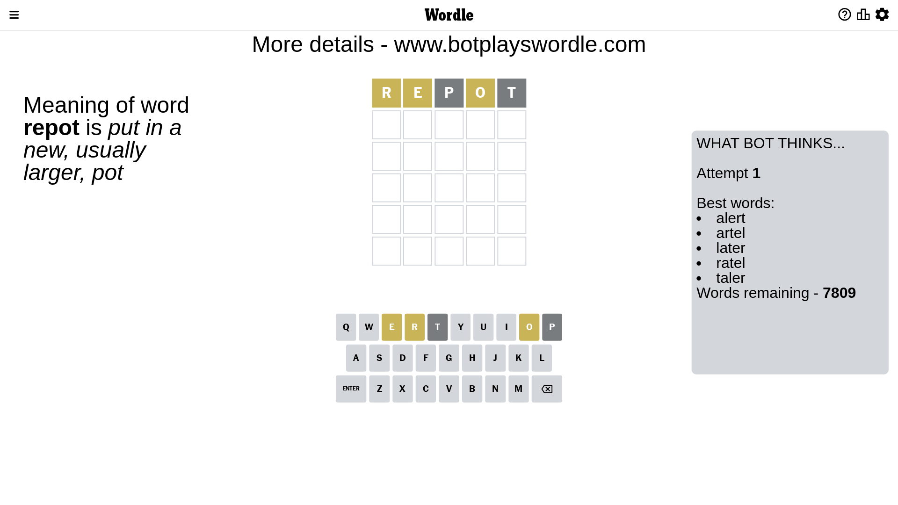
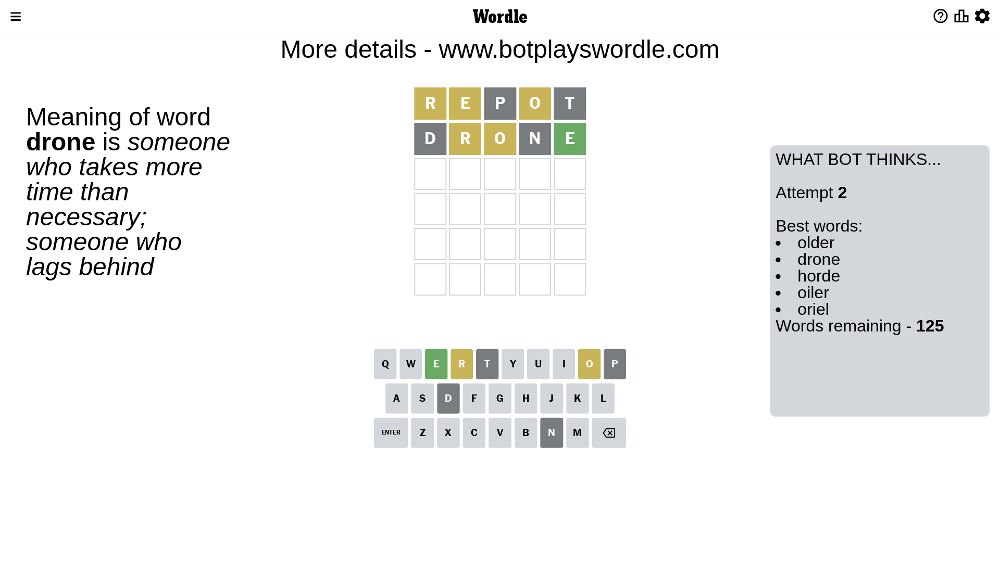
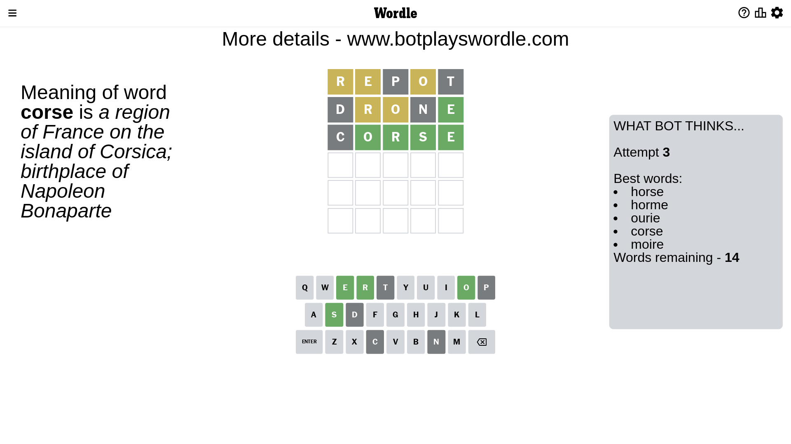
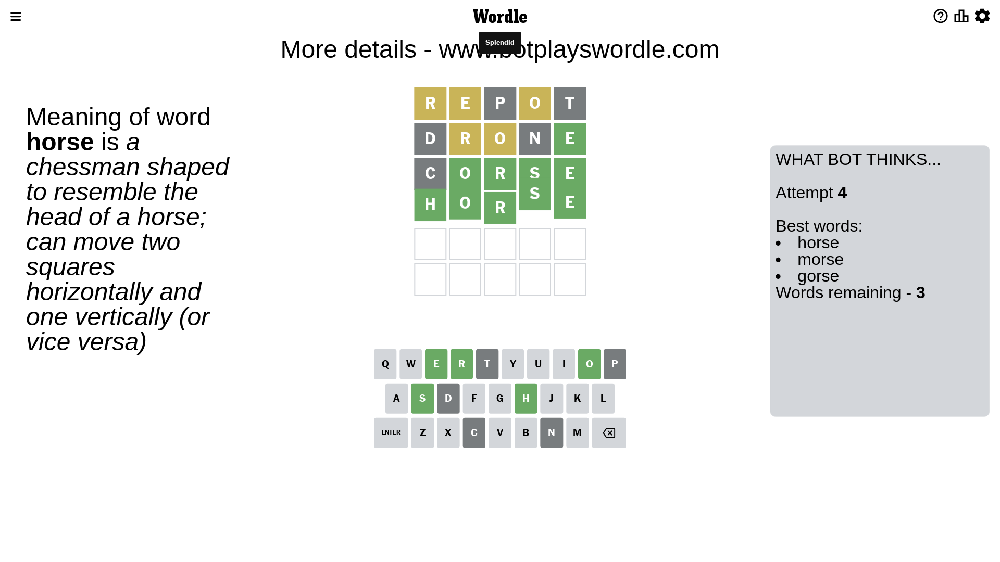

# Wordle for March 7, 2023 - \#626

## Attempt 1

This is the first attempt and we'll choose a random word to start with.

Let's start with word `repot`

Attempt for `repot` gives us 0 correct letters, 3 present letters and 2 wrong letters.

If we look into details, we can see that:

Letter `r` is on a different spot - this means that it cannot be at position 1

Letter `e` is on a different spot - this means that it cannot be at position 2

Letter `p` is not present in the word and we will not use it any more

Letter `o` is on a different spot - this means that it cannot be at position 4

Letter `t` is not present in the word and we will not use it any more

Some letters are missing (like `p`, `t`) but it's also important piece of information

Word should contain letters `[r e o]`

That was a great guess that limited number of remaining words

## Attempt 2

Right now we have 125 words to choose from and best of them seem to be `[older drone horde oiler oriel]`

So far we know that possible letters are:

At position 1: `[a b c d e f g h i j k l m n o q s u v w x y z]`

At position 2: `[a b c d f g h i j k l m n o q r s u v w x y z]`

At position 3: `[a b c d e f g h i j k l m n o q r s u v w x y z]`

At position 4: `[a b c d e f g h i j k l m n q r s u v w x y z]`

At position 5: `[a b c d e f g h i j k l m n o q r s u v w x y z]`

Next guess is `drone`, let's see what it gives us

Attempt for `drone` gives us 1 correct letters, 2 present letters and 2 wrong letters.

If we look into details, we can see that:

Letter `d` is not present in the word and we will not use it any more

Letter `r` is on a different spot - this means that it cannot be at position 2

Letter `o` is on a different spot - this means that it cannot be at position 3

Letter `n` is not present in the word and we will not use it any more

Letter `e` should be at position 5

We got information about the correct letters and it should make next attempt easier

Some letters are missing (like `d`, `n`) but it's also important piece of information

Word should contain letters `[r e o]`

That was a great guess that limited number of remaining words

## Attempt 3

Right now we have 14 words to choose from and best of them seem to be `[horse horme ourie corse moire]`

So far we know that possible letters are:

At position 1: `[a b c e f g h i j k l m o q s u v w x y z]`

At position 2: `[a b c f g h i j k l m o q s u v w x y z]`

At position 3: `[a b c e f g h i j k l m q r s u v w x y z]`

At position 4: `[a b c e f g h i j k l m q r s u v w x y z]`

At position 5: `[e]`

Next guess is `corse`, let's see what it gives us

Attempt for `corse` gives us 4 correct letters, 0 present letters and 1 wrong letters.

If we look into details, we can see that:

Letter `c` is not present in the word and we will not use it any more

Letter `o` should be at position 2

Letter `r` should be at position 3

Letter `s` should be at position 4

We got information about the correct letters and it should make next attempt easier

Some letters are missing (like `c`) but it's also important piece of information

Word should contain letters `[r e o s]`

Not a bad guess in general

## Attempt 4

Right now we have 3 words to choose from and best of them seem to be `[horse morse gorse]`

So far we know that possible letters are:

At position 1: `[a b e f g h i j k l m o q s u v w x y z]`

At position 2: `[o]`

At position 3: `[r]`

At position 4: `[s]`

At position 5: `[e]`

Next guess is `horse`, let's see what it gives us

That's the correct answer! The word is `horse`!

## Conclusion

Today's word is `horse` and it took 4 attempts to guess it

