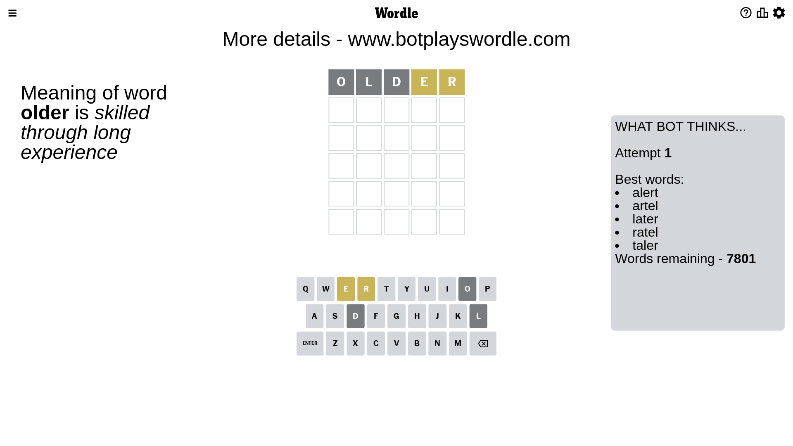
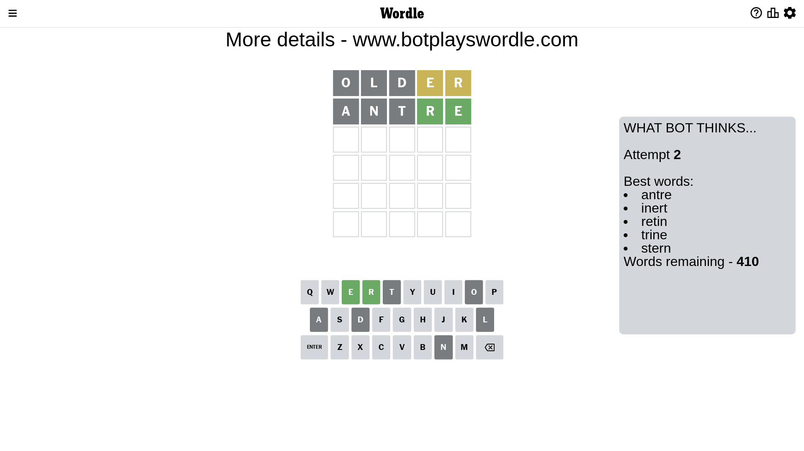
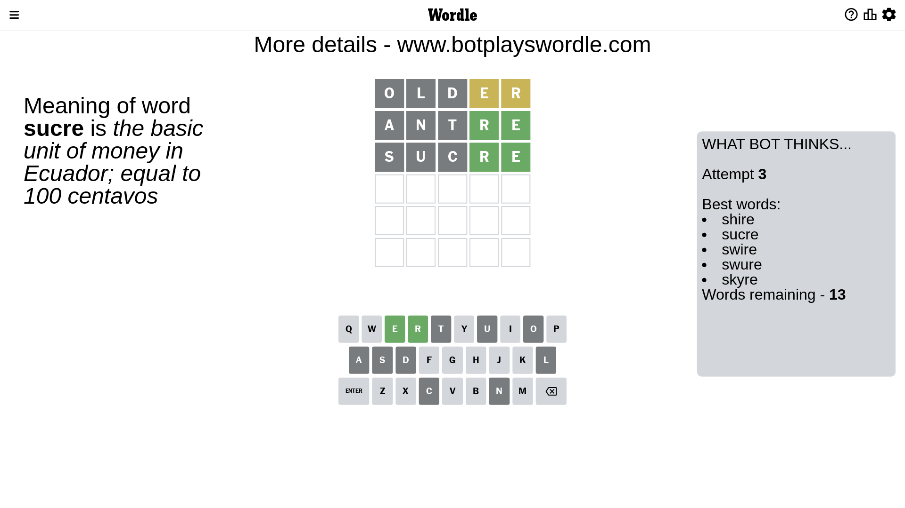
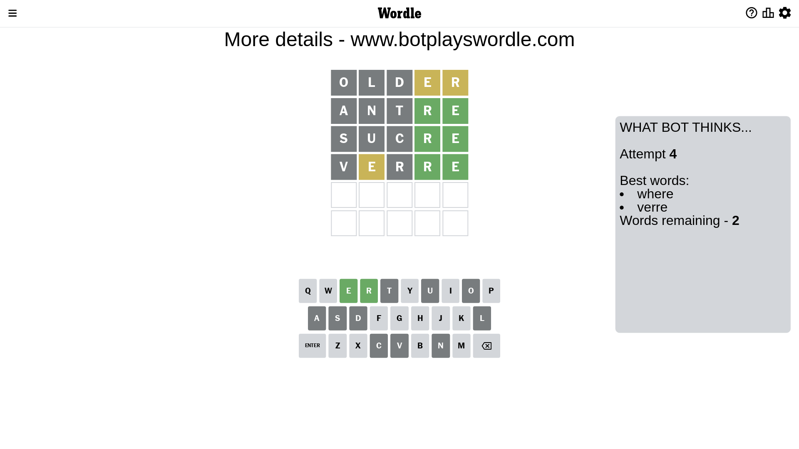
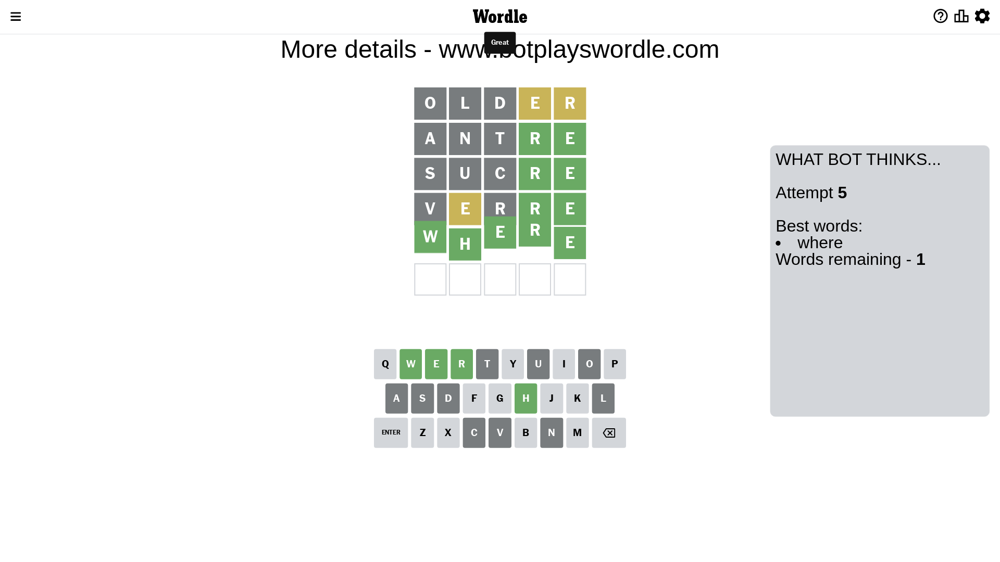

# Wordle for March 9, 2023 - \#628

## Attempt 1

This is the first attempt and we'll choose a random word to start with.

Let's start with word `older`

Attempt for `older` gives us 0 correct letters, 2 present letters and 3 wrong letters.

If we look into details, we can see that:

Letter `o` is not present in the word and we will not use it any more

Letter `l` is not present in the word and we will not use it any more

Letter `d` is not present in the word and we will not use it any more

Letter `e` is on a different spot - this means that it cannot be at position 4

Letter `r` is on a different spot - this means that it cannot be at position 5

Some letters are missing (like `o`, `l`, `d`) but it's also important piece of information

Word should contain letters `[e r]`

That was a great guess that limited number of remaining words

## Attempt 2

Right now we have 410 words to choose from and best of them seem to be `[antre inert retin trine stern]`

So far we know that possible letters are:

At position 1: `[a b c e f g h i j k m n p q r s t u v w x y z]`

At position 2: `[a b c e f g h i j k m n p q r s t u v w x y z]`

At position 3: `[a b c e f g h i j k m n p q r s t u v w x y z]`

At position 4: `[a b c f g h i j k m n p q r s t u v w x y z]`

At position 5: `[a b c e f g h i j k m n p q s t u v w x y z]`

Next guess is `antre`, let's see what it gives us

Attempt for `antre` gives us 2 correct letters, 0 present letters and 3 wrong letters.

If we look into details, we can see that:

Letter `a` is not present in the word and we will not use it any more

Letter `n` is not present in the word and we will not use it any more

Letter `t` is not present in the word and we will not use it any more

Letter `r` should be at position 4

Letter `e` should be at position 5

We got information about the correct letters and it should make next attempt easier

Some letters are missing (like `a`, `n`, `t`) but it's also important piece of information

Word should contain letters `[e r]`

That was a great guess that limited number of remaining words

## Attempt 3

Right now we have 13 words to choose from and best of them seem to be `[shire sucre swire swure skyre]`

So far we know that possible letters are:

At position 1: `[b c e f g h i j k m p q r s u v w x y z]`

At position 2: `[b c e f g h i j k m p q r s u v w x y z]`

At position 3: `[b c e f g h i j k m p q r s u v w x y z]`

At position 4: `[r]`

At position 5: `[e]`

Next guess is `sucre`, let's see what it gives us

Attempt for `sucre` gives us 2 correct letters, 0 present letters and 3 wrong letters.

If we look into details, we can see that:

Letter `s` is not present in the word and we will not use it any more

Letter `u` is not present in the word and we will not use it any more

Letter `c` is not present in the word and we will not use it any more

Some letters are missing (like `s`, `u`, `c`) but it's also important piece of information

Word should contain letters `[e r]`

Not a bad guess in general

## Attempt 4

Right now we have 2 words to choose from and best of them seem to be `[where verre]`

So far we know that possible letters are:

At position 1: `[b e f g h i j k m p q r v w x y z]`

At position 2: `[b e f g h i j k m p q r v w x y z]`

At position 3: `[b e f g h i j k m p q r v w x y z]`

At position 4: `[r]`

At position 5: `[e]`

Next guess is `verre`, let's see what it gives us

Attempt for `verre` gives us 2 correct letters, 1 present letters and 2 wrong letters.

If we look into details, we can see that:

Letter `v` is not present in the word and we will not use it any more

Letter `e` is on a different spot - this means that it cannot be at position 2

Letter `r` is not present in the word and we will not use it any more

Some letters are missing (like `v`, `r`) but it's also important piece of information

Word should contain letters `[e r]`

This was a waste, almost no valuable information...

## Attempt 5

Right now we have 1 words to choose from and best of them seem to be `[where]`

So far we know that possible letters are:

At position 1: `[b e f g h i j k m p q w x y z]`

At position 2: `[b f g h i j k m p q w x y z]`

At position 3: `[b e f g h i j k m p q w x y z]`

At position 4: `[r]`

At position 5: `[e]`

It must be `where`

That's the correct answer! The word is `where`!

## Conclusion

Today's word is `where` and it took 5 attempts to guess it

