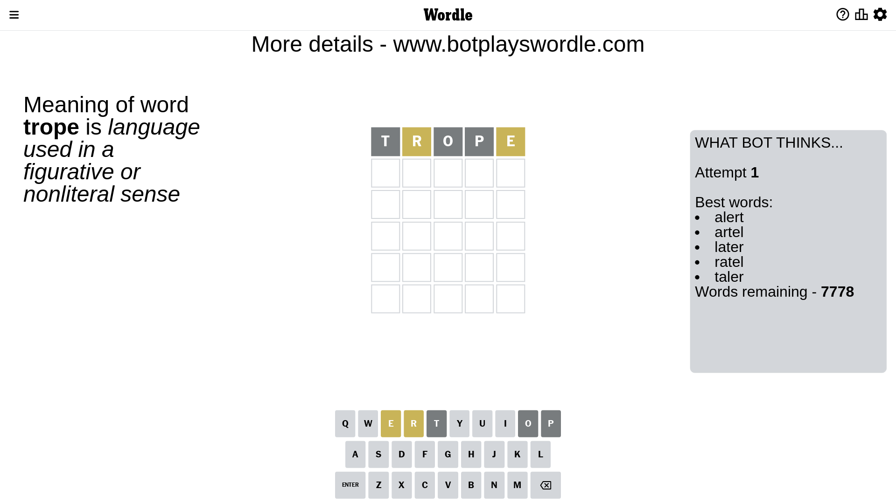
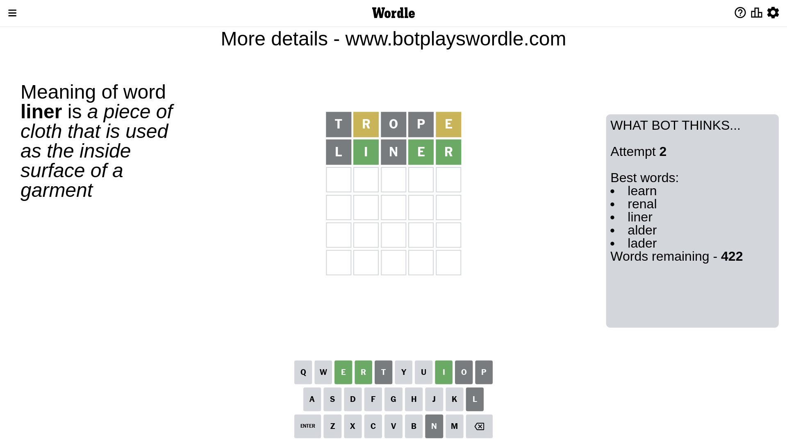
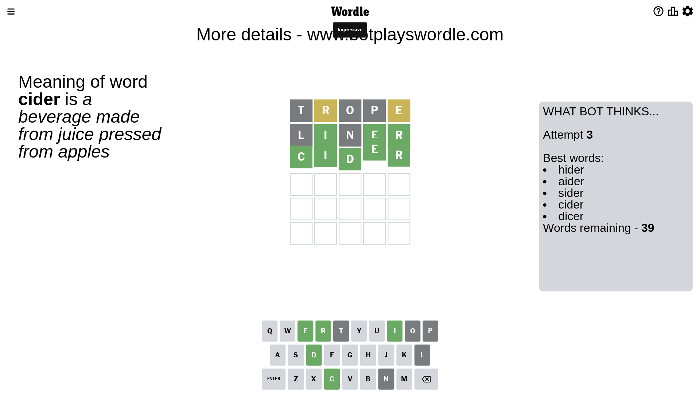

# Wordle for March 16, 2023 - \#635

## Attempt 1

This is the first attempt and we'll choose a random word to start with.

Let's start with word `trope`

Attempt for `trope` gives us 0 correct letters, 2 present letters and 3 wrong letters.

If we look into details, we can see that:

Letter `t` is not present in the word and we will not use it any more

Letter `r` is on a different spot - this means that it cannot be at position 2

Letter `o` is not present in the word and we will not use it any more

Letter `p` is not present in the word and we will not use it any more

Letter `e` is on a different spot - this means that it cannot be at position 5

Some letters are missing (like `t`, `o`, `p`) but it's also important piece of information

Word should contain letters `[r e]`

That was a great guess that limited number of remaining words

## Attempt 2

Right now we have 422 words to choose from and best of them seem to be `[learn renal liner alder lader]`

So far we know that possible letters are:

At position 1: `[a b c d e f g h i j k l m n q r s u v w x y z]`

At position 2: `[a b c d e f g h i j k l m n q s u v w x y z]`

At position 3: `[a b c d e f g h i j k l m n q r s u v w x y z]`

At position 4: `[a b c d e f g h i j k l m n q r s u v w x y z]`

At position 5: `[a b c d f g h i j k l m n q r s u v w x y z]`

Next guess is `liner`, let's see what it gives us

Attempt for `liner` gives us 3 correct letters, 0 present letters and 2 wrong letters.

If we look into details, we can see that:

Letter `l` is not present in the word and we will not use it any more

Letter `i` should be at position 2

Letter `n` is not present in the word and we will not use it any more

Letter `e` should be at position 4

Letter `r` should be at position 5

We got information about the correct letters and it should make next attempt easier

Some letters are missing (like `l`, `n`) but it's also important piece of information

Word should contain letters `[r e i]`

That was a great guess that limited number of remaining words

## Attempt 3

Right now we have 39 words to choose from and best of them seem to be `[hider aider sider cider dicer]`

So far we know that possible letters are:

At position 1: `[a b c d e f g h i j k m q r s u v w x y z]`

At position 2: `[i]`

At position 3: `[a b c d e f g h i j k m q r s u v w x y z]`

At position 4: `[e]`

At position 5: `[r]`

Next guess is `cider`, let's see what it gives us

That's the correct answer! The word is `cider`!

To be honest that was a pretty lucky guess, but it worked out well.

## Conclusion

Today's word is `cider` and it took 3 attempts to guess it

