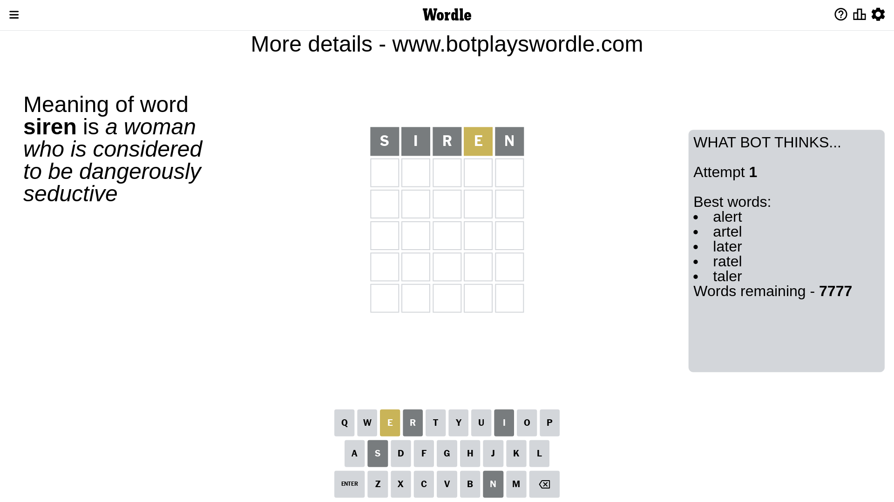
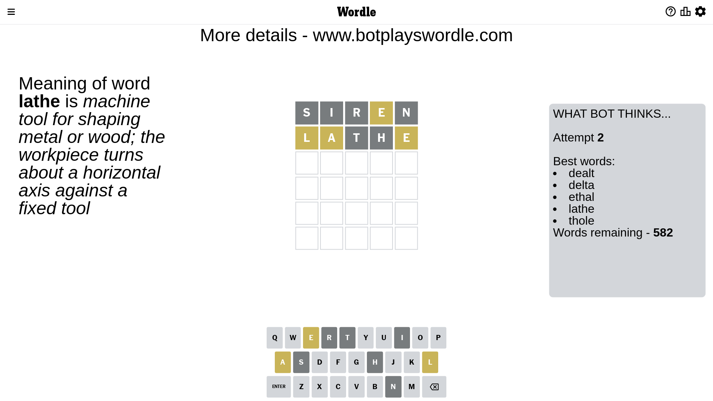
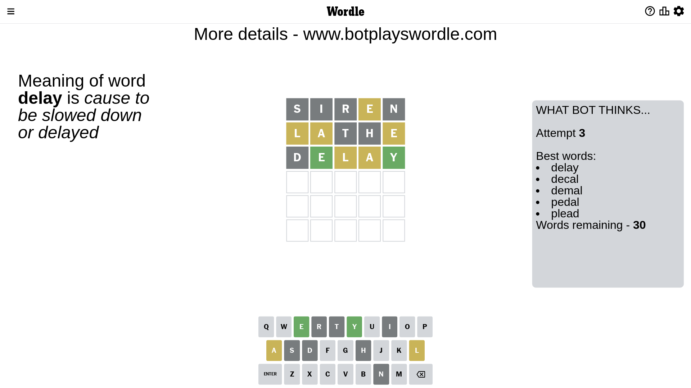
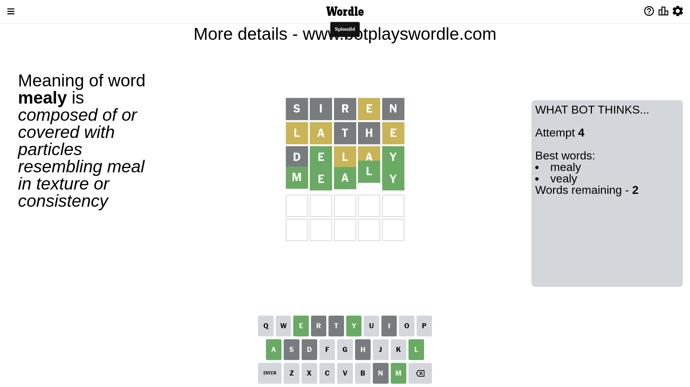

# Wordle for March 17, 2023 - \#636

## Attempt 1

This is the first attempt and we'll choose a random word to start with.

Let's start with word `siren`

Attempt for `siren` gives us 0 correct letters, 1 present letters and 4 wrong letters.

If we look into details, we can see that:

Letter `s` is not present in the word and we will not use it any more

Letter `i` is not present in the word and we will not use it any more

Letter `r` is not present in the word and we will not use it any more

Letter `e` is on a different spot - this means that it cannot be at position 4

Letter `n` is not present in the word and we will not use it any more

Some letters are missing (like `s`, `i`, `r`, `n`) but it's also important piece of information

Word should contain letters `[e]`

That was a great guess that limited number of remaining words

## Attempt 2

Right now we have 582 words to choose from and best of them seem to be `[dealt delta ethal lathe thole]`

So far we know that possible letters are:

At position 1: `[a b c d e f g h j k l m o p q t u v w x y z]`

At position 2: `[a b c d e f g h j k l m o p q t u v w x y z]`

At position 3: `[a b c d e f g h j k l m o p q t u v w x y z]`

At position 4: `[a b c d f g h j k l m o p q t u v w x y z]`

At position 5: `[a b c d e f g h j k l m o p q t u v w x y z]`

Next guess is `lathe`, let's see what it gives us

Attempt for `lathe` gives us 0 correct letters, 3 present letters and 2 wrong letters.

If we look into details, we can see that:

Letter `l` is on a different spot - this means that it cannot be at position 1

Letter `a` is on a different spot - this means that it cannot be at position 2

Letter `t` is not present in the word and we will not use it any more

Letter `h` is not present in the word and we will not use it any more

Letter `e` is on a different spot - this means that it cannot be at position 5

Some letters are missing (like `t`, `h`) but it's also important piece of information

Word should contain letters `[e l a]`

That was a great guess that limited number of remaining words

## Attempt 3

Right now we have 30 words to choose from and best of them seem to be `[delay decal demal pedal plead]`

So far we know that possible letters are:

At position 1: `[a b c d e f g j k m o p q u v w x y z]`

At position 2: `[b c d e f g j k l m o p q u v w x y z]`

At position 3: `[a b c d e f g j k l m o p q u v w x y z]`

At position 4: `[a b c d f g j k l m o p q u v w x y z]`

At position 5: `[a b c d f g j k l m o p q u v w x y z]`

Next guess is `delay`, let's see what it gives us

Attempt for `delay` gives us 2 correct letters, 2 present letters and 1 wrong letters.

If we look into details, we can see that:

Letter `d` is not present in the word and we will not use it any more

Letter `e` should be at position 2

Letter `l` is on a different spot - this means that it cannot be at position 3

Letter `a` is on a different spot - this means that it cannot be at position 4

Letter `y` should be at position 5

We got information about the correct letters and it should make next attempt easier

Some letters are missing (like `d`) but it's also important piece of information

Word should contain letters `[e l a y]`

That was a great guess that limited number of remaining words

## Attempt 4

Right now we have 2 words to choose from and best of them seem to be `[mealy vealy]`

So far we know that possible letters are:

At position 1: `[a b c e f g j k m o p q u v w x y z]`

At position 2: `[e]`

At position 3: `[a b c e f g j k m o p q u v w x y z]`

At position 4: `[b c f g j k l m o p q u v w x y z]`

At position 5: `[y]`

Next guess is `mealy`, let's see what it gives us

That's the correct answer! The word is `mealy`!

## Conclusion

Today's word is `mealy` and it took 4 attempts to guess it

