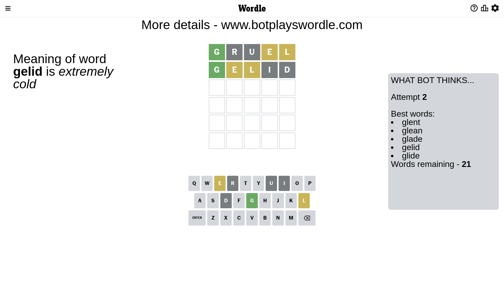

# Wordle for March 20, 2023 - \#639

## Attempt 1

This is the first attempt and we'll choose a random word to start with.

Let's start with word `gruel`

Attempt for `gruel` gives us 1 correct letters, 2 present letters and 2 wrong letters.

If we look into details, we can see that:

Letter `g` should be at position 1

Letter `r` is not present in the word and we will not use it any more

Letter `u` is not present in the word and we will not use it any more

Letter `e` is on a different spot - this means that it cannot be at position 4

Letter `l` is on a different spot - this means that it cannot be at position 5

We got information about the correct letters and it should make next attempt easier

Some letters are missing (like `r`, `u`) but it's also important piece of information

Word should contain letters `[g e l]`

That was a great guess that limited number of remaining words

## Attempt 2

Right now we have 21 words to choose from and best of them seem to be `[glent glean glade gelid glide]`

So far we know that possible letters are:

At position 1: `[g]`

At position 2: `[a b c d e f g h i j k l m n o p q s t v w x y z]`

At position 3: `[a b c d e f g h i j k l m n o p q s t v w x y z]`

At position 4: `[a b c d f g h i j k l m n o p q s t v w x y z]`

At position 5: `[a b c d e f g h i j k m n o p q s t v w x y z]`

Next guess is `gelid`, let's see what it gives us

Attempt for `gelid` gives us 1 correct letters, 2 present letters and 2 wrong letters.

If we look into details, we can see that:

Letter `e` is on a different spot - this means that it cannot be at position 2

Letter `l` is on a different spot - this means that it cannot be at position 3

Letter `i` is not present in the word and we will not use it any more

Letter `d` is not present in the word and we will not use it any more

Some letters are missing (like `i`, `d`) but it's also important piece of information

Word should contain letters `[g e l]`

This was a waste, almost no valuable information...

## Attempt 3

Right now we have 12 words to choose from and best of them seem to be `[glent glean glace gleam gable]`

So far we know that possible letters are:

At position 1: `[g]`

At position 2: `[a b c f g h j k l m n o p q s t v w x y z]`

At position 3: `[a b c e f g h j k m n o p q s t v w x y z]`

At position 4: `[a b c f g h j k l m n o p q s t v w x y z]`

At position 5: `[a b c e f g h j k m n o p q s t v w x y z]`

Next guess is `glace`, let's see what it gives us

Attempt for `glace` gives us 3 correct letters, 0 present letters and 2 wrong letters.

If we look into details, we can see that:

Letter `l` should be at position 2

Letter `a` is not present in the word and we will not use it any more

Letter `c` is not present in the word and we will not use it any more

Letter `e` should be at position 5

We got information about the correct letters and it should make next attempt easier

Some letters are missing (like `a`, `c`) but it's also important piece of information

Word should contain letters `[g e l]`

Could be a better guess

## Attempt 4

Right now we have 3 words to choose from and best of them seem to be `[globe gloze glebe]`

So far we know that possible letters are:

At position 1: `[g]`

At position 2: `[l]`

At position 3: `[b e f g h j k m n o p q s t v w x y z]`

At position 4: `[b f g h j k l m n o p q s t v w x y z]`

At position 5: `[e]`

Next guess is `glove`, let's see what it gives us

That's the correct answer! The word is `glove`!

## Conclusion

Today's word is `glove` and it took 4 attempts to guess it

