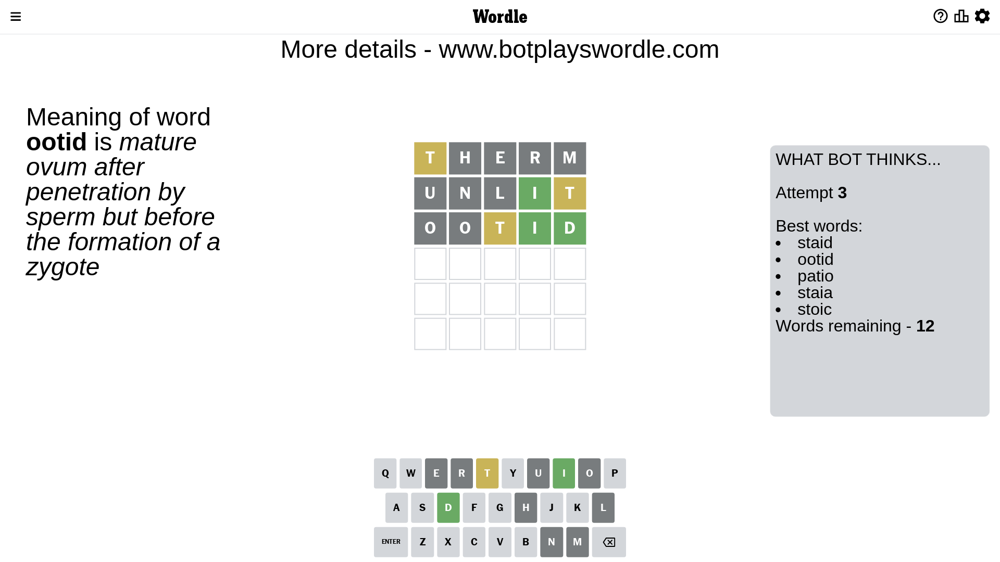

# Wordle for March 23, 2023 - \#642

## Attempt 1

This is the first attempt and we'll choose a random word to start with.

Let's start with word `therm`

Attempt for `therm` gives us 0 correct letters, 1 present letters and 4 wrong letters.

If we look into details, we can see that:

Letter `t` is on a different spot - this means that it cannot be at position 1

Letter `h` is not present in the word and we will not use it any more

Letter `e` is not present in the word and we will not use it any more

Letter `r` is not present in the word and we will not use it any more

Letter `m` is not present in the word and we will not use it any more

Some letters are missing (like `h`, `e`, `r`, `m`) but it's also important piece of information

Word should contain letters `[t]`

That was a great guess that limited number of remaining words

## Attempt 2

Right now we have 440 words to choose from and best of them seem to be `[notal ontal slant plant natal]`

So far we know that possible letters are:

At position 1: `[a b c d f g i j k l n o p q s u v w x y z]`

At position 2: `[a b c d f g i j k l n o p q s t u v w x y z]`

At position 3: `[a b c d f g i j k l n o p q s t u v w x y z]`

At position 4: `[a b c d f g i j k l n o p q s t u v w x y z]`

At position 5: `[a b c d f g i j k l n o p q s t u v w x y z]`

Next guess is `unlit`, let's see what it gives us

Attempt for `unlit` gives us 1 correct letters, 1 present letters and 3 wrong letters.

If we look into details, we can see that:

Letter `u` is not present in the word and we will not use it any more

Letter `n` is not present in the word and we will not use it any more

Letter `l` is not present in the word and we will not use it any more

Letter `i` should be at position 4

Letter `t` is on a different spot - this means that it cannot be at position 5

We got information about the correct letters and it should make next attempt easier

Some letters are missing (like `u`, `n`, `l`) but it's also important piece of information

Word should contain letters `[t i]`

That was a great guess that limited number of remaining words

## Attempt 3

Right now we have 12 words to choose from and best of them seem to be `[staid ootid patio staia stoic]`

So far we know that possible letters are:

At position 1: `[a b c d f g i j k o p q s v w x y z]`

At position 2: `[a b c d f g i j k o p q s t v w x y z]`

At position 3: `[a b c d f g i j k o p q s t v w x y z]`

At position 4: `[i]`

At position 5: `[a b c d f g i j k o p q s v w x y z]`

Next guess is `ootid`, let's see what it gives us

Attempt for `ootid` gives us 2 correct letters, 1 present letters and 2 wrong letters.

If we look into details, we can see that:

Letter `o` is not present in the word and we will not use it any more

Letter `o` is not present in the word and we will not use it any more

Letter `t` is on a different spot - this means that it cannot be at position 3

Letter `d` should be at position 5

We got information about the correct letters and it should make next attempt easier

Some letters are missing (like `o`) but it's also important piece of information

Word should contain letters `[t i d]`

That was a great guess that limited number of remaining words

## Attempt 4

Right now we have 1 words to choose from and best of them seem to be `[staid]`

So far we know that possible letters are:

At position 1: `[a b c d f g i j k p q s v w x y z]`

At position 2: `[a b c d f g i j k p q s t v w x y z]`

At position 3: `[a b c d f g i j k p q s v w x y z]`

At position 4: `[i]`

At position 5: `[d]`

It must be `staid`

That's the correct answer! The word is `staid`!

## Conclusion

Today's word is `staid` and it took 4 attempts to guess it

