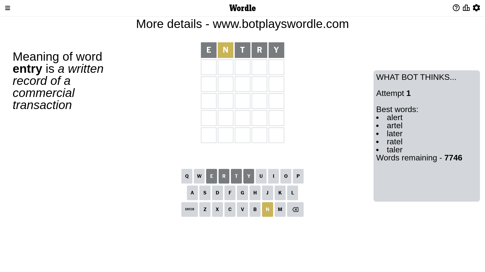
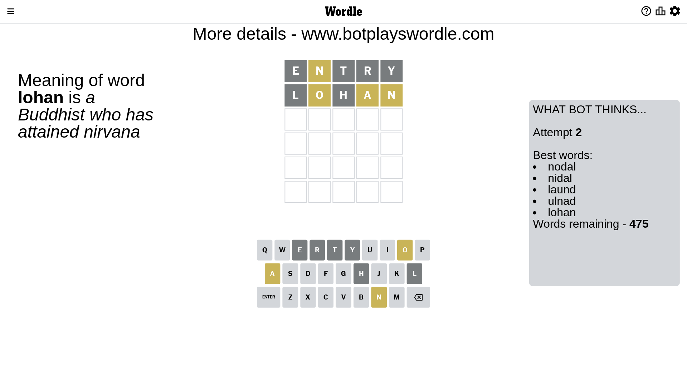
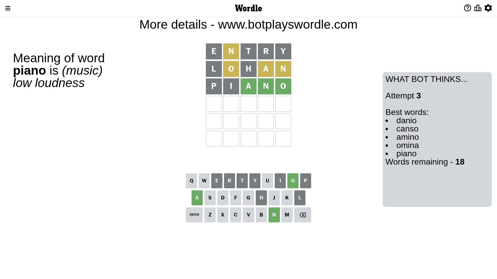
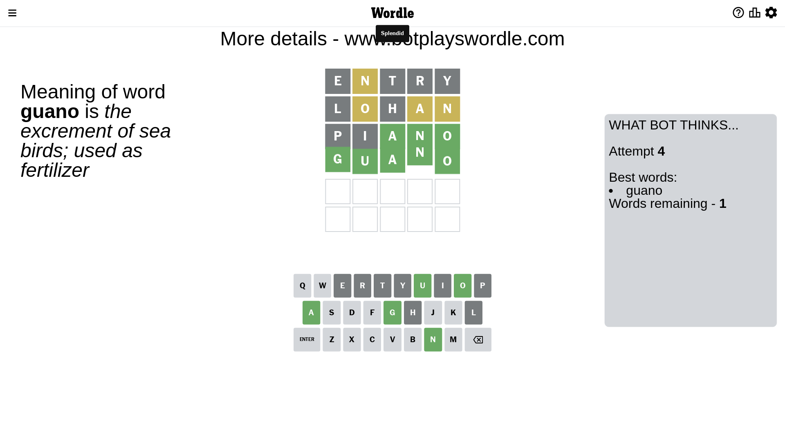

# Wordle for March 27, 2023 - \#646

## Attempt 1

This is the first attempt and we'll choose a random word to start with.

Let's start with word `entry`

Attempt for `entry` gives us 0 correct letters, 1 present letters and 4 wrong letters.

If we look into details, we can see that:

Letter `e` is not present in the word and we will not use it any more

Letter `n` is on a different spot - this means that it cannot be at position 2

Letter `t` is not present in the word and we will not use it any more

Letter `r` is not present in the word and we will not use it any more

Letter `y` is not present in the word and we will not use it any more

Some letters are missing (like `e`, `t`, `r`, `y`) but it's also important piece of information

Word should contain letters `[n]`

That was a great guess that limited number of remaining words

## Attempt 2

Right now we have 475 words to choose from and best of them seem to be `[nodal nidal laund ulnad lohan]`

So far we know that possible letters are:

At position 1: `[a b c d f g h i j k l m n o p q s u v w x z]`

At position 2: `[a b c d f g h i j k l m o p q s u v w x z]`

At position 3: `[a b c d f g h i j k l m n o p q s u v w x z]`

At position 4: `[a b c d f g h i j k l m n o p q s u v w x z]`

At position 5: `[a b c d f g h i j k l m n o p q s u v w x z]`

Next guess is `lohan`, let's see what it gives us

Attempt for `lohan` gives us 0 correct letters, 3 present letters and 2 wrong letters.

If we look into details, we can see that:

Letter `l` is not present in the word and we will not use it any more

Letter `o` is on a different spot - this means that it cannot be at position 2

Letter `h` is not present in the word and we will not use it any more

Letter `a` is on a different spot - this means that it cannot be at position 4

Letter `n` is on a different spot - this means that it cannot be at position 5

Some letters are missing (like `l`, `h`) but it's also important piece of information

Word should contain letters `[n o a]`

That was a great guess that limited number of remaining words

## Attempt 3

Right now we have 18 words to choose from and best of them seem to be `[danio canso amino omina piano]`

So far we know that possible letters are:

At position 1: `[a b c d f g i j k m n o p q s u v w x z]`

At position 2: `[a b c d f g i j k m p q s u v w x z]`

At position 3: `[a b c d f g i j k m n o p q s u v w x z]`

At position 4: `[b c d f g i j k m n o p q s u v w x z]`

At position 5: `[a b c d f g i j k m o p q s u v w x z]`

Next guess is `piano`, let's see what it gives us

Attempt for `piano` gives us 3 correct letters, 0 present letters and 2 wrong letters.

If we look into details, we can see that:

Letter `p` is not present in the word and we will not use it any more

Letter `i` is not present in the word and we will not use it any more

Letter `a` should be at position 3

Letter `n` should be at position 4

Letter `o` should be at position 5

We got information about the correct letters and it should make next attempt easier

Some letters are missing (like `p`, `i`) but it's also important piece of information

Word should contain letters `[n o a]`

That was a great guess that limited number of remaining words

## Attempt 4

Right now we have 1 words to choose from and best of them seem to be `[guano]`

So far we know that possible letters are:

At position 1: `[a b c d f g j k m n o q s u v w x z]`

At position 2: `[a b c d f g j k m q s u v w x z]`

At position 3: `[a]`

At position 4: `[n]`

At position 5: `[o]`

It must be `guano`

That's the correct answer! The word is `guano`!

## Conclusion

Today's word is `guano` and it took 4 attempts to guess it

