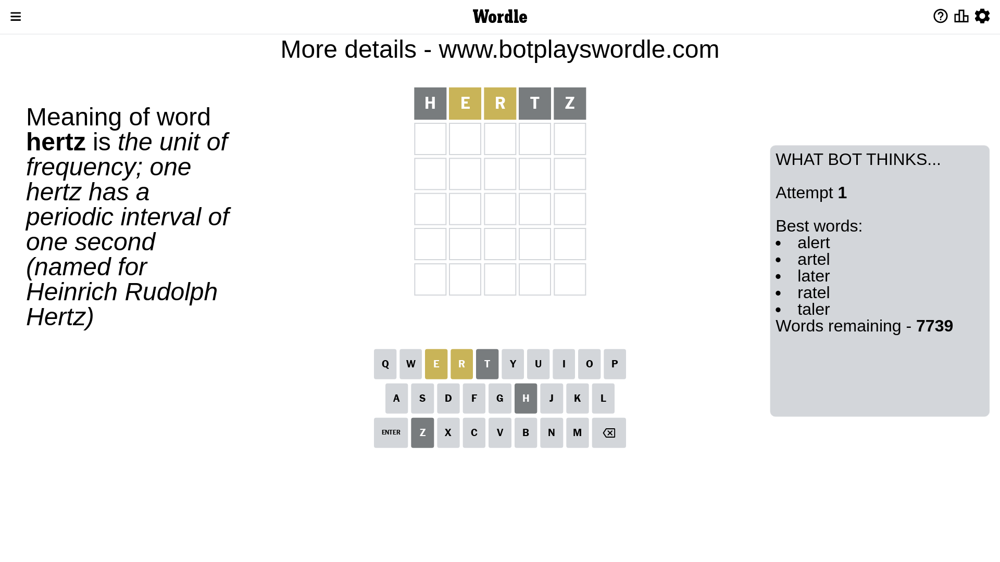

# Wordle for March 30, 2023 - \#649

## Attempt 1

This is the first attempt and we'll choose a random word to start with.

Let's start with word `hertz`

Attempt for `hertz` gives us 0 correct letters, 2 present letters and 3 wrong letters.

If we look into details, we can see that:

Letter `h` is not present in the word and we will not use it any more

Letter `e` is on a different spot - this means that it cannot be at position 2

Letter `r` is on a different spot - this means that it cannot be at position 3

Letter `t` is not present in the word and we will not use it any more

Letter `z` is not present in the word and we will not use it any more

Some letters are missing (like `h`, `t`, `z`) but it's also important piece of information

Word should contain letters `[e r]`

That was a great guess that limited number of remaining words

## Attempt 2

Right now we have 520 words to choose from and best of them seem to be `[liner alder lader older idler]`

So far we know that possible letters are:

At position 1: `[a b c d e f g i j k l m n o p q r s u v w x y]`

At position 2: `[a b c d f g i j k l m n o p q r s u v w x y]`

At position 3: `[a b c d e f g i j k l m n o p q s u v w x y]`

At position 4: `[a b c d e f g i j k l m n o p q r s u v w x y]`

At position 5: `[a b c d e f g i j k l m n o p q r s u v w x y]`

Next guess is `alder`, let's see what it gives us

Attempt for `alder` gives us 0 correct letters, 4 present letters and 1 wrong letters.

If we look into details, we can see that:

Letter `a` is on a different spot - this means that it cannot be at position 1

Letter `l` is not present in the word and we will not use it any more

Letter `d` is on a different spot - this means that it cannot be at position 3

Letter `e` is on a different spot - this means that it cannot be at position 4

Letter `r` is on a different spot - this means that it cannot be at position 5

Some letters are missing (like `l`) but it's also important piece of information

Word should contain letters `[e r a d]`

That was a great guess that limited number of remaining words

## Attempt 3

Right now we have 8 words to choose from and best of them seem to be `[oread irade drape bread grade]`

So far we know that possible letters are:

At position 1: `[b c d e f g i j k m n o p q r s u v w x y]`

At position 2: `[a b c d f g i j k m n o p q r s u v w x y]`

At position 3: `[a b c e f g i j k m n o p q s u v w x y]`

At position 4: `[a b c d f g i j k m n o p q r s u v w x y]`

At position 5: `[a b c d e f g i j k m n o p q s u v w x y]`

Next guess is `bread`, let's see what it gives us

That's the correct answer! The word is `bread`!

## Conclusion

Today's word is `bread` and it took 3 attempts to guess it

