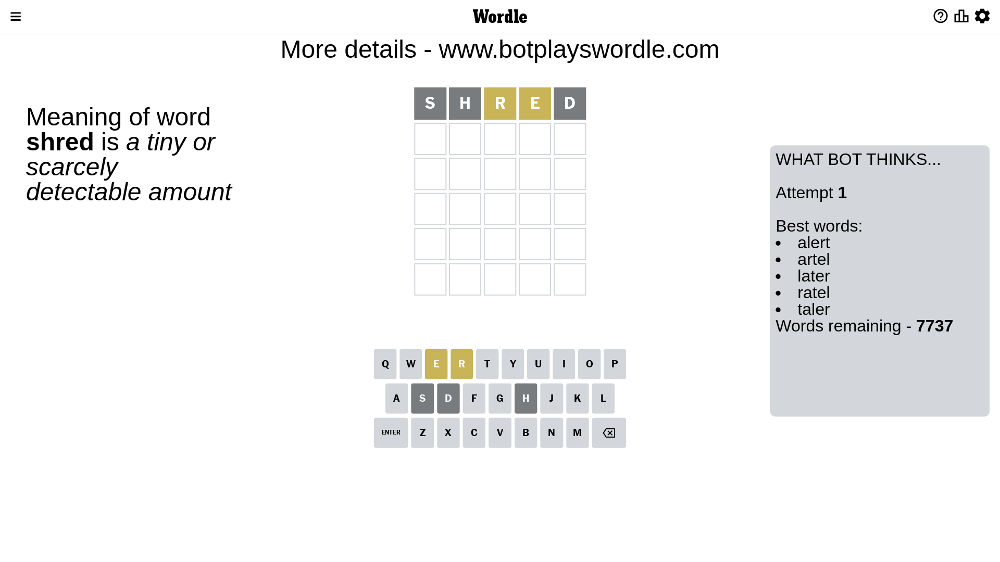
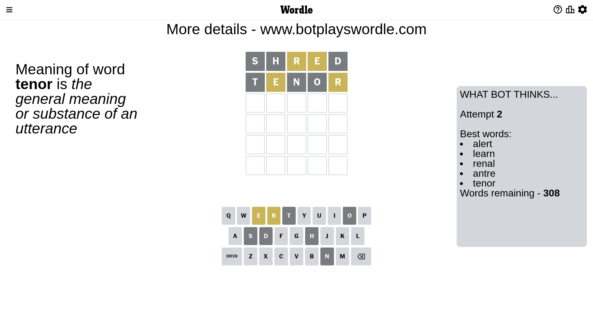
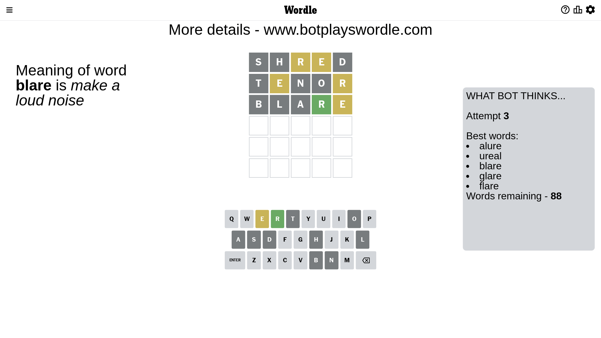
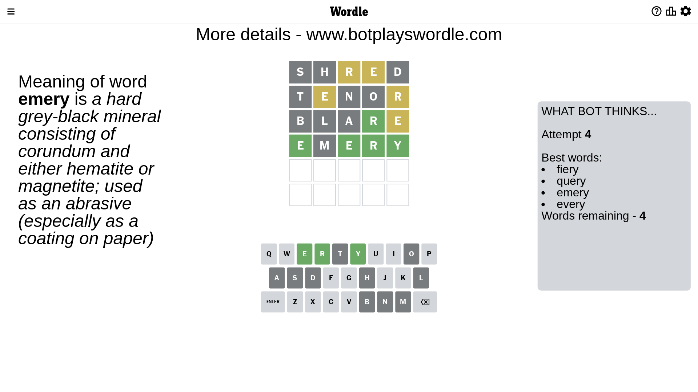
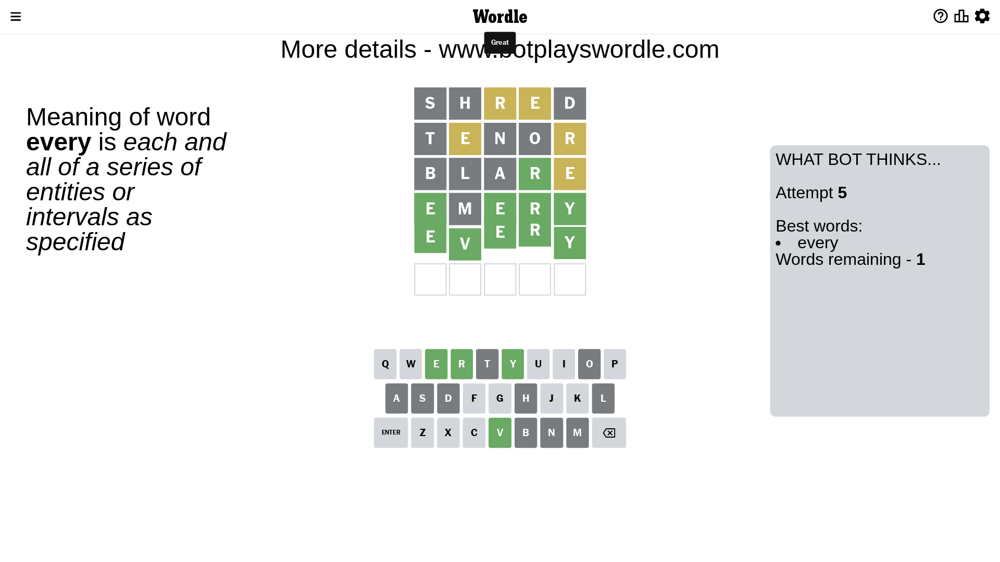

# Wordle for March 31, 2023 - \#650

## Attempt 1

This is the first attempt and we'll choose a random word to start with.

Let's start with word `shred`

Attempt for `shred` gives us 0 correct letters, 2 present letters and 3 wrong letters.

If we look into details, we can see that:

Letter `s` is not present in the word and we will not use it any more

Letter `h` is not present in the word and we will not use it any more

Letter `r` is on a different spot - this means that it cannot be at position 3

Letter `e` is on a different spot - this means that it cannot be at position 4

Letter `d` is not present in the word and we will not use it any more

Some letters are missing (like `s`, `h`, `d`) but it's also important piece of information

Word should contain letters `[r e]`

That was a great guess that limited number of remaining words

## Attempt 2

Right now we have 308 words to choose from and best of them seem to be `[alert learn renal antre tenor]`

So far we know that possible letters are:

At position 1: `[a b c e f g i j k l m n o p q r t u v w x y z]`

At position 2: `[a b c e f g i j k l m n o p q r t u v w x y z]`

At position 3: `[a b c e f g i j k l m n o p q t u v w x y z]`

At position 4: `[a b c f g i j k l m n o p q r t u v w x y z]`

At position 5: `[a b c e f g i j k l m n o p q r t u v w x y z]`

Next guess is `tenor`, let's see what it gives us

Attempt for `tenor` gives us 0 correct letters, 2 present letters and 3 wrong letters.

If we look into details, we can see that:

Letter `t` is not present in the word and we will not use it any more

Letter `e` is on a different spot - this means that it cannot be at position 2

Letter `n` is not present in the word and we will not use it any more

Letter `o` is not present in the word and we will not use it any more

Letter `r` is on a different spot - this means that it cannot be at position 5

Some letters are missing (like `t`, `n`, `o`) but it's also important piece of information

Word should contain letters `[r e]`

Could be a better guess

## Attempt 3

Right now we have 88 words to choose from and best of them seem to be `[alure ureal blare glare flare]`

So far we know that possible letters are:

At position 1: `[a b c e f g i j k l m p q r u v w x y z]`

At position 2: `[a b c f g i j k l m p q r u v w x y z]`

At position 3: `[a b c e f g i j k l m p q u v w x y z]`

At position 4: `[a b c f g i j k l m p q r u v w x y z]`

At position 5: `[a b c e f g i j k l m p q u v w x y z]`

Next guess is `blare`, let's see what it gives us

Attempt for `blare` gives us 1 correct letters, 1 present letters and 3 wrong letters.

If we look into details, we can see that:

Letter `b` is not present in the word and we will not use it any more

Letter `l` is not present in the word and we will not use it any more

Letter `a` is not present in the word and we will not use it any more

Letter `r` should be at position 4

Letter `e` is on a different spot - this means that it cannot be at position 5

We got information about the correct letters and it should make next attempt easier

Some letters are missing (like `b`, `l`, `a`) but it's also important piece of information

Word should contain letters `[r e]`

That was a great guess that limited number of remaining words

## Attempt 4

Right now we have 4 words to choose from and best of them seem to be `[fiery query emery every]`

So far we know that possible letters are:

At position 1: `[c e f g i j k m p q r u v w x y z]`

At position 2: `[c f g i j k m p q r u v w x y z]`

At position 3: `[c e f g i j k m p q u v w x y z]`

At position 4: `[r]`

At position 5: `[c f g i j k m p q u v w x y z]`

Next guess is `emery`, let's see what it gives us

Attempt for `emery` gives us 4 correct letters, 0 present letters and 1 wrong letters.

If we look into details, we can see that:

Letter `e` should be at position 1

Letter `m` is not present in the word and we will not use it any more

Letter `e` should be at position 3

Letter `y` should be at position 5

We got information about the correct letters and it should make next attempt easier

Some letters are missing (like `m`) but it's also important piece of information

Word should contain letters `[r e y]`

Could be a better guess

## Attempt 5

Right now we have 1 words to choose from and best of them seem to be `[every]`

So far we know that possible letters are:

At position 1: `[e]`

At position 2: `[c f g i j k p q r u v w x y z]`

At position 3: `[e]`

At position 4: `[r]`

At position 5: `[y]`

It must be `every`

That's the correct answer! The word is `every`!

## Conclusion

Today's word is `every` and it took 5 attempts to guess it

