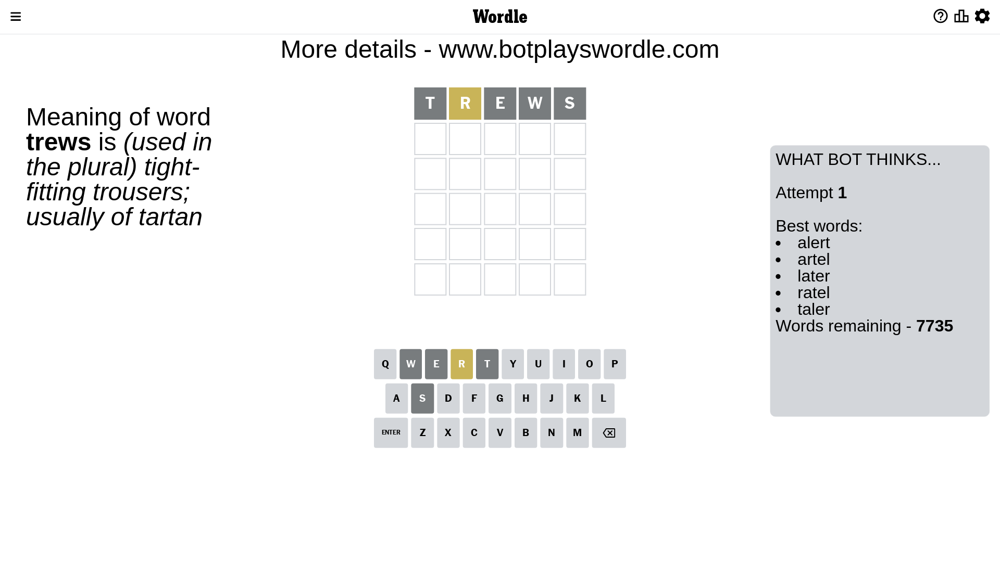
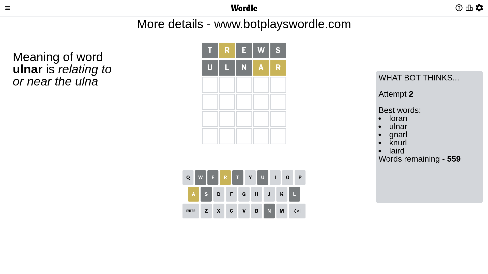
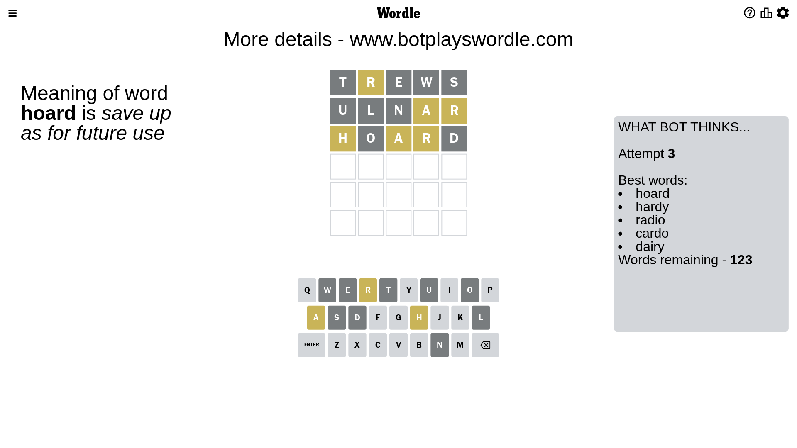
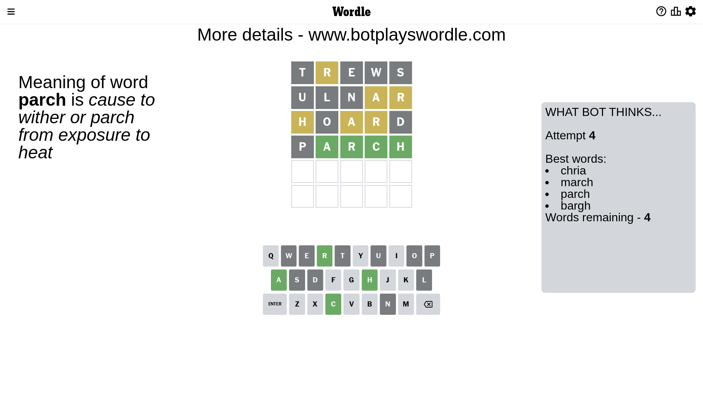
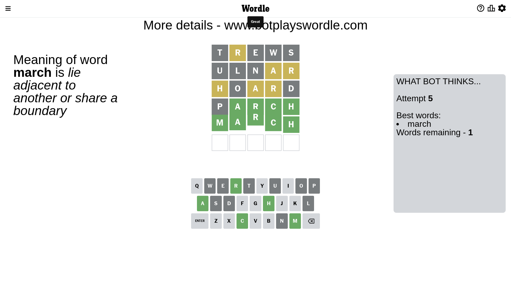

# Wordle for April 1, 2023 - \#651

## Attempt 1

This is the first attempt and we'll choose a random word to start with.

Let's start with word `trews`

Attempt for `trews` gives us 0 correct letters, 1 present letters and 4 wrong letters.

If we look into details, we can see that:

Letter `t` is not present in the word and we will not use it any more

Letter `r` is on a different spot - this means that it cannot be at position 2

Letter `e` is not present in the word and we will not use it any more

Letter `w` is not present in the word and we will not use it any more

Letter `s` is not present in the word and we will not use it any more

Some letters are missing (like `t`, `e`, `w`, `s`) but it's also important piece of information

Word should contain letters `[r]`

That was a great guess that limited number of remaining words

## Attempt 2

Right now we have 559 words to choose from and best of them seem to be `[loran ulnar gnarl knurl laird]`

So far we know that possible letters are:

At position 1: `[a b c d f g h i j k l m n o p q r u v x y z]`

At position 2: `[a b c d f g h i j k l m n o p q u v x y z]`

At position 3: `[a b c d f g h i j k l m n o p q r u v x y z]`

At position 4: `[a b c d f g h i j k l m n o p q r u v x y z]`

At position 5: `[a b c d f g h i j k l m n o p q r u v x y z]`

Next guess is `ulnar`, let's see what it gives us

Attempt for `ulnar` gives us 0 correct letters, 2 present letters and 3 wrong letters.

If we look into details, we can see that:

Letter `u` is not present in the word and we will not use it any more

Letter `l` is not present in the word and we will not use it any more

Letter `n` is not present in the word and we will not use it any more

Letter `a` is on a different spot - this means that it cannot be at position 4

Letter `r` is on a different spot - this means that it cannot be at position 5

Some letters are missing (like `u`, `l`, `n`) but it's also important piece of information

Word should contain letters `[r a]`

Not a bad guess in general

## Attempt 3

Right now we have 123 words to choose from and best of them seem to be `[hoard hardy radio cardo dairy]`

So far we know that possible letters are:

At position 1: `[a b c d f g h i j k m o p q r v x y z]`

At position 2: `[a b c d f g h i j k m o p q v x y z]`

At position 3: `[a b c d f g h i j k m o p q r v x y z]`

At position 4: `[b c d f g h i j k m o p q r v x y z]`

At position 5: `[a b c d f g h i j k m o p q v x y z]`

Next guess is `hoard`, let's see what it gives us

Attempt for `hoard` gives us 0 correct letters, 3 present letters and 2 wrong letters.

If we look into details, we can see that:

Letter `h` is on a different spot - this means that it cannot be at position 1

Letter `o` is not present in the word and we will not use it any more

Letter `a` is on a different spot - this means that it cannot be at position 3

Letter `r` is on a different spot - this means that it cannot be at position 4

Letter `d` is not present in the word and we will not use it any more

Some letters are missing (like `o`, `d`) but it's also important piece of information

Word should contain letters `[r a h]`

That was a great guess that limited number of remaining words

## Attempt 4

Right now we have 4 words to choose from and best of them seem to be `[chria march parch bargh]`

So far we know that possible letters are:

At position 1: `[a b c f g i j k m p q r v x y z]`

At position 2: `[a b c f g h i j k m p q v x y z]`

At position 3: `[b c f g h i j k m p q r v x y z]`

At position 4: `[b c f g h i j k m p q v x y z]`

At position 5: `[a b c f g h i j k m p q v x y z]`

Next guess is `parch`, let's see what it gives us

Attempt for `parch` gives us 4 correct letters, 0 present letters and 1 wrong letters.

If we look into details, we can see that:

Letter `p` is not present in the word and we will not use it any more

Letter `a` should be at position 2

Letter `r` should be at position 3

Letter `c` should be at position 4

Letter `h` should be at position 5

We got information about the correct letters and it should make next attempt easier

Some letters are missing (like `p`) but it's also important piece of information

Word should contain letters `[r a h c]`

Could be a better guess

## Attempt 5

Right now we have 1 words to choose from and best of them seem to be `[march]`

So far we know that possible letters are:

At position 1: `[a b c f g i j k m q r v x y z]`

At position 2: `[a]`

At position 3: `[r]`

At position 4: `[c]`

At position 5: `[h]`

It must be `march`

That's the correct answer! The word is `march`!

## Conclusion

Today's word is `march` and it took 5 attempts to guess it

