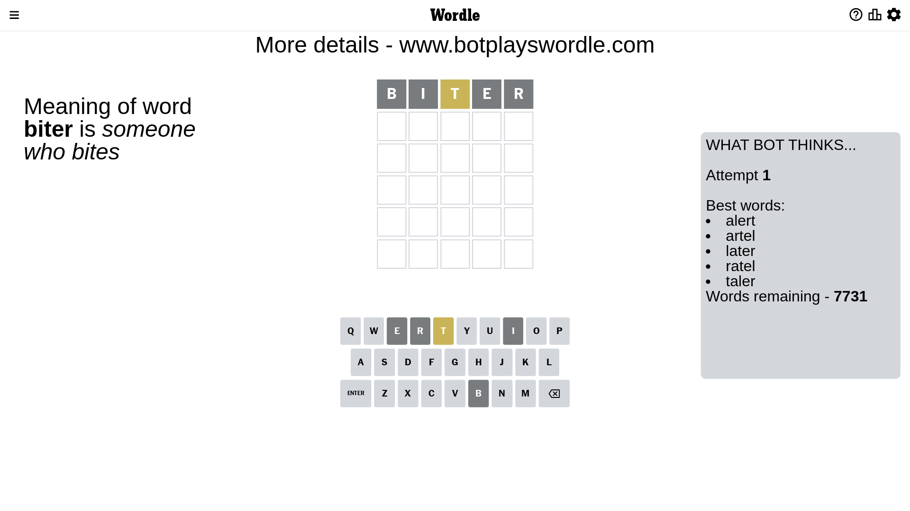
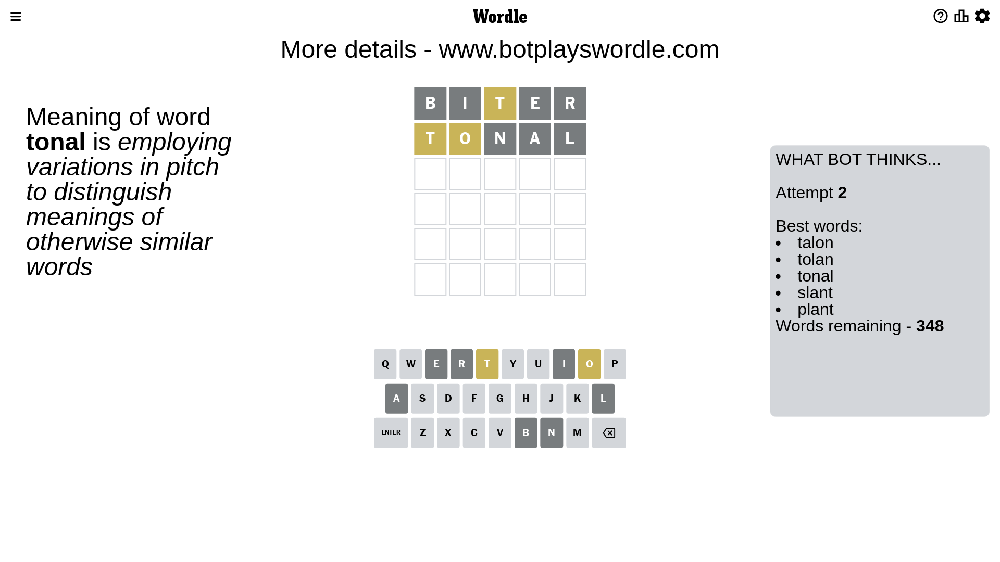
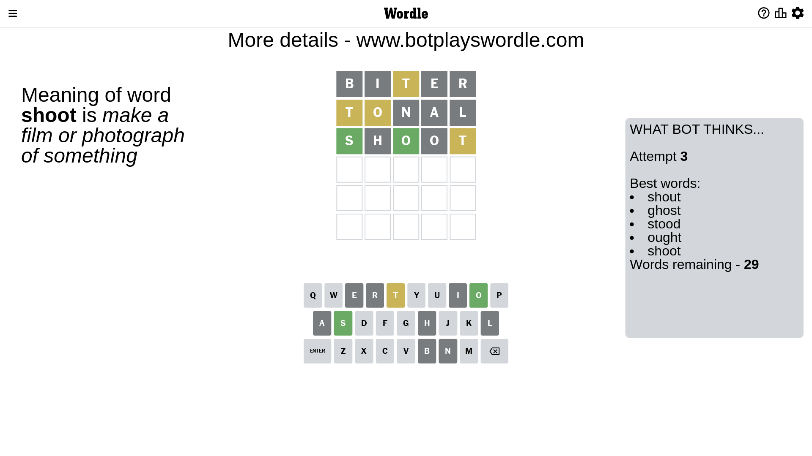
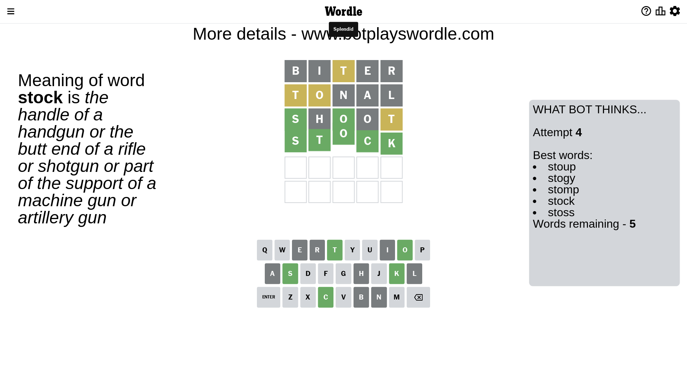

# Wordle for April 2, 2023 - \#652

## Attempt 1

This is the first attempt and we'll choose a random word to start with.

Let's start with word `biter`

Attempt for `biter` gives us 0 correct letters, 1 present letters and 4 wrong letters.

If we look into details, we can see that:

Letter `b` is not present in the word and we will not use it any more

Letter `i` is not present in the word and we will not use it any more

Letter `t` is on a different spot - this means that it cannot be at position 3

Letter `e` is not present in the word and we will not use it any more

Letter `r` is not present in the word and we will not use it any more

Some letters are missing (like `b`, `i`, `e`, `r`) but it's also important piece of information

Word should contain letters `[t]`

That was a great guess that limited number of remaining words

## Attempt 2

Right now we have 348 words to choose from and best of them seem to be `[talon tolan tonal slant plant]`

So far we know that possible letters are:

At position 1: `[a c d f g h j k l m n o p q s t u v w x y z]`

At position 2: `[a c d f g h j k l m n o p q s t u v w x y z]`

At position 3: `[a c d f g h j k l m n o p q s u v w x y z]`

At position 4: `[a c d f g h j k l m n o p q s t u v w x y z]`

At position 5: `[a c d f g h j k l m n o p q s t u v w x y z]`

Next guess is `tonal`, let's see what it gives us

Attempt for `tonal` gives us 0 correct letters, 2 present letters and 3 wrong letters.

If we look into details, we can see that:

Letter `t` is on a different spot - this means that it cannot be at position 1

Letter `o` is on a different spot - this means that it cannot be at position 2

Letter `n` is not present in the word and we will not use it any more

Letter `a` is not present in the word and we will not use it any more

Letter `l` is not present in the word and we will not use it any more

Some letters are missing (like `n`, `a`, `l`) but it's also important piece of information

Word should contain letters `[t o]`

That was a great guess that limited number of remaining words

## Attempt 3

Right now we have 29 words to choose from and best of them seem to be `[shout ghost stood ought shoot]`

So far we know that possible letters are:

At position 1: `[c d f g h j k m o p q s u v w x y z]`

At position 2: `[c d f g h j k m p q s t u v w x y z]`

At position 3: `[c d f g h j k m o p q s u v w x y z]`

At position 4: `[c d f g h j k m o p q s t u v w x y z]`

At position 5: `[c d f g h j k m o p q s t u v w x y z]`

Next guess is `shoot`, let's see what it gives us

Attempt for `shoot` gives us 2 correct letters, 1 present letters and 2 wrong letters.

If we look into details, we can see that:

Letter `s` should be at position 1

Letter `h` is not present in the word and we will not use it any more

Letter `o` should be at position 3

Letter `o` is not present in the word and we will not use it any more

Letter `t` is on a different spot - this means that it cannot be at position 5

We got information about the correct letters and it should make next attempt easier

Some letters are missing (like `h`, `o`) but it's also important piece of information

Word should contain letters `[t o s]`

Not a bad guess in general

## Attempt 4

Right now we have 5 words to choose from and best of them seem to be `[stoup stogy stomp stock stoss]`

So far we know that possible letters are:

At position 1: `[s]`

At position 2: `[c d f g j k m p q s t u v w x y z]`

At position 3: `[o]`

At position 4: `[c d f g j k m p q s t u v w x y z]`

At position 5: `[c d f g j k m p q s u v w x y z]`

Next guess is `stock`, let's see what it gives us

That's the correct answer! The word is `stock`!

## Conclusion

Today's word is `stock` and it took 4 attempts to guess it

