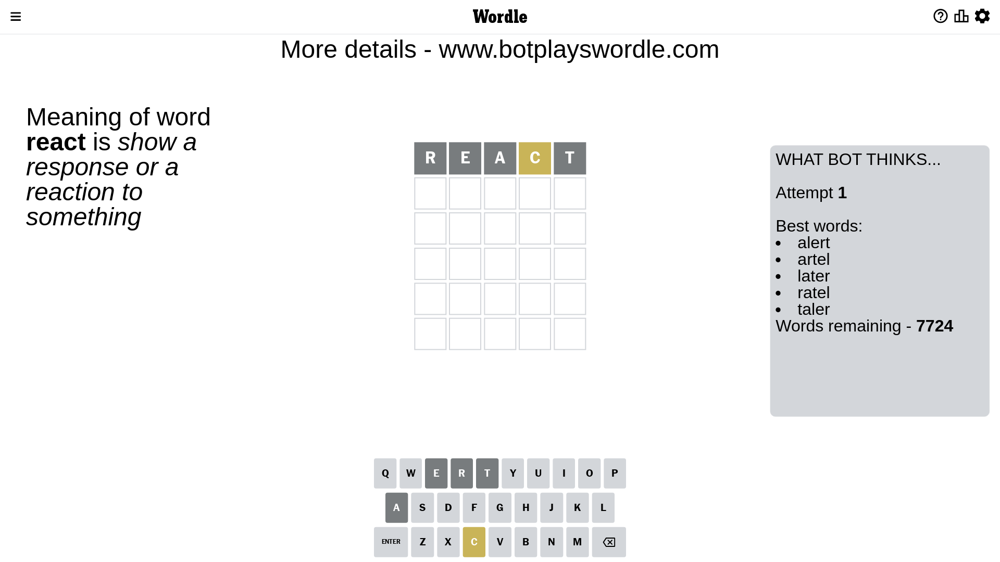
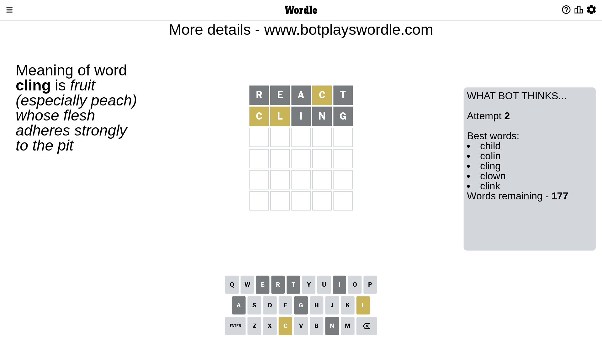
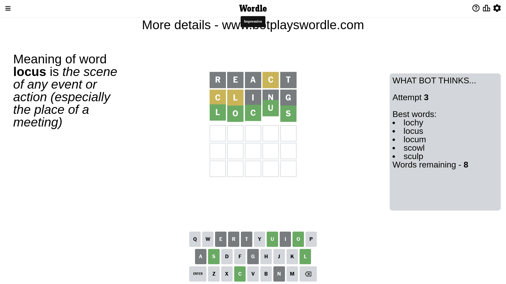

# Wordle for April 7, 2023 - \#657

## Attempt 1

This is the first attempt and we'll choose a random word to start with.

Let's start with word `react`

Attempt for `react` gives us 0 correct letters, 1 present letters and 4 wrong letters.

If we look into details, we can see that:

Letter `r` is not present in the word and we will not use it any more

Letter `e` is not present in the word and we will not use it any more

Letter `a` is not present in the word and we will not use it any more

Letter `c` is on a different spot - this means that it cannot be at position 4

Letter `t` is not present in the word and we will not use it any more

Some letters are missing (like `r`, `e`, `a`, `t`) but it's also important piece of information

Word should contain letters `[c]`

That was a great guess that limited number of remaining words

## Attempt 2

Right now we have 177 words to choose from and best of them seem to be `[child colin cling clown clink]`

So far we know that possible letters are:

At position 1: `[b c d f g h i j k l m n o p q s u v w x y z]`

At position 2: `[b c d f g h i j k l m n o p q s u v w x y z]`

At position 3: `[b c d f g h i j k l m n o p q s u v w x y z]`

At position 4: `[b d f g h i j k l m n o p q s u v w x y z]`

At position 5: `[b c d f g h i j k l m n o p q s u v w x y z]`

Next guess is `cling`, let's see what it gives us

Attempt for `cling` gives us 0 correct letters, 2 present letters and 3 wrong letters.

If we look into details, we can see that:

Letter `c` is on a different spot - this means that it cannot be at position 1

Letter `l` is on a different spot - this means that it cannot be at position 2

Letter `i` is not present in the word and we will not use it any more

Letter `n` is not present in the word and we will not use it any more

Letter `g` is not present in the word and we will not use it any more

Some letters are missing (like `i`, `n`, `g`) but it's also important piece of information

Word should contain letters `[c l]`

That was a great guess that limited number of remaining words

## Attempt 3

Right now we have 8 words to choose from and best of them seem to be `[lochy locus locum scowl sculp]`

So far we know that possible letters are:

At position 1: `[b d f h j k l m o p q s u v w x y z]`

At position 2: `[b c d f h j k m o p q s u v w x y z]`

At position 3: `[b c d f h j k l m o p q s u v w x y z]`

At position 4: `[b d f h j k l m o p q s u v w x y z]`

At position 5: `[b c d f h j k l m o p q s u v w x y z]`

Next guess is `locus`, let's see what it gives us

That's the correct answer! The word is `locus`!

## Conclusion

Today's word is `locus` and it took 3 attempts to guess it

