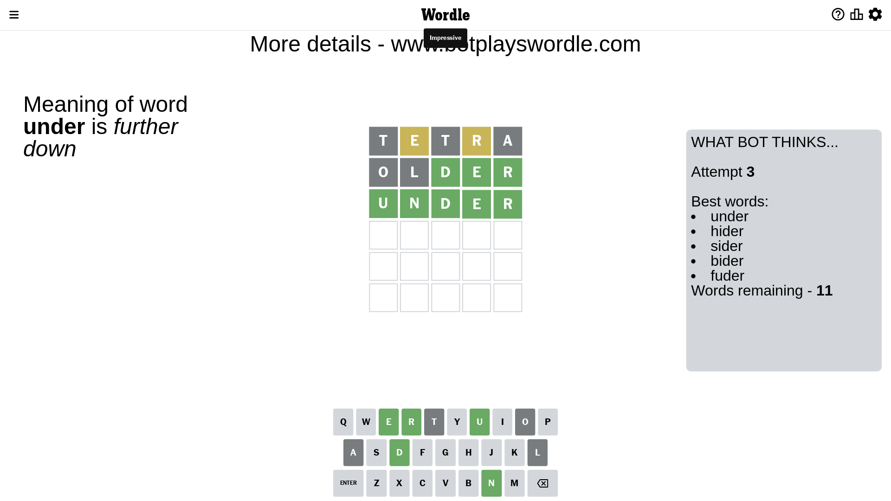

# Wordle for April 10, 2023 - \#660

## Attempt 1

This is the first attempt and we'll choose a random word to start with.

Let's start with word `tetra`

Attempt for `tetra` gives us 0 correct letters, 2 present letters and 3 wrong letters.

If we look into details, we can see that:

Letter `t` is not present in the word and we will not use it any more

Letter `e` is on a different spot - this means that it cannot be at position 2

Letter `t` is not present in the word and we will not use it any more

Letter `r` is on a different spot - this means that it cannot be at position 4

Letter `a` is not present in the word and we will not use it any more

Some letters are missing (like `t`, `a`) but it's also important piece of information

Word should contain letters `[e r]`

That was a great guess that limited number of remaining words

## Attempt 2

Right now we have 420 words to choose from and best of them seem to be `[enrol liner older idler drone]`

So far we know that possible letters are:

At position 1: `[b c d e f g h i j k l m n o p q r s u v w x y z]`

At position 2: `[b c d f g h i j k l m n o p q r s u v w x y z]`

At position 3: `[b c d e f g h i j k l m n o p q r s u v w x y z]`

At position 4: `[b c d e f g h i j k l m n o p q s u v w x y z]`

At position 5: `[b c d e f g h i j k l m n o p q r s u v w x y z]`

Next guess is `older`, let's see what it gives us

Attempt for `older` gives us 3 correct letters, 0 present letters and 2 wrong letters.

If we look into details, we can see that:

Letter `o` is not present in the word and we will not use it any more

Letter `l` is not present in the word and we will not use it any more

Letter `d` should be at position 3

Letter `e` should be at position 4

Letter `r` should be at position 5

We got information about the correct letters and it should make next attempt easier

Some letters are missing (like `o`, `l`) but it's also important piece of information

Word should contain letters `[e r d]`

That was a great guess that limited number of remaining words

## Attempt 3

Right now we have 11 words to choose from and best of them seem to be `[under hider sider bider fuder]`

So far we know that possible letters are:

At position 1: `[b c d e f g h i j k m n p q r s u v w x y z]`

At position 2: `[b c d f g h i j k m n p q r s u v w x y z]`

At position 3: `[d]`

At position 4: `[e]`

At position 5: `[r]`

Next guess is `under`, let's see what it gives us

That's the correct answer! The word is `under`!

## Conclusion

Today's word is `under` and it took 3 attempts to guess it

