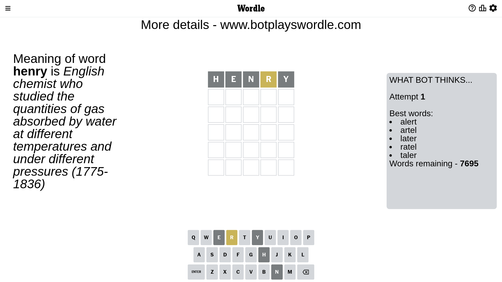
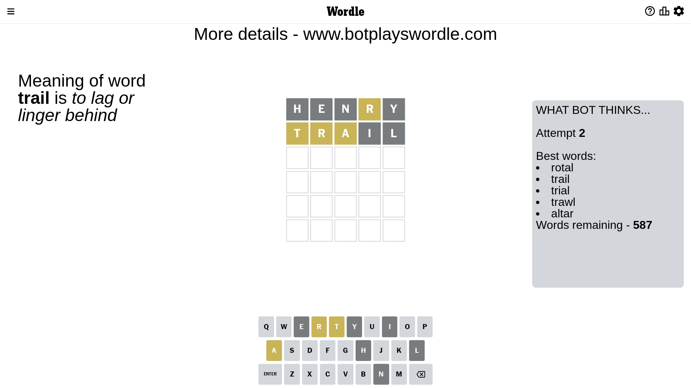
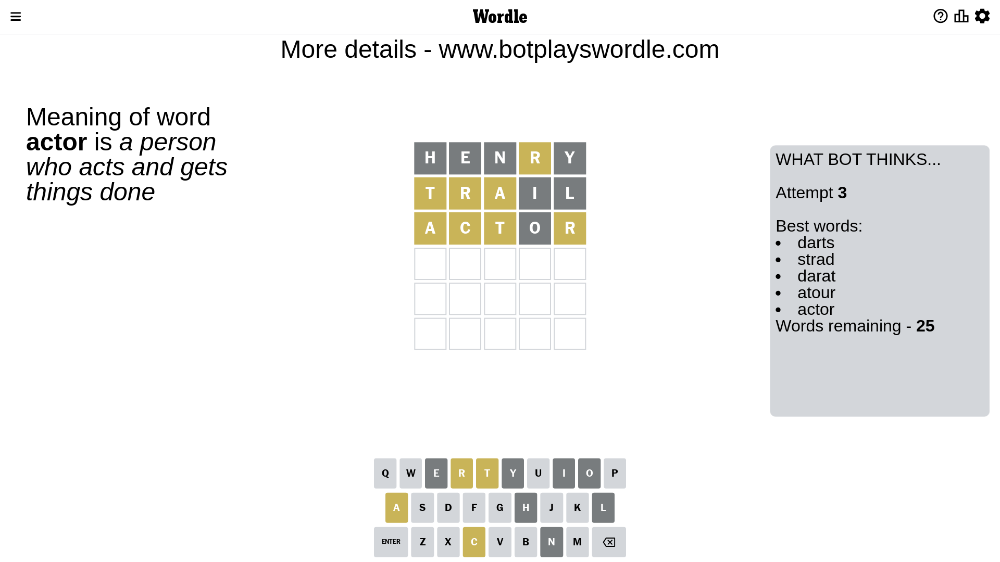
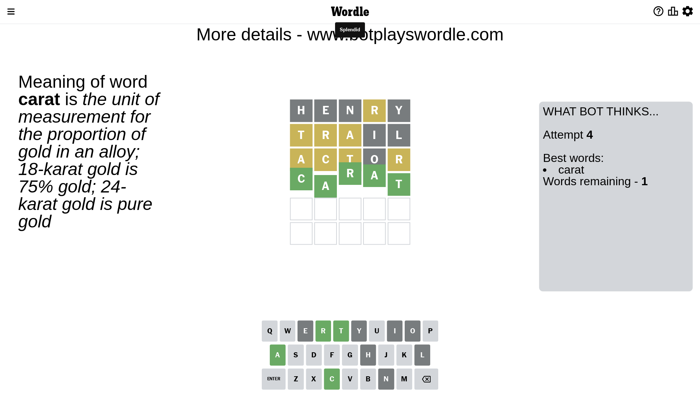

# Wordle for April 13, 2023 - \#663

## Attempt 1

This is the first attempt and we'll choose a random word to start with.

Let's start with word `henry`

Attempt for `henry` gives us 0 correct letters, 1 present letters and 4 wrong letters.

If we look into details, we can see that:

Letter `h` is not present in the word and we will not use it any more

Letter `e` is not present in the word and we will not use it any more

Letter `n` is not present in the word and we will not use it any more

Letter `r` is on a different spot - this means that it cannot be at position 4

Letter `y` is not present in the word and we will not use it any more

Some letters are missing (like `h`, `e`, `n`, `y`) but it's also important piece of information

Word should contain letters `[r]`

That was a great guess that limited number of remaining words

## Attempt 2

Right now we have 587 words to choose from and best of them seem to be `[rotal trail trial trawl altar]`

So far we know that possible letters are:

At position 1: `[a b c d f g i j k l m o p q r s t u v w x z]`

At position 2: `[a b c d f g i j k l m o p q r s t u v w x z]`

At position 3: `[a b c d f g i j k l m o p q r s t u v w x z]`

At position 4: `[a b c d f g i j k l m o p q s t u v w x z]`

At position 5: `[a b c d f g i j k l m o p q r s t u v w x z]`

Next guess is `trail`, let's see what it gives us

Attempt for `trail` gives us 0 correct letters, 3 present letters and 2 wrong letters.

If we look into details, we can see that:

Letter `t` is on a different spot - this means that it cannot be at position 1

Letter `r` is on a different spot - this means that it cannot be at position 2

Letter `a` is on a different spot - this means that it cannot be at position 3

Letter `i` is not present in the word and we will not use it any more

Letter `l` is not present in the word and we will not use it any more

Some letters are missing (like `i`, `l`) but it's also important piece of information

Word should contain letters `[r t a]`

That was a great guess that limited number of remaining words

## Attempt 3

Right now we have 25 words to choose from and best of them seem to be `[darts strad darat atour actor]`

So far we know that possible letters are:

At position 1: `[a b c d f g j k m o p q r s u v w x z]`

At position 2: `[a b c d f g j k m o p q s t u v w x z]`

At position 3: `[b c d f g j k m o p q r s t u v w x z]`

At position 4: `[a b c d f g j k m o p q s t u v w x z]`

At position 5: `[a b c d f g j k m o p q r s t u v w x z]`

Next guess is `actor`, let's see what it gives us

Attempt for `actor` gives us 0 correct letters, 4 present letters and 1 wrong letters.

If we look into details, we can see that:

Letter `a` is on a different spot - this means that it cannot be at position 1

Letter `c` is on a different spot - this means that it cannot be at position 2

Letter `t` is on a different spot - this means that it cannot be at position 3

Letter `o` is not present in the word and we will not use it any more

Letter `r` is on a different spot - this means that it cannot be at position 5

Some letters are missing (like `o`) but it's also important piece of information

Word should contain letters `[r t a c]`

That was a great guess that limited number of remaining words

## Attempt 4

Right now we have 1 words to choose from and best of them seem to be `[carat]`

So far we know that possible letters are:

At position 1: `[b c d f g j k m p q r s u v w x z]`

At position 2: `[a b d f g j k m p q s t u v w x z]`

At position 3: `[b c d f g j k m p q r s u v w x z]`

At position 4: `[a b c d f g j k m p q s t u v w x z]`

At position 5: `[a b c d f g j k m p q s t u v w x z]`

It must be `carat`

That's the correct answer! The word is `carat`!

## Conclusion

Today's word is `carat` and it took 4 attempts to guess it

