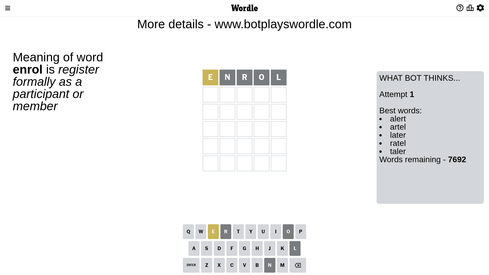
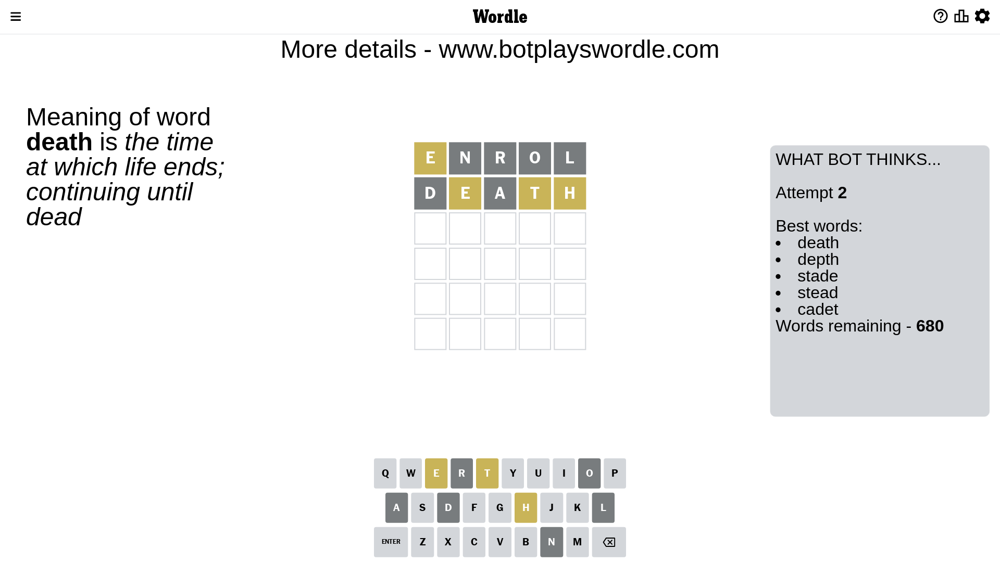
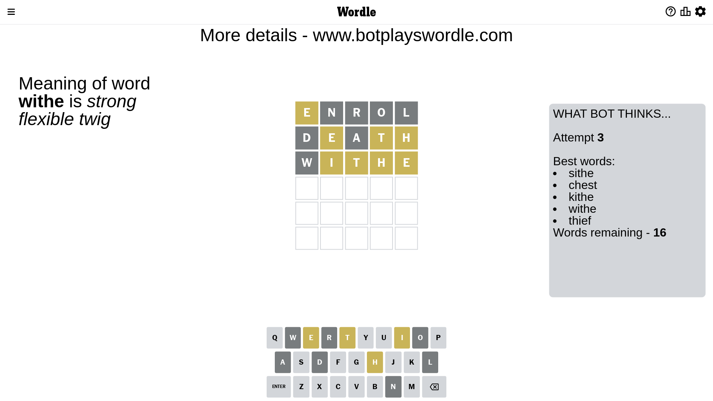
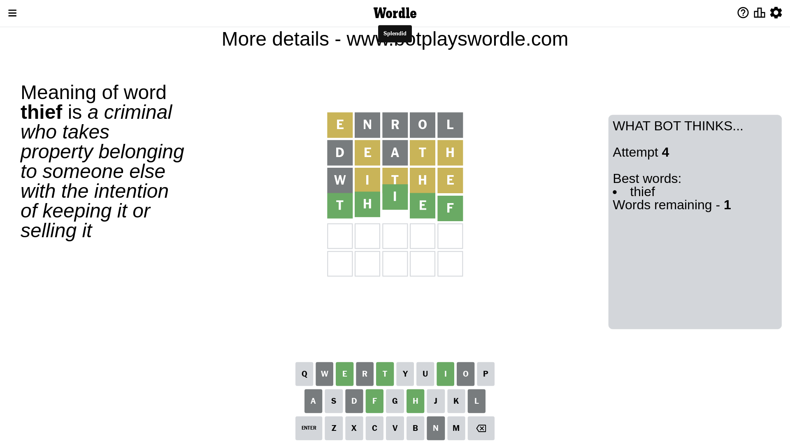

# Wordle for April 14, 2023 - \#664

## Attempt 1

This is the first attempt and we'll choose a random word to start with.

Let's start with word `enrol`

Attempt for `enrol` gives us 0 correct letters, 1 present letters and 4 wrong letters.

If we look into details, we can see that:

Letter `e` is on a different spot - this means that it cannot be at position 1

Letter `n` is not present in the word and we will not use it any more

Letter `r` is not present in the word and we will not use it any more

Letter `o` is not present in the word and we will not use it any more

Letter `l` is not present in the word and we will not use it any more

Some letters are missing (like `n`, `r`, `o`, `l`) but it's also important piece of information

Word should contain letters `[e]`

That was a great guess that limited number of remaining words

## Attempt 2

Right now we have 680 words to choose from and best of them seem to be `[death depth stade stead cadet]`

So far we know that possible letters are:

At position 1: `[a b c d f g h i j k m p q s t u v w x y z]`

At position 2: `[a b c d e f g h i j k m p q s t u v w x y z]`

At position 3: `[a b c d e f g h i j k m p q s t u v w x y z]`

At position 4: `[a b c d e f g h i j k m p q s t u v w x y z]`

At position 5: `[a b c d e f g h i j k m p q s t u v w x y z]`

Next guess is `death`, let's see what it gives us

Attempt for `death` gives us 0 correct letters, 3 present letters and 2 wrong letters.

If we look into details, we can see that:

Letter `d` is not present in the word and we will not use it any more

Letter `e` is on a different spot - this means that it cannot be at position 2

Letter `a` is not present in the word and we will not use it any more

Letter `t` is on a different spot - this means that it cannot be at position 4

Letter `h` is on a different spot - this means that it cannot be at position 5

Some letters are missing (like `d`, `a`) but it's also important piece of information

Word should contain letters `[e t h]`

That was a great guess that limited number of remaining words

## Attempt 3

Right now we have 16 words to choose from and best of them seem to be `[sithe chest kithe withe thief]`

So far we know that possible letters are:

At position 1: `[b c f g h i j k m p q s t u v w x y z]`

At position 2: `[b c f g h i j k m p q s t u v w x y z]`

At position 3: `[b c e f g h i j k m p q s t u v w x y z]`

At position 4: `[b c e f g h i j k m p q s u v w x y z]`

At position 5: `[b c e f g i j k m p q s t u v w x y z]`

Next guess is `withe`, let's see what it gives us

Attempt for `withe` gives us 0 correct letters, 4 present letters and 1 wrong letters.

If we look into details, we can see that:

Letter `w` is not present in the word and we will not use it any more

Letter `i` is on a different spot - this means that it cannot be at position 2

Letter `t` is on a different spot - this means that it cannot be at position 3

Letter `h` is on a different spot - this means that it cannot be at position 4

Letter `e` is on a different spot - this means that it cannot be at position 5

Some letters are missing (like `w`) but it's also important piece of information

Word should contain letters `[e t h i]`

That was a great guess that limited number of remaining words

## Attempt 4

Right now we have 1 words to choose from and best of them seem to be `[thief]`

So far we know that possible letters are:

At position 1: `[b c f g h i j k m p q s t u v x y z]`

At position 2: `[b c f g h j k m p q s t u v x y z]`

At position 3: `[b c e f g h i j k m p q s u v x y z]`

At position 4: `[b c e f g i j k m p q s u v x y z]`

At position 5: `[b c f g i j k m p q s t u v x y z]`

It must be `thief`

That's the correct answer! The word is `thief`!

## Conclusion

Today's word is `thief` and it took 4 attempts to guess it

