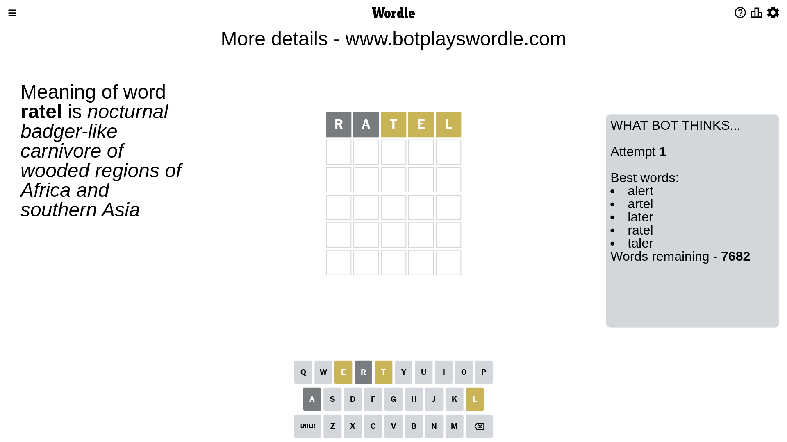
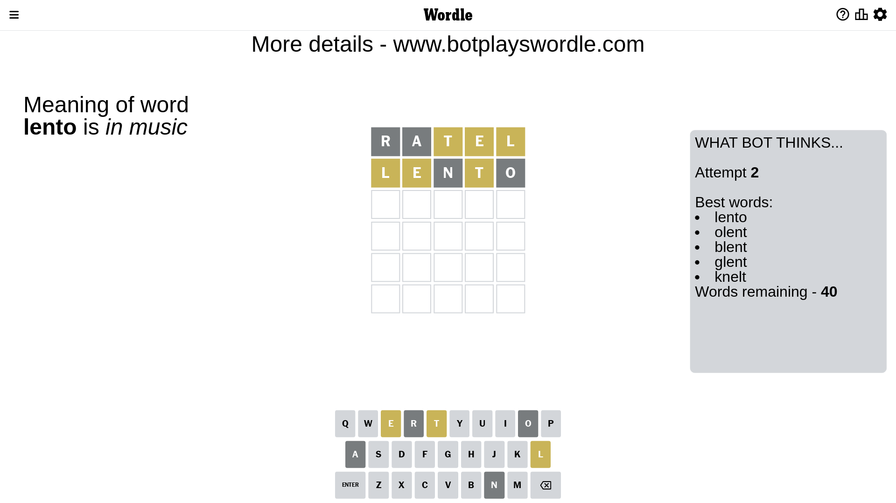
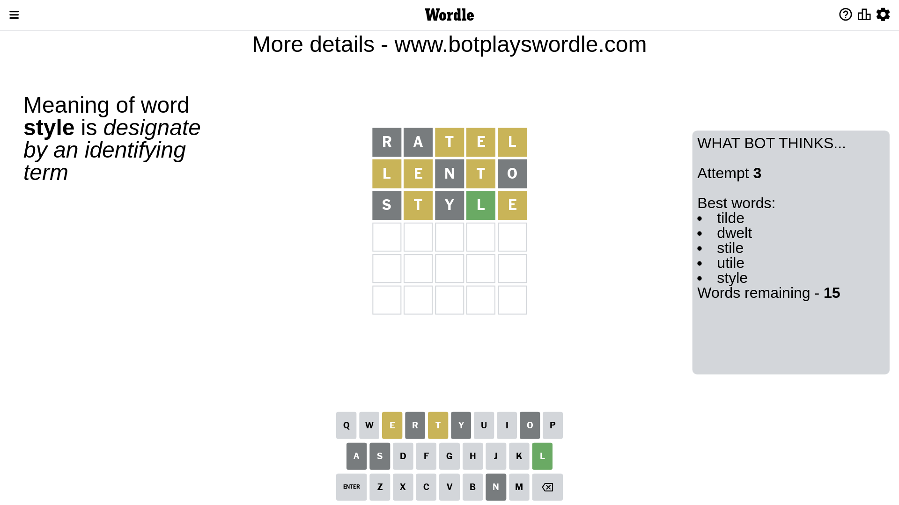
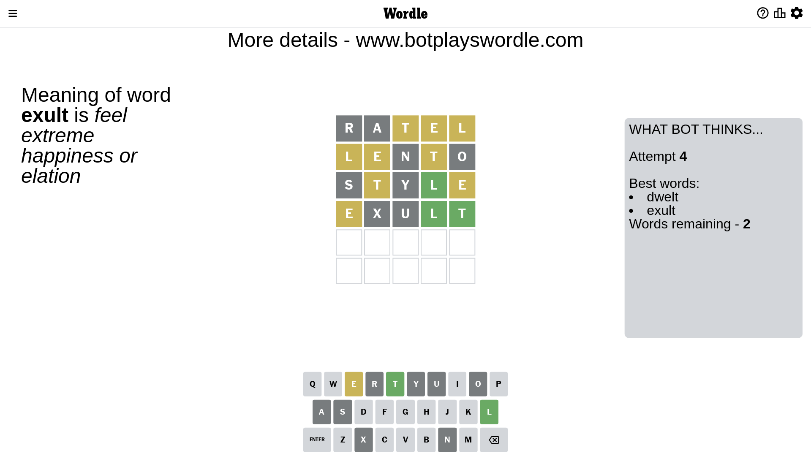
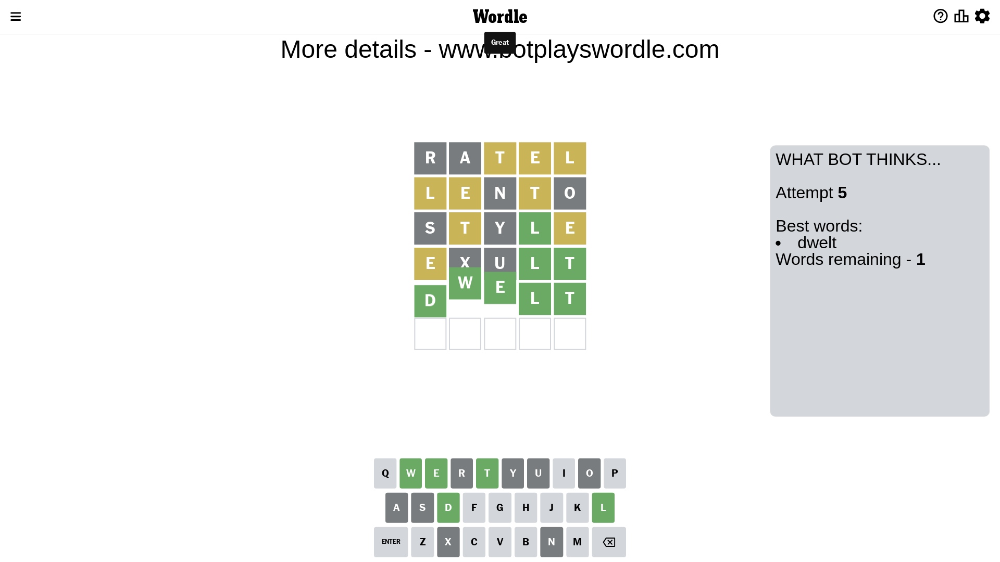

# Wordle for April 16, 2023 - \#666

## Attempt 1

This is the first attempt and we'll choose a random word to start with.

Let's start with word `ratel`

Attempt for `ratel` gives us 0 correct letters, 3 present letters and 2 wrong letters.

If we look into details, we can see that:

Letter `r` is not present in the word and we will not use it any more

Letter `a` is not present in the word and we will not use it any more

Letter `t` is on a different spot - this means that it cannot be at position 3

Letter `e` is on a different spot - this means that it cannot be at position 4

Letter `l` is on a different spot - this means that it cannot be at position 5

Some letters are missing (like `r`, `a`) but it's also important piece of information

Word should contain letters `[t e l]`

That was a great guess that limited number of remaining words

## Attempt 2

Right now we have 40 words to choose from and best of them seem to be `[lento olent blent glent knelt]`

So far we know that possible letters are:

At position 1: `[b c d e f g h i j k l m n o p q s t u v w x y z]`

At position 2: `[b c d e f g h i j k l m n o p q s t u v w x y z]`

At position 3: `[b c d e f g h i j k l m n o p q s u v w x y z]`

At position 4: `[b c d f g h i j k l m n o p q s t u v w x y z]`

At position 5: `[b c d e f g h i j k m n o p q s t u v w x y z]`

Next guess is `lento`, let's see what it gives us

Attempt for `lento` gives us 0 correct letters, 3 present letters and 2 wrong letters.

If we look into details, we can see that:

Letter `l` is on a different spot - this means that it cannot be at position 1

Letter `e` is on a different spot - this means that it cannot be at position 2

Letter `n` is not present in the word and we will not use it any more

Letter `t` is on a different spot - this means that it cannot be at position 4

Letter `o` is not present in the word and we will not use it any more

Some letters are missing (like `n`, `o`) but it's also important piece of information

Word should contain letters `[t e l]`

Could be a better guess

## Attempt 3

Right now we have 15 words to choose from and best of them seem to be `[tilde dwelt stile utile style]`

So far we know that possible letters are:

At position 1: `[b c d e f g h i j k m p q s t u v w x y z]`

At position 2: `[b c d f g h i j k l m p q s t u v w x y z]`

At position 3: `[b c d e f g h i j k l m p q s u v w x y z]`

At position 4: `[b c d f g h i j k l m p q s u v w x y z]`

At position 5: `[b c d e f g h i j k m p q s t u v w x y z]`

Next guess is `style`, let's see what it gives us

Attempt for `style` gives us 1 correct letters, 2 present letters and 2 wrong letters.

If we look into details, we can see that:

Letter `s` is not present in the word and we will not use it any more

Letter `t` is on a different spot - this means that it cannot be at position 2

Letter `y` is not present in the word and we will not use it any more

Letter `l` should be at position 4

Letter `e` is on a different spot - this means that it cannot be at position 5

We got information about the correct letters and it should make next attempt easier

Some letters are missing (like `s`, `y`) but it's also important piece of information

Word should contain letters `[t e l]`

Not a bad guess in general

## Attempt 4

Right now we have 2 words to choose from and best of them seem to be `[dwelt exult]`

So far we know that possible letters are:

At position 1: `[b c d e f g h i j k m p q t u v w x z]`

At position 2: `[b c d f g h i j k l m p q u v w x z]`

At position 3: `[b c d e f g h i j k l m p q u v w x z]`

At position 4: `[l]`

At position 5: `[b c d f g h i j k m p q t u v w x z]`

Next guess is `exult`, let's see what it gives us

Attempt for `exult` gives us 2 correct letters, 1 present letters and 2 wrong letters.

If we look into details, we can see that:

Letter `e` is on a different spot - this means that it cannot be at position 1

Letter `x` is not present in the word and we will not use it any more

Letter `u` is not present in the word and we will not use it any more

Letter `t` should be at position 5

We got information about the correct letters and it should make next attempt easier

Some letters are missing (like `x`, `u`) but it's also important piece of information

Word should contain letters `[t e l]`

This was a waste, almost no valuable information...

## Attempt 5

Right now we have 1 words to choose from and best of them seem to be `[dwelt]`

So far we know that possible letters are:

At position 1: `[b c d f g h i j k m p q t v w z]`

At position 2: `[b c d f g h i j k l m p q v w z]`

At position 3: `[b c d e f g h i j k l m p q v w z]`

At position 4: `[l]`

At position 5: `[t]`

It must be `dwelt`

That's the correct answer! The word is `dwelt`!

## Conclusion

Today's word is `dwelt` and it took 5 attempts to guess it

