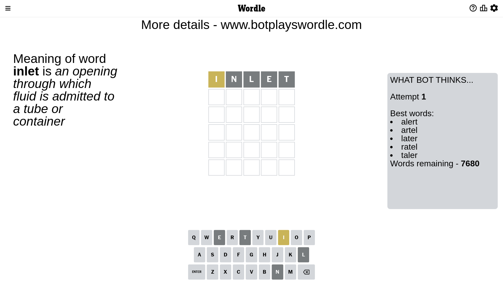
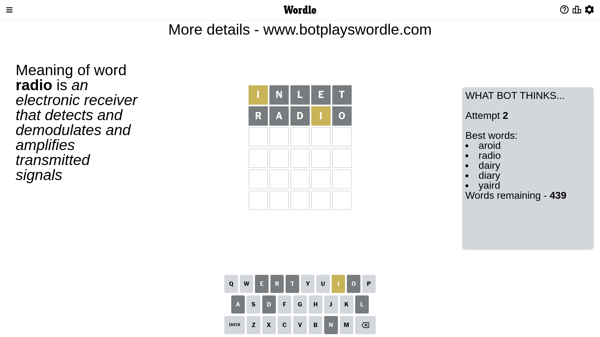
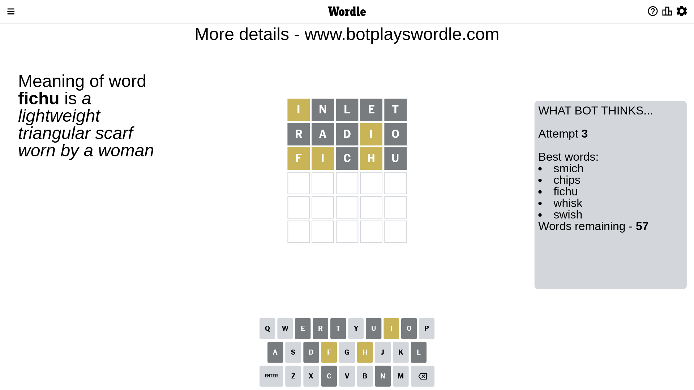
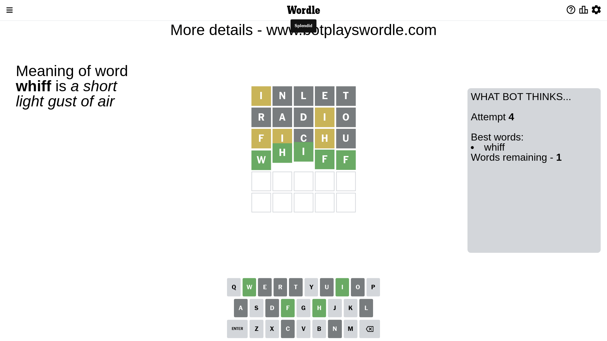

# Wordle for April 17, 2023 - \#667

## Attempt 1

This is the first attempt and we'll choose a random word to start with.

Let's start with word `inlet`

Attempt for `inlet` gives us 0 correct letters, 1 present letters and 4 wrong letters.

If we look into details, we can see that:

Letter `i` is on a different spot - this means that it cannot be at position 1

Letter `n` is not present in the word and we will not use it any more

Letter `l` is not present in the word and we will not use it any more

Letter `e` is not present in the word and we will not use it any more

Letter `t` is not present in the word and we will not use it any more

Some letters are missing (like `n`, `l`, `e`, `t`) but it's also important piece of information

Word should contain letters `[i]`

That was a great guess that limited number of remaining words

## Attempt 2

Right now we have 439 words to choose from and best of them seem to be `[aroid radio dairy diary yaird]`

So far we know that possible letters are:

At position 1: `[a b c d f g h j k m o p q r s u v w x y z]`

At position 2: `[a b c d f g h i j k m o p q r s u v w x y z]`

At position 3: `[a b c d f g h i j k m o p q r s u v w x y z]`

At position 4: `[a b c d f g h i j k m o p q r s u v w x y z]`

At position 5: `[a b c d f g h i j k m o p q r s u v w x y z]`

Next guess is `radio`, let's see what it gives us

Attempt for `radio` gives us 0 correct letters, 1 present letters and 4 wrong letters.

If we look into details, we can see that:

Letter `r` is not present in the word and we will not use it any more

Letter `a` is not present in the word and we will not use it any more

Letter `d` is not present in the word and we will not use it any more

Letter `i` is on a different spot - this means that it cannot be at position 4

Letter `o` is not present in the word and we will not use it any more

Some letters are missing (like `r`, `a`, `d`, `o`) but it's also important piece of information

Word should contain letters `[i]`

Not a bad guess in general

## Attempt 3

Right now we have 57 words to choose from and best of them seem to be `[smich chips fichu whisk swish]`

So far we know that possible letters are:

At position 1: `[b c f g h j k m p q s u v w x y z]`

At position 2: `[b c f g h i j k m p q s u v w x y z]`

At position 3: `[b c f g h i j k m p q s u v w x y z]`

At position 4: `[b c f g h j k m p q s u v w x y z]`

At position 5: `[b c f g h i j k m p q s u v w x y z]`

Next guess is `fichu`, let's see what it gives us

Attempt for `fichu` gives us 0 correct letters, 3 present letters and 2 wrong letters.

If we look into details, we can see that:

Letter `f` is on a different spot - this means that it cannot be at position 1

Letter `i` is on a different spot - this means that it cannot be at position 2

Letter `c` is not present in the word and we will not use it any more

Letter `h` is on a different spot - this means that it cannot be at position 4

Letter `u` is not present in the word and we will not use it any more

Some letters are missing (like `c`, `u`) but it's also important piece of information

Word should contain letters `[i f h]`

That was a great guess that limited number of remaining words

## Attempt 4

Right now we have 1 words to choose from and best of them seem to be `[whiff]`

So far we know that possible letters are:

At position 1: `[b g h j k m p q s v w x y z]`

At position 2: `[b f g h j k m p q s v w x y z]`

At position 3: `[b f g h i j k m p q s v w x y z]`

At position 4: `[b f g j k m p q s v w x y z]`

At position 5: `[b f g h i j k m p q s v w x y z]`

It must be `whiff`

That's the correct answer! The word is `whiff`!

## Conclusion

Today's word is `whiff` and it took 4 attempts to guess it

