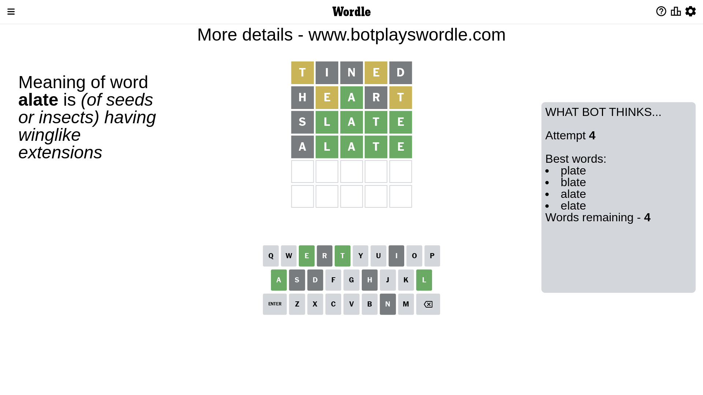

# Wordle for April 20, 2023 - \#670

## Attempt 1

This is the first attempt and we'll choose a random word to start with.

Let's start with word `tined`

Attempt for `tined` gives us 0 correct letters, 2 present letters and 3 wrong letters.

If we look into details, we can see that:

Letter `t` is on a different spot - this means that it cannot be at position 1

Letter `i` is not present in the word and we will not use it any more

Letter `n` is not present in the word and we will not use it any more

Letter `e` is on a different spot - this means that it cannot be at position 4

Letter `d` is not present in the word and we will not use it any more

Some letters are missing (like `i`, `n`, `d`) but it's also important piece of information

Word should contain letters `[t e]`

That was a great guess that limited number of remaining words

## Attempt 2

Right now we have 234 words to choose from and best of them seem to be `[alert earth heart rathe chert]`

So far we know that possible letters are:

At position 1: `[a b c e f g h j k l m o p q r s u v w x y z]`

At position 2: `[a b c e f g h j k l m o p q r s t u v w x y z]`

At position 3: `[a b c e f g h j k l m o p q r s t u v w x y z]`

At position 4: `[a b c f g h j k l m o p q r s t u v w x y z]`

At position 5: `[a b c e f g h j k l m o p q r s t u v w x y z]`

Next guess is `heart`, let's see what it gives us

Attempt for `heart` gives us 1 correct letters, 2 present letters and 2 wrong letters.

If we look into details, we can see that:

Letter `h` is not present in the word and we will not use it any more

Letter `e` is on a different spot - this means that it cannot be at position 2

Letter `a` should be at position 3

Letter `r` is not present in the word and we will not use it any more

Letter `t` is on a different spot - this means that it cannot be at position 5

We got information about the correct letters and it should make next attempt easier

Some letters are missing (like `h`, `r`) but it's also important piece of information

Word should contain letters `[t e a]`

That was a great guess that limited number of remaining words

## Attempt 3

Right now we have 14 words to choose from and best of them seem to be `[plate blate elate spate ovate]`

So far we know that possible letters are:

At position 1: `[a b c e f g j k l m o p q s u v w x y z]`

At position 2: `[a b c f g j k l m o p q s t u v w x y z]`

At position 3: `[a]`

At position 4: `[a b c f g j k l m o p q s t u v w x y z]`

At position 5: `[a b c e f g j k l m o p q s u v w x y z]`

Next guess is `slate`, let's see what it gives us

Attempt for `slate` gives us 4 correct letters, 0 present letters and 1 wrong letters.

If we look into details, we can see that:

Letter `s` is not present in the word and we will not use it any more

Letter `l` should be at position 2

Letter `t` should be at position 4

Letter `e` should be at position 5

We got information about the correct letters and it should make next attempt easier

Some letters are missing (like `s`) but it's also important piece of information

Word should contain letters `[t e a l]`

Could be a better guess

## Attempt 4

Right now we have 4 words to choose from and best of them seem to be `[plate blate alate elate]`

So far we know that possible letters are:

At position 1: `[a b c e f g j k l m o p q u v w x y z]`

At position 2: `[l]`

At position 3: `[a]`

At position 4: `[t]`

At position 5: `[e]`

Next guess is `alate`, let's see what it gives us

Attempt for `alate` gives us 4 correct letters, 0 present letters and 1 wrong letters.

If we look into details, we can see that:

Letter `a` is not present in the word and we will not use it any more

Some letters are missing (like `a`) but it's also important piece of information

Word should contain letters `[t e a l]`

This was a waste, almost no valuable information...

## Attempt 5

Right now we have 3 words to choose from and best of them seem to be `[plate blate elate]`

So far we know that possible letters are:

At position 1: `[b c e f g j k l m o p q u v w x y z]`

At position 2: `[l]`

At position 3: `[a]`

At position 4: `[t]`

At position 5: `[e]`

Next guess is `plate`, let's see what it gives us

That's the correct answer! The word is `plate`!

## Conclusion

Today's word is `plate` and it took 5 attempts to guess it

