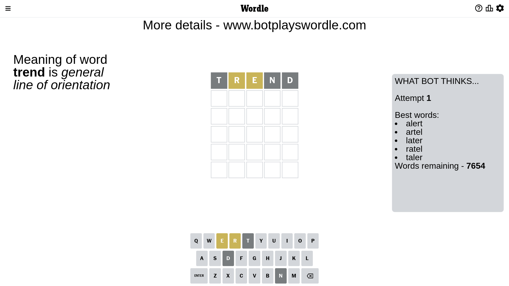
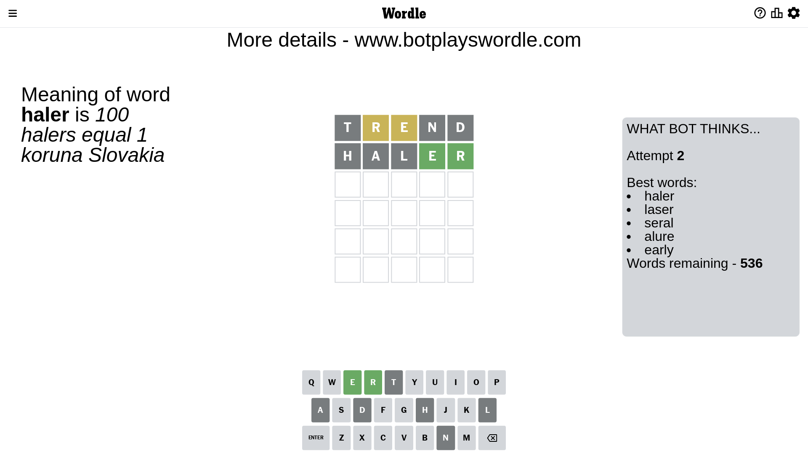
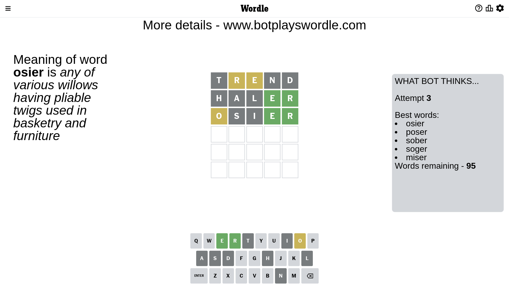
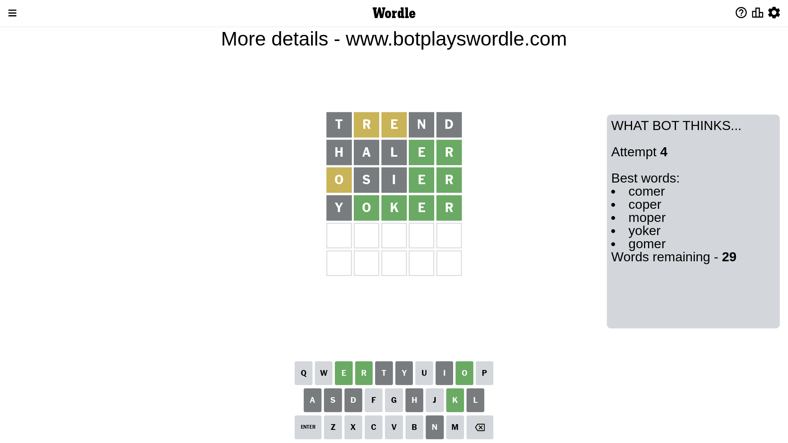
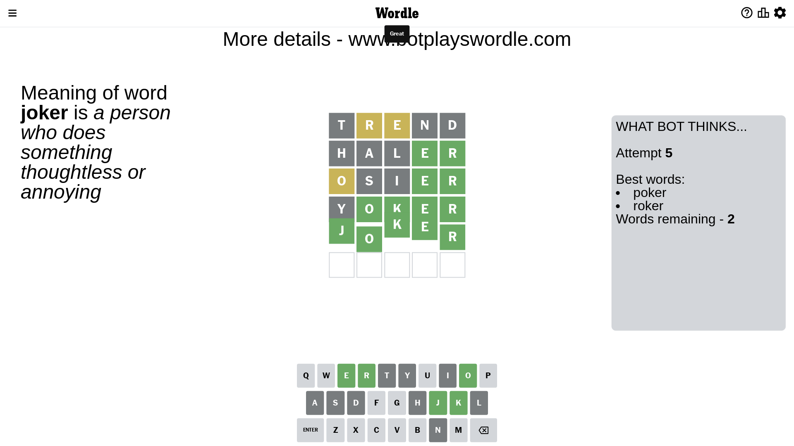

# Wordle for April 25, 2023 - \#675

## Attempt 1

This is the first attempt and we'll choose a random word to start with.

Let's start with word `trend`

Attempt for `trend` gives us 0 correct letters, 2 present letters and 3 wrong letters.

If we look into details, we can see that:

Letter `t` is not present in the word and we will not use it any more

Letter `r` is on a different spot - this means that it cannot be at position 2

Letter `e` is on a different spot - this means that it cannot be at position 3

Letter `n` is not present in the word and we will not use it any more

Letter `d` is not present in the word and we will not use it any more

Some letters are missing (like `t`, `n`, `d`) but it's also important piece of information

Word should contain letters `[r e]`

That was a great guess that limited number of remaining words

## Attempt 2

Right now we have 536 words to choose from and best of them seem to be `[haler laser seral alure early]`

So far we know that possible letters are:

At position 1: `[a b c e f g h i j k l m o p q r s u v w x y z]`

At position 2: `[a b c e f g h i j k l m o p q s u v w x y z]`

At position 3: `[a b c f g h i j k l m o p q r s u v w x y z]`

At position 4: `[a b c e f g h i j k l m o p q r s u v w x y z]`

At position 5: `[a b c e f g h i j k l m o p q r s u v w x y z]`

Next guess is `haler`, let's see what it gives us

Attempt for `haler` gives us 2 correct letters, 0 present letters and 3 wrong letters.

If we look into details, we can see that:

Letter `h` is not present in the word and we will not use it any more

Letter `a` is not present in the word and we will not use it any more

Letter `l` is not present in the word and we will not use it any more

Letter `e` should be at position 4

Letter `r` should be at position 5

We got information about the correct letters and it should make next attempt easier

Some letters are missing (like `h`, `a`, `l`) but it's also important piece of information

Word should contain letters `[r e]`

Not a bad guess in general

## Attempt 3

Right now we have 95 words to choose from and best of them seem to be `[osier poser sober soger miser]`

So far we know that possible letters are:

At position 1: `[b c e f g i j k m o p q r s u v w x y z]`

At position 2: `[b c e f g i j k m o p q s u v w x y z]`

At position 3: `[b c f g i j k m o p q r s u v w x y z]`

At position 4: `[e]`

At position 5: `[r]`

Next guess is `osier`, let's see what it gives us

Attempt for `osier` gives us 2 correct letters, 1 present letters and 2 wrong letters.

If we look into details, we can see that:

Letter `o` is on a different spot - this means that it cannot be at position 1

Letter `s` is not present in the word and we will not use it any more

Letter `i` is not present in the word and we will not use it any more

Some letters are missing (like `s`, `i`) but it's also important piece of information

Word should contain letters `[r e o]`

Could be a better guess

## Attempt 4

Right now we have 29 words to choose from and best of them seem to be `[comer coper moper yoker gomer]`

So far we know that possible letters are:

At position 1: `[b c e f g j k m p q r u v w x y z]`

At position 2: `[b c e f g j k m o p q u v w x y z]`

At position 3: `[b c f g j k m o p q r u v w x y z]`

At position 4: `[e]`

At position 5: `[r]`

Next guess is `yoker`, let's see what it gives us

Attempt for `yoker` gives us 4 correct letters, 0 present letters and 1 wrong letters.

If we look into details, we can see that:

Letter `y` is not present in the word and we will not use it any more

Letter `o` should be at position 2

Letter `k` should be at position 3

We got information about the correct letters and it should make next attempt easier

Some letters are missing (like `y`) but it's also important piece of information

Word should contain letters `[r e o k]`

That was a great guess that limited number of remaining words

## Attempt 5

Right now we have 2 words to choose from and best of them seem to be `[poker roker]`

So far we know that possible letters are:

At position 1: `[b c e f g j k m p q r u v w x z]`

At position 2: `[o]`

At position 3: `[k]`

At position 4: `[e]`

At position 5: `[r]`

Next guess is `joker`, let's see what it gives us

That's the correct answer! The word is `joker`!

## Conclusion

Today's word is `joker` and it took 5 attempts to guess it

