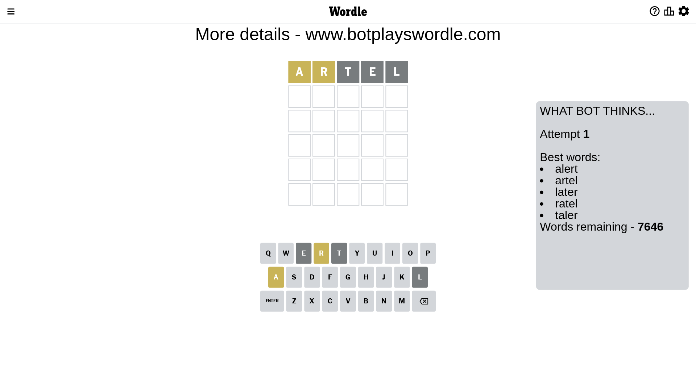

# Wordle for April 28, 2023 - \#678

## Attempt 1

This is the first attempt and we'll choose a random word to start with.

Let's start with word `artel`

Attempt for `artel` gives us 0 correct letters, 2 present letters and 3 wrong letters.

If we look into details, we can see that:

Letter `a` is on a different spot - this means that it cannot be at position 1

Letter `r` is on a different spot - this means that it cannot be at position 2

Letter `t` is not present in the word and we will not use it any more

Letter `e` is not present in the word and we will not use it any more

Letter `l` is not present in the word and we will not use it any more

Some letters are missing (like `t`, `e`, `l`) but it's also important piece of information

Word should contain letters `[a r]`

That was a great guess that limited number of remaining words

## Attempt 2

Right now we have 310 words to choose from and best of them seem to be `[radon dinar nadir ranid rohan]`

So far we know that possible letters are:

At position 1: `[b c d f g h i j k m n o p q r s u v w x y z]`

At position 2: `[a b c d f g h i j k m n o p q s u v w x y z]`

At position 3: `[a b c d f g h i j k m n o p q r s u v w x y z]`

At position 4: `[a b c d f g h i j k m n o p q r s u v w x y z]`

At position 5: `[a b c d f g h i j k m n o p q r s u v w x y z]`

Next guess is `dinar`, let's see what it gives us

Attempt for `dinar` gives us 1 correct letters, 2 present letters and 2 wrong letters.

If we look into details, we can see that:

Letter `d` is not present in the word and we will not use it any more

Letter `i` should be at position 2

Letter `n` is not present in the word and we will not use it any more

Letter `a` is on a different spot - this means that it cannot be at position 4

Letter `r` is on a different spot - this means that it cannot be at position 5

We got information about the correct letters and it should make next attempt easier

Some letters are missing (like `d`, `n`) but it's also important piece of information

Word should contain letters `[a r i]`

That was a great guess that limited number of remaining words

## Attempt 3

Right now we have 9 words to choose from and best of them seem to be `[picra girba virga mirza circa]`

So far we know that possible letters are:

At position 1: `[b c f g h i j k m o p q r s u v w x y z]`

At position 2: `[i]`

At position 3: `[a b c f g h i j k m o p q r s u v w x y z]`

At position 4: `[b c f g h i j k m o p q r s u v w x y z]`

At position 5: `[a b c f g h i j k m o p q s u v w x y z]`

Next guess is `circa`, let's see what it gives us

That's the correct answer! The word is `circa`!

## Conclusion

Today's word is `circa` and it took 3 attempts to guess it

