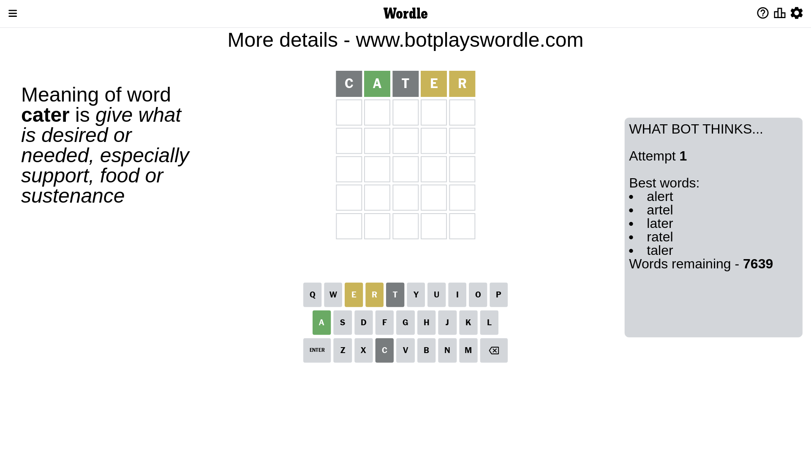
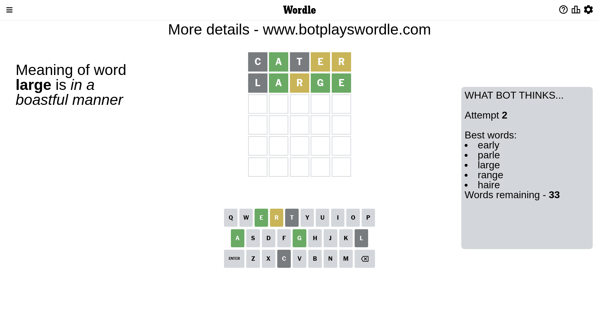
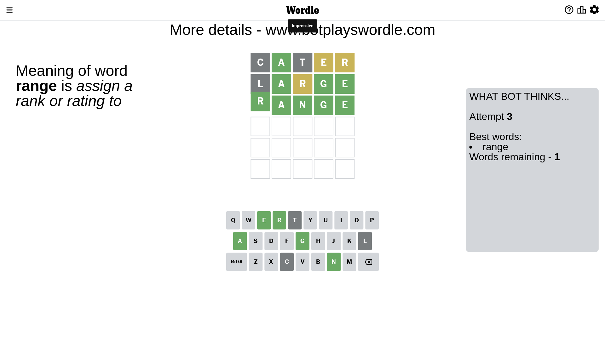

# Wordle for May 1, 2023 - \#681

## Attempt 1

This is the first attempt and we'll choose a random word to start with.

Let's start with word `cater`

Attempt for `cater` gives us 1 correct letters, 2 present letters and 2 wrong letters.

If we look into details, we can see that:

Letter `c` is not present in the word and we will not use it any more

Letter `a` should be at position 2

Letter `t` is not present in the word and we will not use it any more

Letter `e` is on a different spot - this means that it cannot be at position 4

Letter `r` is on a different spot - this means that it cannot be at position 5

We got information about the correct letters and it should make next attempt easier

Some letters are missing (like `c`, `t`) but it's also important piece of information

Word should contain letters `[a e r]`

That was a great guess that limited number of remaining words

## Attempt 2

Right now we have 33 words to choose from and best of them seem to be `[early parle large range haire]`

So far we know that possible letters are:

At position 1: `[a b d e f g h i j k l m n o p q r s u v w x y z]`

At position 2: `[a]`

At position 3: `[a b d e f g h i j k l m n o p q r s u v w x y z]`

At position 4: `[a b d f g h i j k l m n o p q r s u v w x y z]`

At position 5: `[a b d e f g h i j k l m n o p q s u v w x y z]`

Next guess is `large`, let's see what it gives us

Attempt for `large` gives us 3 correct letters, 1 present letters and 1 wrong letters.

If we look into details, we can see that:

Letter `l` is not present in the word and we will not use it any more

Letter `r` is on a different spot - this means that it cannot be at position 3

Letter `g` should be at position 4

Letter `e` should be at position 5

We got information about the correct letters and it should make next attempt easier

Some letters are missing (like `l`) but it's also important piece of information

Word should contain letters `[a e r g]`

That was a great guess that limited number of remaining words

## Attempt 3

Right now we have 1 words to choose from and best of them seem to be `[range]`

So far we know that possible letters are:

At position 1: `[a b d e f g h i j k m n o p q r s u v w x y z]`

At position 2: `[a]`

At position 3: `[a b d e f g h i j k m n o p q s u v w x y z]`

At position 4: `[g]`

At position 5: `[e]`

It must be `range`

That's the correct answer! The word is `range`!

## Conclusion

Today's word is `range` and it took 3 attempts to guess it

