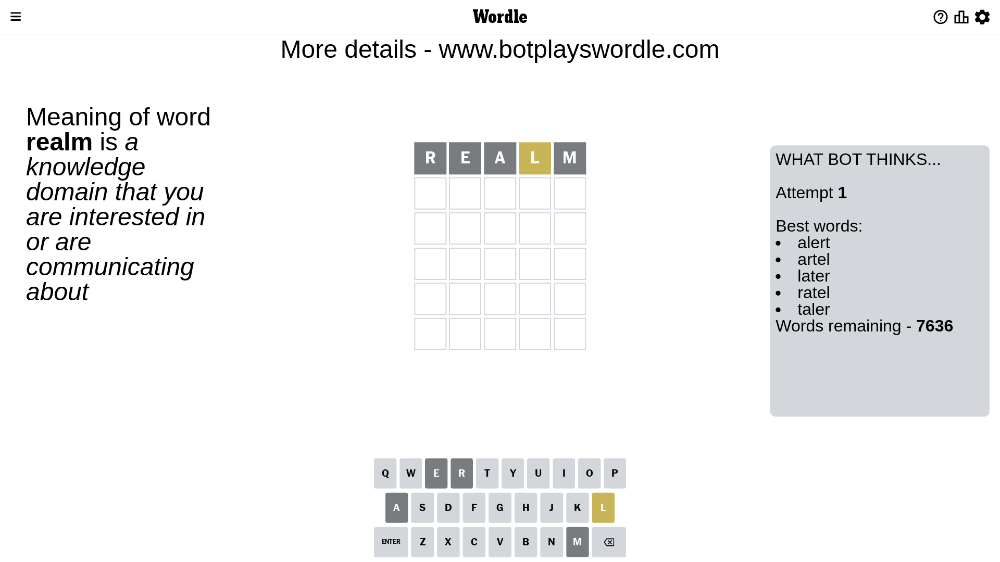
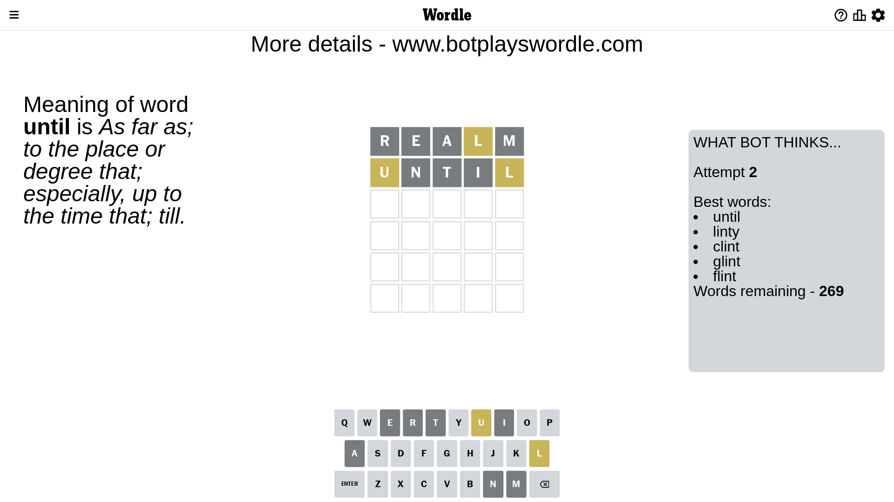
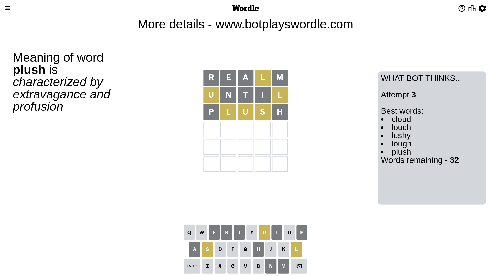
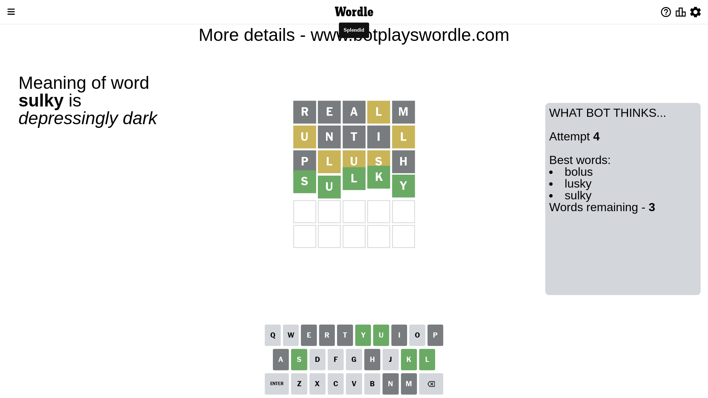

# Wordle for May 2, 2023 - \#682

## Attempt 1

This is the first attempt and we'll choose a random word to start with.

Let's start with word `realm`

Attempt for `realm` gives us 0 correct letters, 1 present letters and 4 wrong letters.

If we look into details, we can see that:

Letter `r` is not present in the word and we will not use it any more

Letter `e` is not present in the word and we will not use it any more

Letter `a` is not present in the word and we will not use it any more

Letter `l` is on a different spot - this means that it cannot be at position 4

Letter `m` is not present in the word and we will not use it any more

Some letters are missing (like `r`, `e`, `a`, `m`) but it's also important piece of information

Word should contain letters `[l]`

That was a great guess that limited number of remaining words

## Attempt 2

Right now we have 269 words to choose from and best of them seem to be `[until linty clint glint flint]`

So far we know that possible letters are:

At position 1: `[b c d f g h i j k l n o p q s t u v w x y z]`

At position 2: `[b c d f g h i j k l n o p q s t u v w x y z]`

At position 3: `[b c d f g h i j k l n o p q s t u v w x y z]`

At position 4: `[b c d f g h i j k n o p q s t u v w x y z]`

At position 5: `[b c d f g h i j k l n o p q s t u v w x y z]`

Next guess is `until`, let's see what it gives us

Attempt for `until` gives us 0 correct letters, 2 present letters and 3 wrong letters.

If we look into details, we can see that:

Letter `u` is on a different spot - this means that it cannot be at position 1

Letter `n` is not present in the word and we will not use it any more

Letter `t` is not present in the word and we will not use it any more

Letter `i` is not present in the word and we will not use it any more

Letter `l` is on a different spot - this means that it cannot be at position 5

Some letters are missing (like `n`, `t`, `i`) but it's also important piece of information

Word should contain letters `[l u]`

That was a great guess that limited number of remaining words

## Attempt 3

Right now we have 32 words to choose from and best of them seem to be `[cloud louch lushy lough plush]`

So far we know that possible letters are:

At position 1: `[b c d f g h j k l o p q s v w x y z]`

At position 2: `[b c d f g h j k l o p q s u v w x y z]`

At position 3: `[b c d f g h j k l o p q s u v w x y z]`

At position 4: `[b c d f g h j k o p q s u v w x y z]`

At position 5: `[b c d f g h j k o p q s u v w x y z]`

Next guess is `plush`, let's see what it gives us

Attempt for `plush` gives us 0 correct letters, 3 present letters and 2 wrong letters.

If we look into details, we can see that:

Letter `p` is not present in the word and we will not use it any more

Letter `l` is on a different spot - this means that it cannot be at position 2

Letter `u` is on a different spot - this means that it cannot be at position 3

Letter `s` is on a different spot - this means that it cannot be at position 4

Letter `h` is not present in the word and we will not use it any more

Some letters are missing (like `p`, `h`) but it's also important piece of information

Word should contain letters `[l u s]`

That was a great guess that limited number of remaining words

## Attempt 4

Right now we have 3 words to choose from and best of them seem to be `[bolus lusky sulky]`

So far we know that possible letters are:

At position 1: `[b c d f g j k l o q s v w x y z]`

At position 2: `[b c d f g j k o q s u v w x y z]`

At position 3: `[b c d f g j k l o q s v w x y z]`

At position 4: `[b c d f g j k o q u v w x y z]`

At position 5: `[b c d f g j k o q s u v w x y z]`

Next guess is `sulky`, let's see what it gives us

That's the correct answer! The word is `sulky`!

## Conclusion

Today's word is `sulky` and it took 4 attempts to guess it

