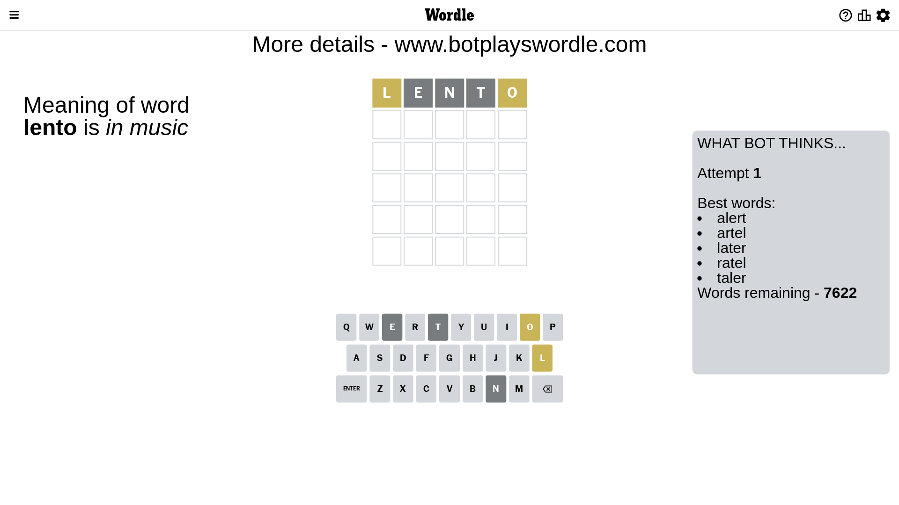
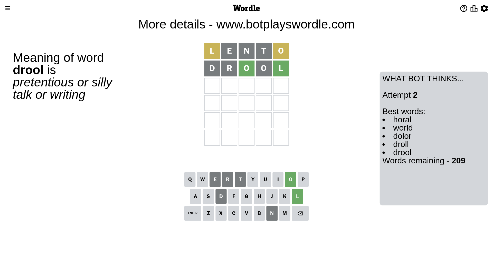
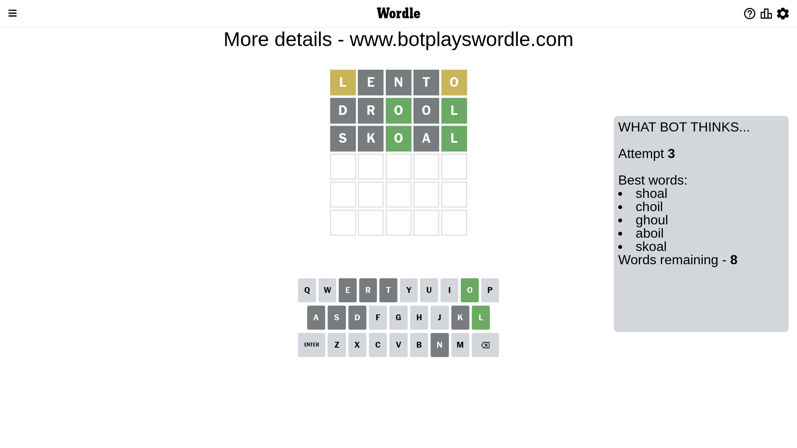

# Wordle for May 7, 2023 - \#687

## Attempt 1

This is the first attempt and we'll choose a random word to start with.

Let's start with word `lento`

Attempt for `lento` gives us 0 correct letters, 2 present letters and 3 wrong letters.

If we look into details, we can see that:

Letter `l` is on a different spot - this means that it cannot be at position 1

Letter `e` is not present in the word and we will not use it any more

Letter `n` is not present in the word and we will not use it any more

Letter `t` is not present in the word and we will not use it any more

Letter `o` is on a different spot - this means that it cannot be at position 5

Some letters are missing (like `e`, `n`, `t`) but it's also important piece of information

Word should contain letters `[l o]`

That was a great guess that limited number of remaining words

## Attempt 2

Right now we have 209 words to choose from and best of them seem to be `[horal world dolor droll drool]`

So far we know that possible letters are:

At position 1: `[a b c d f g h i j k m o p q r s u v w x y z]`

At position 2: `[a b c d f g h i j k l m o p q r s u v w x y z]`

At position 3: `[a b c d f g h i j k l m o p q r s u v w x y z]`

At position 4: `[a b c d f g h i j k l m o p q r s u v w x y z]`

At position 5: `[a b c d f g h i j k l m p q r s u v w x y z]`

Next guess is `drool`, let's see what it gives us

Attempt for `drool` gives us 2 correct letters, 0 present letters and 3 wrong letters.

If we look into details, we can see that:

Letter `d` is not present in the word and we will not use it any more

Letter `r` is not present in the word and we will not use it any more

Letter `o` should be at position 3

Letter `o` is not present in the word and we will not use it any more

Letter `l` should be at position 5

We got information about the correct letters and it should make next attempt easier

Some letters are missing (like `d`, `r`, `o`) but it's also important piece of information

Word should contain letters `[l o]`

That was a great guess that limited number of remaining words

## Attempt 3

Right now we have 8 words to choose from and best of them seem to be `[shoal choil ghoul aboil skoal]`

So far we know that possible letters are:

At position 1: `[a b c f g h i j k m p q s u v w x y z]`

At position 2: `[a b c f g h i j k l m p q s u v w x y z]`

At position 3: `[o]`

At position 4: `[a b c f g h i j k l m p q s u v w x y z]`

At position 5: `[l]`

Next guess is `skoal`, let's see what it gives us

Attempt for `skoal` gives us 2 correct letters, 0 present letters and 3 wrong letters.

If we look into details, we can see that:

Letter `s` is not present in the word and we will not use it any more

Letter `k` is not present in the word and we will not use it any more

Letter `a` is not present in the word and we will not use it any more

Some letters are missing (like `s`, `k`, `a`) but it's also important piece of information

Word should contain letters `[l o]`

Could be a better guess

## Attempt 4

Right now we have 2 words to choose from and best of them seem to be `[choil ghoul]`

So far we know that possible letters are:

At position 1: `[b c f g h i j m p q u v w x y z]`

At position 2: `[b c f g h i j l m p q u v w x y z]`

At position 3: `[o]`

At position 4: `[b c f g h i j l m p q u v w x y z]`

At position 5: `[l]`

Next guess is `ghoul`, let's see what it gives us

That's the correct answer! The word is `ghoul`!

## Conclusion

Today's word is `ghoul` and it took 4 attempts to guess it

