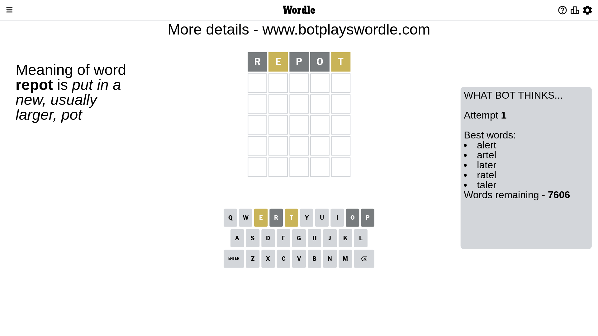
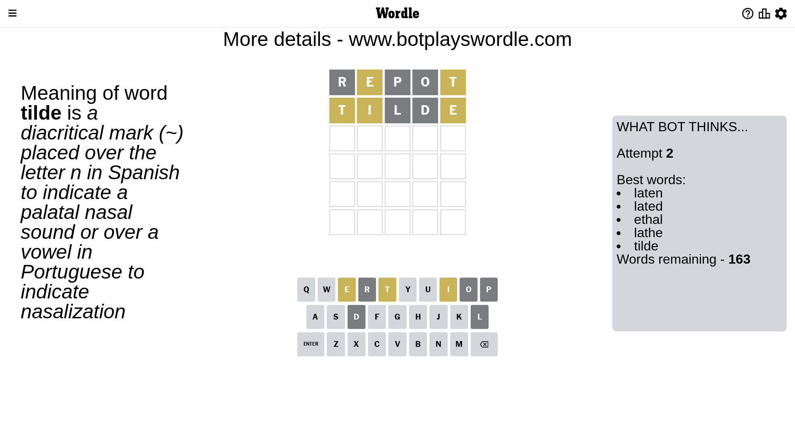
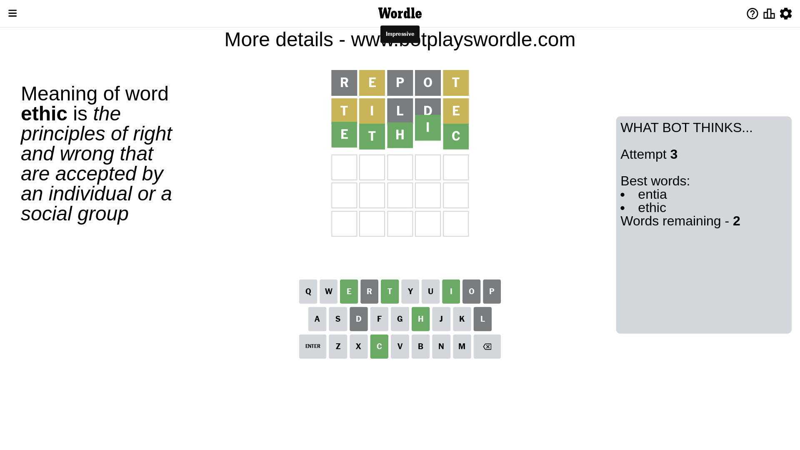

# Wordle for May 10, 2023 - \#690

## Attempt 1

This is the first attempt and we'll choose a random word to start with.

Let's start with word `repot`

Attempt for `repot` gives us 0 correct letters, 2 present letters and 3 wrong letters.

If we look into details, we can see that:

Letter `r` is not present in the word and we will not use it any more

Letter `e` is on a different spot - this means that it cannot be at position 2

Letter `p` is not present in the word and we will not use it any more

Letter `o` is not present in the word and we will not use it any more

Letter `t` is on a different spot - this means that it cannot be at position 5

Some letters are missing (like `r`, `p`, `o`) but it's also important piece of information

Word should contain letters `[e t]`

That was a great guess that limited number of remaining words

## Attempt 2

Right now we have 163 words to choose from and best of them seem to be `[laten lated ethal lathe tilde]`

So far we know that possible letters are:

At position 1: `[a b c d e f g h i j k l m n q s t u v w x y z]`

At position 2: `[a b c d f g h i j k l m n q s t u v w x y z]`

At position 3: `[a b c d e f g h i j k l m n q s t u v w x y z]`

At position 4: `[a b c d e f g h i j k l m n q s t u v w x y z]`

At position 5: `[a b c d e f g h i j k l m n q s u v w x y z]`

Next guess is `tilde`, let's see what it gives us

Attempt for `tilde` gives us 0 correct letters, 3 present letters and 2 wrong letters.

If we look into details, we can see that:

Letter `t` is on a different spot - this means that it cannot be at position 1

Letter `i` is on a different spot - this means that it cannot be at position 2

Letter `l` is not present in the word and we will not use it any more

Letter `d` is not present in the word and we will not use it any more

Letter `e` is on a different spot - this means that it cannot be at position 5

Some letters are missing (like `l`, `d`) but it's also important piece of information

Word should contain letters `[e t i]`

That was a great guess that limited number of remaining words

## Attempt 3

Right now we have 2 words to choose from and best of them seem to be `[entia ethic]`

So far we know that possible letters are:

At position 1: `[a b c e f g h i j k m n q s u v w x y z]`

At position 2: `[a b c f g h j k m n q s t u v w x y z]`

At position 3: `[a b c e f g h i j k m n q s t u v w x y z]`

At position 4: `[a b c e f g h i j k m n q s t u v w x y z]`

At position 5: `[a b c f g h i j k m n q s u v w x y z]`

Next guess is `ethic`, let's see what it gives us

That's the correct answer! The word is `ethic`!

## Conclusion

Today's word is `ethic` and it took 3 attempts to guess it

